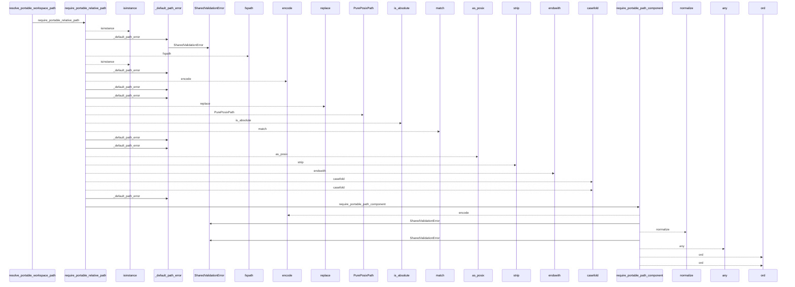
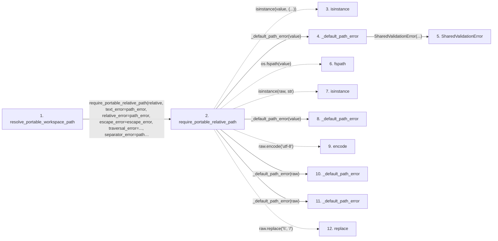

# resolve_portable_workspace_path

**Entry point:** `resolve_portable_workspace_path` (`api`)
**Source:** [validation](../modules/validation.md)
**Modules touched:** [validation](../modules/validation.md)

## Call sequence

<!-- Auto-generated from static call edges. Dashed arrows are external or unresolved calls. Reviewed runtime conditions and side effects belong in Behavior. -->

> Call sequence diagram shows 30 of 47 interactions; 17 omitted to keep the visualization within the 30-interaction and generated-diagram limits.

## Data flow

<!-- Auto-generated static analysis. Treat values and boundaries as best-effort hints, not runtime proof. -->

### Step data

| Step | Inputs | Reads | Writes | Returns |
|---|---|---|---|---|
| `resolve_portable_workspace_path` | `workspace_root: Path`, `relative: str \| Path`, `path_error: Exception`, `escape_error: Exception`, `traversal_error: Exception \| None` | - | - | `resolve_workspace_path(...)` |
| `require_portable_relative_path` | `value: object`, `normalize_backslashes: bool`, `normalize_posix_spelling: bool`, `required_suffix: str \| None`, `defer_non_nfc_error: bool`, `reject_delete_character: bool`, `text_error: Exception \| None`, `relative_error: Exception \| None` | `os` | - | `canonical` |
| `isinstance` | - | - | - | - |
| `_default_path_error` | `value: object` | - | - | `SharedValidationError(...)` |
| `SharedValidationError` | - | - | - | - |
| `fspath` | - | - | - | - |
| `isinstance` | - | - | - | - |
| `_default_path_error` | `value: object` | - | - | `SharedValidationError(...)` |
| `encode` | - | - | - | - |
| `_default_path_error` | `value: object` | - | - | `SharedValidationError(...)` |
| `_default_path_error` | `value: object` | - | - | `SharedValidationError(...)` |
| `replace` | - | - | - | - |

### Call data

| From | To | Line | Call |
|---|---|---:|---|
| resolve_portable_workspace_path | require_portable_relative_path | 503 | `require_portable_relative_path(relative, text_error=path_error, relative_error=path_error, escape_error=escape_error, traversal_error=..., separator_error=path_error, utf8_error=path_error, control_error=path_error, non_nfc_error=path_error, nonportable_error=path_error, reserved_error=path_error)` |
| require_portable_relative_path | isinstance | 170 | `isinstance(value, (...))` |
| require_portable_relative_path | _default_path_error | 171 | `_default_path_error(value)` |
| _default_path_error | SharedValidationError | 67 | `SharedValidationError(...)` |
| require_portable_relative_path | fspath | 172 | `os.fspath(value)` |
| require_portable_relative_path | isinstance | 173 | `isinstance(raw, str)` |
| require_portable_relative_path | _default_path_error | 174 | `_default_path_error(value)` |
| require_portable_relative_path | encode | 176 | `raw.encode('utf-8')` |
| require_portable_relative_path | _default_path_error | 179 | `_default_path_error(raw)` |
| require_portable_relative_path | _default_path_error | 182 | `_default_path_error(raw)` |
| require_portable_relative_path | replace | 183 | `raw.replace('\\', '/')` |

### Boundary effects

*No boundary effects detected.*

### Static analysis gaps

| Kind | Step | Target | Line |
|---|---|---|---:|
| unresolved_call | `require_portable_relative_path` | `isinstance` | 170 |
| external_call | `require_portable_relative_path` | `os.fspath` | 172 |
| unresolved_call | `require_portable_relative_path` | `isinstance` | 173 |
| unresolved_call | `require_portable_relative_path` | `raw.encode` | 176 |
| unresolved_call | `require_portable_relative_path` | `raw.replace` | 183 |
| step_limit | `resolve_portable_workspace_path` | `first 12 steps` | 0 |

## Behavior

This flow starts at `resolve_portable_workspace_path` and is classified as `api`. The generated call and data-flow sections are bounded static projections; runtime conditions and side effects require source-level confirmation.
