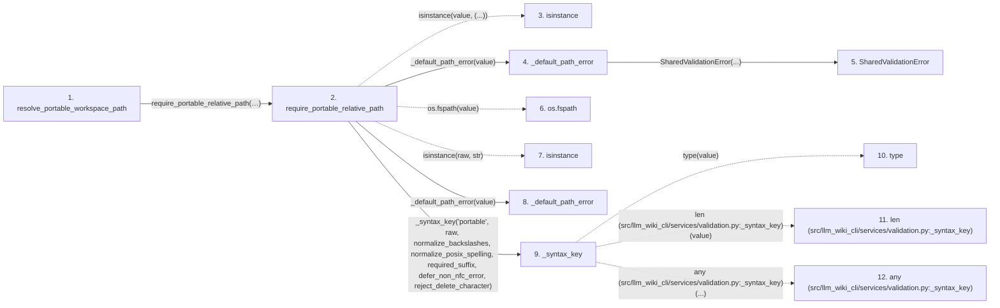

# resolve_portable_workspace_path

**Entry point:** `resolve_portable_workspace_path` (`api`)
**Source:** [validation](../modules/validation.md)
**Modules touched:** [validation](../modules/validation.md)

## Call sequence

> Static overview in presentation order, not runtime execution order. Arrows retain captured callers; representative internal continuations and boundary examples precede repeated helper detail.

<!-- Auto-generated from static call edges. Dashed arrows are external or unresolved calls. Reviewed runtime conditions and side effects belong in Behavior. -->

```mermaid
sequenceDiagram
    participant p0 as resolve_portable_workspace_path
    participant p1 as require_portable_relative_path
    participant p2 as resolve_workspace_path
    participant p3 as _default_path_error
    participant p4 as _check_path_collision
    participant p5 as require_portable_path_component
    participant p6 as _syntax_key
    participant p7 as _known_syntax
    participant p8 as _remember_syntax
    participant p9 as SharedValidationError
    participant p10 as portable_path_key
    participant p11 as isinstance
    participant p12 as workspace_root.resolve
    participant p13 as (…).resolve
    participant p14 as os.fspath
    participant p15 as target.relative_to
    participant p16 as raw.encode
    participant p17 as raw.replace
    participant p18 as PurePosixPath
    participant p19 as path.is_absolute
    participant p20 as _WINDOWS_ABSOLUTE_RE.match
    participant p21 as path.as_posix
    participant p22 as normalized.strip
    participant p23 as canonical.casefold().endswith
    participant p24 as canonical.casefold
    participant p25 as required_suffix.casefold
    participant p26 as type
    participant p27 as _PATH_SYNTAX.get
    participant p28 as component.encode
    participant p29 as _PATH_SYNTAX.move_to_end (src/llm_wiki_cli/services…dation.py:_remember_syntax)
    p0->>p1: require_portable_relative_path
    p0->>p2: resolve_workspace_path
    p1->>p3: _default_path_error
    p1->>p4: _check_path_collision
    p1->>p5: require_portable_path_component
    p1->>p6: _syntax_key
    p1->>p7: _known_syntax
    p1->>p8: _remember_syntax
    p3->>p9: SharedValidationError
    p4->>p10: portable_path_key
    p1-->>p11: isinstance(value, (...))
    p2-->>p12: workspace_root.resolve
    p2-->>p13: (…).resolve
    p1-->>p14: os.fspath(value)
    p2-->>p15: target.relative_to(resolved_root)
    p1-->>p11: isinstance(raw, str)
    p1-->>p16: raw.encode('utf-8')
    p1-->>p17: raw.replace('\\', '/')
    p1-->>p18: PurePosixPath(normalized)
    p1-->>p19: path.is_absolute
    p1-->>p20: _WINDOWS_ABSOLUTE_RE.match(raw)
    p1-->>p21: path.as_posix
    p1-->>p22: normalized.strip
    p1-->>p23: canonical.casefold().endswith(required_suffix.casefold(...))
    p1-->>p24: canonical.casefold
    p1-->>p25: required_suffix.casefold
    p6-->>p26: type(value)
    p7-->>p27: _PATH_SYNTAX.get(key)
    p5-->>p28: component.encode('utf-8')
    p8-->>p29: _PATH_SYNTAX.move_to_end (src/llm_wiki_cli/services…dation.py:_remember_syntax)(key)
```

> Call sequence diagram shows 30 of 63 interactions; 33 omitted to keep the visualization within the 30-interaction and generated-diagram limits, with uncertain identities omitted rather than inferred.

> Captured boundary calls: external 5 of 17 (12 omitted); unresolved 15 of 23 (8 omitted). These counts cover the captured static trace.

Omitted captured detail, grouped by actual caller occurrence and target module:

| Caller | Parent step | Target module | Kind | Omitted interactions |
| --- | --- | --- | --- | --- |
| `src/llm_wiki_cli/services/validation.py:require_portable_relative_path` | 2 | [src/llm_wiki_cli/services/validation.py](../modules/validation.md) | internal | 7 |
| `src/llm_wiki_cli/services/validation.py:_syntax_key` | 9 | - | external | 5 |
| `src/llm_wiki_cli/services/validation.py:_known_syntax` | 16 | - | unresolved | 1 |
| `src/llm_wiki_cli/services/validation.py:portable_path_key` | 20 | - | unresolved | 1 |
| `src/llm_wiki_cli/services/validation.py:portable_path_key` | 20 | - | external | 1 |
| `src/llm_wiki_cli/services/validation.py:_check_path_collision` | 19 | - | unresolved | 2 |
| `src/llm_wiki_cli/services/validation.py:_check_path_collision` | 19 | [src/llm_wiki_cli/services/validation.py](../modules/validation.md) | internal | 1 |
| `src/llm_wiki_cli/services/validation.py:require_portable_path_component` | 41 | [src/llm_wiki_cli/services/validation.py](../modules/validation.md) | internal | 5 |
> Omission summary shows 8 of 12 groups; 4 further groups are not expanded here. Counts above include all omitted interactions.
> Detailed flow queries retain their own coverage and limits; omitted paths may execute at runtime.

## Data flow

<!-- Auto-generated static analysis. Treat values and boundaries as best-effort hints, not runtime proof. -->

### Analysis coverage

**Effect analysis partially available.** Flow assembly and source effect analysis are separate; empty observations do not prove an empty handler body.

Source steps: 24; effect analysis evaluated: 17, partial: 0, unavailable: 7. Counts include steps omitted from the displayed trace.

- Callable record unavailable; the selected entry symbol has no represented callable body.
- Effect collector totals unavailable; observed counts cover captured records only.

| Step | Callable record | Effect analysis | Collector totals |
|---|---|---|---|
| `resolve_portable_workspace_path` | `available` | `evaluated` | `available` |
| `require_portable_relative_path` | `available` | `evaluated` | `available` |
| `isinstance` | `not_applicable` | `not_applicable` | `not_applicable` |
| `_default_path_error` | `available` | `evaluated` | `available` |
| `SharedValidationError` | `unavailable` | `unavailable` | `unavailable` |
| `os.fspath` | `not_applicable` | `not_applicable` | `not_applicable` |
| `isinstance` | `not_applicable` | `not_applicable` | `not_applicable` |
| `_default_path_error` | `available` | `evaluated` | `available` |
| `_syntax_key` | `available` | `evaluated` | `available` |
| `type` | `not_applicable` | `not_applicable` | `not_applicable` |
| `len (src/llm_wiki_cli/services/validation.py:_syntax_key)` | `not_applicable` | `not_applicable` | `not_applicable` |
| `any (src/llm_wiki_cli/services/validation.py:_syntax_key)` | `not_applicable` | `not_applicable` | `not_applicable` |

```mermaid
flowchart LR
    s1["1. resolve_portable_workspace_path"]
    s2["2. require_portable_relative_path"]
    s3["3. isinstance"]
    s4["4. _default_path_error"]
    s5["5. SharedValidationError"]
    s6["6. os.fspath"]
    s7["7. isinstance"]
    s8["8. _default_path_error"]
    s9["9. _syntax_key"]
    s10["10. type"]
    s11["11. len (src/llm_wiki_cli/services/validation.py:_syntax_key)"]
    s12["12. any (src/llm_wiki_cli/services/validation.py:_syntax_key)"]
    s1 -->|"require_portable_relative_path(…)"| s2
    s2 -. "isinstance(value, (...))" .-> s3
    s2 -->|"_default_path_error(value)"| s4
    s4 -->|"SharedValidationError(...)"| s5
    s2 -. "os.fspath(value)" .-> s6
    s2 -. "isinstance(raw, str)" .-> s7
    s2 -->|"_default_path_error(value)"| s8
    s2 -->|"_syntax_key('portable', raw, normalize_backslashes, normalize_posix_spelling, required_suffix, defer_non_nfc_error, reject_delete_character)"| s9
    s9 -. "type(value)" .-> s10
    s9 -. "len (src/llm_wiki_cli/services/validation.py:_syntax_key)(value)" .-> s11
    s9 -. "any (src/llm_wiki_cli/services/validation.py:_syntax_key)(...)" .-> s12
    click s1 "../modules/validation.md"
    click s2 "../modules/validation.md"
    click s4 "../modules/validation.md"
    click s5 "../modules/validation.md"
    click s8 "../modules/validation.md"
    click s9 "../modules/validation.md"
```

### Step data

| Step | Inputs | Reads | Writes | Returns |
|---|---|---|---|---|
| `resolve_portable_workspace_path` | `workspace_root: Path`, `relative: str \| Path`, `path_error: Exception`, `escape_error: Exception`, `traversal_error: Exception \| None` | - | - | `resolve_workspace_path(...)` |
| `require_portable_relative_path` | `value: object`, `normalize_backslashes: bool`, `normalize_posix_spelling: bool`, `required_suffix: str \| None`, `defer_non_nfc_error: bool`, `reject_delete_character: bool`, `text_error: Exception \| None`, `relative_error: Exception \| None` | `os` | - | `cached`, `_remember_syntax(...)` |
| `isinstance` | - | - | - | - |
| `_default_path_error` | `value: object` | - | - | `SharedValidationError(...)` |
| `SharedValidationError` | - | - | - | - |
| `os.fspath` | - | - | - | - |
| `isinstance` | - | - | - | - |
| `_default_path_error` | `value: object` | - | - | `SharedValidationError(...)` |
| `_syntax_key` | `kind`, `value`, `options` | - | - | `None`, `(...)` |
| `type` | - | - | - | - |
| `len (src/llm_wiki_cli/services/validation.py:_syntax_key)` | - | - | - | - |
| `any (src/llm_wiki_cli/services/validation.py:_syntax_key)` | - | - | - | - |

### Call data

| From | To | Line | Call |
|---|---|---:|---|
| resolve_portable_workspace_path | require_portable_relative_path | 552 | `require_portable_relative_path(relative, text_error=path_error, relative_error=path_error, escape_error=escape_error, traversal_error=..., separator_error=path_error, utf8_error=path_error, control_error=path_error, non_nfc_error=path_error, nonportable_error=path_error, reserved_error=path_error)` |
| require_portable_relative_path | isinstance | 216 | `isinstance(value, (...))` |
| require_portable_relative_path | _default_path_error | 217 | `_default_path_error(value)` |
| _default_path_error | SharedValidationError | 113 | `SharedValidationError(...)` |
| require_portable_relative_path | os.fspath | 218 | `os.fspath(value)` |
| require_portable_relative_path | isinstance | 219 | `isinstance(raw, str)` |
| require_portable_relative_path | _default_path_error | 220 | `_default_path_error(value)` |
| require_portable_relative_path | _syntax_key | 221 | `_syntax_key('portable', raw, normalize_backslashes, normalize_posix_spelling, required_suffix, defer_non_nfc_error, reject_delete_character)` |
| _syntax_key | type | 54 | `type(value)` |
| _syntax_key | len (src/llm_wiki_cli/services/validation.py:_syntax_key) | 54 | `len(value)` |
| _syntax_key | any (src/llm_wiki_cli/services/validation.py:_syntax_key) | 55 | `any(...)` |

### Boundary effects

*No boundary-effect observations were captured in this static trace.*

### Static analysis gaps

| Kind | Step | Target | Line |
|---|---|---|---:|
| external_call | `require_portable_relative_path` | `isinstance` | 216 |
| external_call | `require_portable_relative_path` | `os.fspath` | 218 |
| external_call | `require_portable_relative_path` | `isinstance` | 219 |
| external_call | `_syntax_key` | `type` | 54 |
| external_call | `_syntax_key` | `any` | 55 |
| step_limit | `resolve_portable_workspace_path` | `first 12 steps` | 0 |

## Behavior

This flow starts at `resolve_portable_workspace_path` and is classified as `api`. The generated call and data-flow sections are bounded static projections; runtime conditions and side effects require source-level confirmation.
