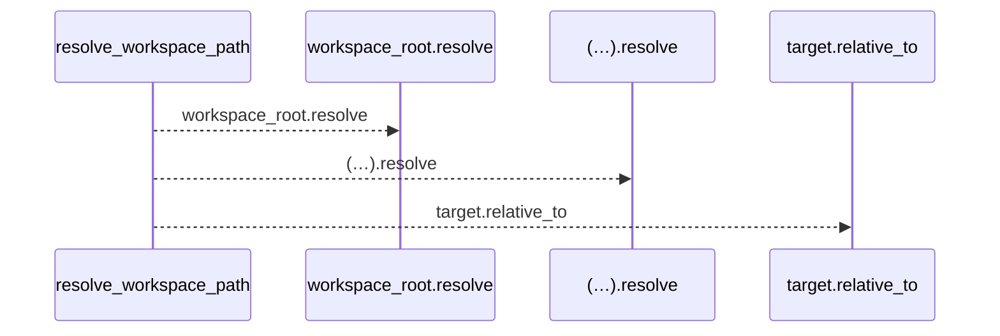
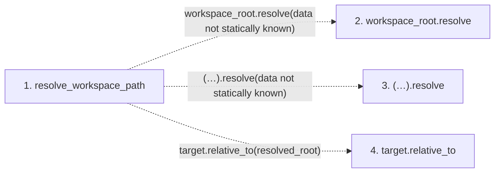

# resolve_workspace_path

**Entry point:** `resolve_workspace_path` (`api`)
**Source:** [validation](../modules/validation.md)
**Modules touched:** [validation](../modules/validation.md)

## Call sequence

<!-- Auto-generated from static call edges. Dashed arrows are external or unresolved calls. Reviewed runtime conditions and side effects belong in Behavior. -->

## Data flow

<!-- Auto-generated static analysis. Treat values and boundaries as best-effort hints, not runtime proof. -->

### Step data

| Step | Inputs | Reads | Writes | Returns |
|---|---|---|---|---|
| `resolve_workspace_path` | `workspace_root: Path`, `relative: str`, `escape_error: Exception` | - | - | `target` |
| `workspace_root.resolve` | - | - | - | - |
| `(…).resolve` | - | - | - | - |
| `target.relative_to` | - | - | - | - |

### Call data

| From | To | Line | Call |
|---|---|---:|---|
| resolve_workspace_path | workspace_root.resolve | 484 | `workspace_root.resolve(data not statically known)` |
| resolve_workspace_path | (…).resolve | 485 | `(resolved_root / relative).resolve(data not statically known)` |
| resolve_workspace_path | target.relative_to | 487 | `target.relative_to(resolved_root)` |

### Boundary effects

*No boundary effects detected.*

### Static analysis gaps

| Kind | Step | Target | Line |
|---|---|---|---:|
| unresolved_call | `resolve_workspace_path` | `workspace_root.resolve` | 484 |
| unresolved_call | `resolve_workspace_path` | `(resolved_root / relative).resolve` | 485 |
| unresolved_call | `resolve_workspace_path` | `target.relative_to` | 487 |

## Behavior

This flow starts at `resolve_workspace_path` and is classified as `api`. The generated call and data-flow sections are bounded static projections; runtime conditions and side effects require source-level confirmation.
