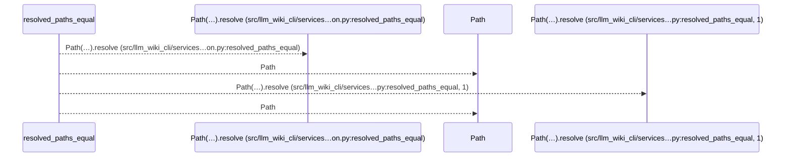
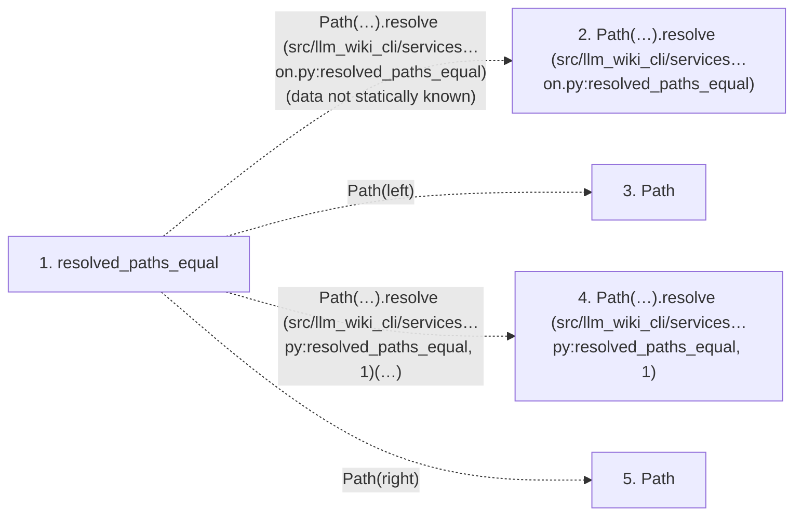

# resolved_paths_equal

**Entry point:** `resolved_paths_equal` (`api`)
**Source:** [validation](../modules/validation.md)
**Modules touched:** [validation](../modules/validation.md)

## Call sequence

<!-- Auto-generated from static call edges. Dashed arrows are external or unresolved calls. Reviewed runtime conditions and side effects belong in Behavior. -->

## Data flow

<!-- Auto-generated static analysis. Treat values and boundaries as best-effort hints, not runtime proof. -->

### Step data

| Step | Inputs | Reads | Writes | Returns |
|---|---|---|---|---|
| `resolved_paths_equal` | `left: str \| Path`, `right: str \| Path` | - | - | `...` |
| `Path(…).resolve (src/llm_wiki_cli/services…on.py:resolved_paths_equal)` | - | - | - | - |
| `Path` | - | - | - | - |
| `Path(…).resolve (src/llm_wiki_cli/services…py:resolved_paths_equal, 1)` | - | - | - | - |
| `Path` | - | - | - | - |

### Call data

| From | To | Line | Call |
|---|---|---:|---|
| resolved_paths_equal | Path(…).resolve (src/llm_wiki_cli/services…on.py:resolved_paths_equal) | 450 | `Path(left).resolve(data not statically known)` |
| resolved_paths_equal | Path | 450 | `Path(left)` |
| resolved_paths_equal | Path(…).resolve (src/llm_wiki_cli/services…py:resolved_paths_equal, 1) | 450 | `Path(left).resolve(data not statically known)` |
| resolved_paths_equal | Path | 450 | `Path(right)` |

### Boundary effects

*No boundary effects detected.*

### Static analysis gaps

| Kind | Step | Target | Line |
|---|---|---|---:|
| unresolved_call | `resolved_paths_equal` | `Path(left).resolve` | 450 |
| unresolved_call | `resolved_paths_equal` | `Path(right).resolve` | 450 |

## Behavior

This flow starts at `resolved_paths_equal` and is classified as `api`. The generated call and data-flow sections are bounded static projections; runtime conditions and side effects require source-level confirmation.
