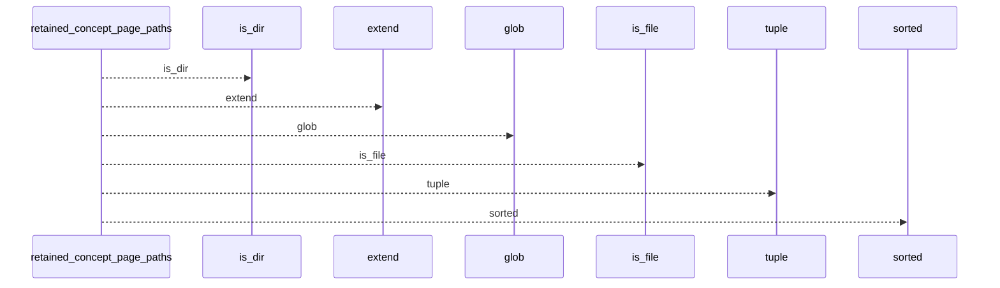
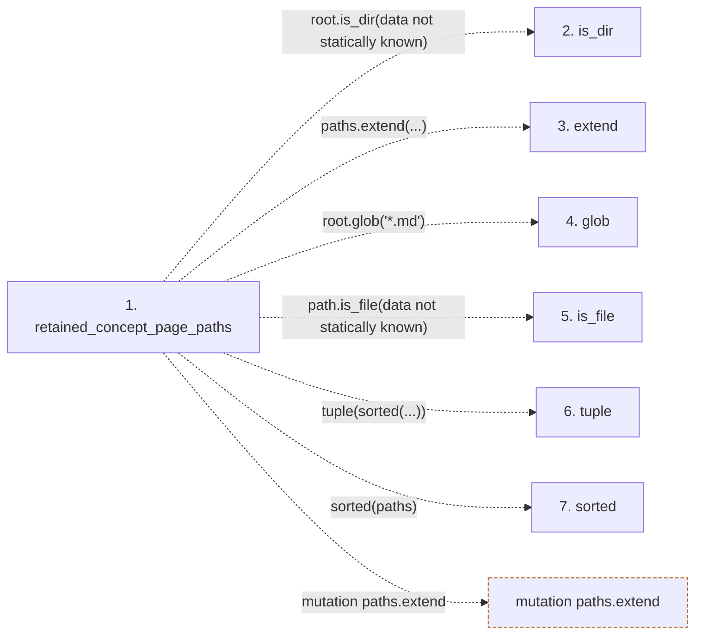

# retained_concept_page_paths

**Entry point:** `retained_concept_page_paths` (`api`)
**Source:** [sync_manifest](../modules/sync_manifest.md)
**Modules touched:** [sync_manifest](../modules/sync_manifest.md)

## Call sequence

<!-- Auto-generated from static call edges. Dashed arrows are external or unresolved calls. Reviewed runtime conditions and side effects belong in Behavior. -->

## Data flow

<!-- Auto-generated static analysis. Treat values and boundaries as best-effort hints, not runtime proof. -->

### Step data

| Step | Inputs | Reads | Writes | Returns |
|---|---|---|---|---|
| `retained_concept_page_paths` | `wiki_dir: Path` | - | - | `tuple(...)` |
| `is_dir` | - | - | - | - |
| `extend` | - | - | - | - |
| `glob` | - | - | - | - |
| `is_file` | - | - | - | - |
| `tuple` | - | - | - | - |
| `sorted` | - | - | - | - |

### Call data

| From | To | Line | Call |
|---|---|---:|---|
| retained_concept_page_paths | is_dir | 706 | `root.is_dir(data not statically known)` |
| retained_concept_page_paths | extend | 708 | `paths.extend(...)` |
| retained_concept_page_paths | glob | 709 | `root.glob('*.md')` |
| retained_concept_page_paths | is_file | 709 | `path.is_file(data not statically known)` |
| retained_concept_page_paths | tuple | 711 | `tuple(sorted(...))` |
| retained_concept_page_paths | sorted | 711 | `sorted(paths)` |

### Boundary effects

| Kind | Target | Step | Line |
|---|---|---|---:|
| mutation | `paths.extend` | `retained_concept_page_paths` | 708 |

### Static analysis gaps

| Kind | Step | Target | Line |
|---|---|---|---:|
| unresolved_call | `retained_concept_page_paths` | `root.is_dir` | 706 |
| unresolved_call | `retained_concept_page_paths` | `root.glob` | 709 |
| unresolved_call | `retained_concept_page_paths` | `path.is_file` | 709 |
| unresolved_call | `retained_concept_page_paths` | `sorted` | 711 |

## Behavior

This flow starts at `retained_concept_page_paths` and is classified as `api`. The generated call and data-flow sections are bounded static projections; runtime conditions and side effects require source-level confirmation.
