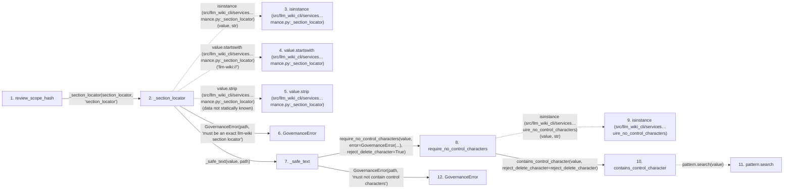

# review_scope_hash

**Entry point:** `review_scope_hash` (`api`)
**Source:** [knowledge_governance](../modules/knowledge_governance.md)
**Modules touched:** [knowledge_evidence](../modules/knowledge_evidence.md), [knowledge_governance](../modules/knowledge_governance.md), [validation](../modules/validation.md), [wiki_media](../modules/wiki_media.md)

## Call sequence

```mermaid
sequenceDiagram
    participant p0 as review_scope_hash
    participant p1 as _section_locator
    participant p2 as isinstance (src/llm_wiki_cli/services…rnance.py:_section_locator)
    participant p3 as value.startswith (src/llm_wiki_cli/services…rnance.py:_section_locator)
    participant p4 as value.strip (src/llm_wiki_cli/services…rnance.py:_section_locator)
    participant p5 as GovernanceError
    participant p6 as _safe_text
    participant p7 as require_no_control_characters
    participant p8 as isinstance (src/llm_wiki_cli/services…uire_no_control_characters)
    participant p9 as contains_control_character
    participant p10 as pattern.search
    participant p11 as _SENSITIVE_RE.search
    participant p12 as contains_uri_authority_userinfo
    participant p13 as value.strip (src/llm_wiki_cli/services…ins_uri_authority_userinfo)
    participant p14 as text.startswith
    participant p15 as text.index
    participant p16 as text[…].strip
    participant p17 as text.split
    participant p18 as len
    participant p19 as destination.startswith
    participant p20 as destination.endswith
    participant p21 as destination.strip
    participant p22 as _uri_candidate_contains_authority_userinfo
    participant p23 as _AUTHORITY_USERINFO_RE.match
    participant p24 as urlsplit
    participant p25 as bool
    participant p26 as tail.split
    participant p27 as token.lstrip
    participant p28 as _URI_AUTHORITY_PREFIX_RE.match
    p0->>p1: _section_locator
    p1-->>p2: isinstance (src/llm_wiki_cli/services…rnance.py:_section_locator)
    p1-->>p3: value.startswith (src/llm_wiki_cli/services…rnance.py:_section_locator)
    p1-->>p4: value.strip (src/llm_wiki_cli/services…rnance.py:_section_locator)
    p1->>p5: GovernanceError
    p1->>p6: _safe_text
    p6->>p7: require_no_control_characters
    p7-->>p8: isinstance (src/llm_wiki_cli/services…uire_no_control_characters)
    p7->>p9: contains_control_character
    p9-->>p10: pattern.search
    p6->>p5: GovernanceError
    p6-->>p11: _SENSITIVE_RE.search
    p6->>p5: GovernanceError
    p6->>p12: contains_uri_authority_userinfo
    p12-->>p13: value.strip (src/llm_wiki_cli/services…ins_uri_authority_userinfo)
    p12-->>p14: text.startswith
    p12-->>p15: text.index
    p12-->>p16: text[…].strip
    p12-->>p17: text.split
    p12-->>p18: len
    p12-->>p19: destination.startswith
    p12-->>p20: destination.endswith
    p12-->>p21: destination.strip
    p12->>p22: _uri_candidate_contains_authority_userinfo
    p22-->>p23: _AUTHORITY_USERINFO_RE.match
    p22-->>p24: urlsplit
    p22-->>p25: bool
    p12-->>p26: tail.split
    p12-->>p27: token.lstrip
    p12-->>p28: _URI_AUTHORITY_PREFIX_RE.match
```

<!-- Auto-generated from static call edges. Dashed arrows are external or unresolved calls. Reviewed runtime conditions and side effects belong in Behavior. -->

> Call sequence diagram shows 30 of 58 interactions; 28 omitted to keep the visualization within the 30-interaction and generated-diagram limits.

## Data flow

<!-- Auto-generated static analysis. Treat values and boundaries as best-effort hints, not runtime proof. -->

### Step data

| Step | Inputs | Reads | Writes | Returns |
|---|---|---|---|---|
| `review_scope_hash` | `knowledge: KnowledgeIndex`, `section_locator: str` | - | - | `semantic_hash` |
| `_section_locator` | `value: object`, `path: str` | - | - | `value` |
| `isinstance (src/llm_wiki_cli/services…rnance.py:_section_locator)` | - | - | - | - |
| `value.startswith (src/llm_wiki_cli/services…rnance.py:_section_locator)` | - | - | - | - |
| `value.strip (src/llm_wiki_cli/services…rnance.py:_section_locator)` | - | - | - | - |
| `GovernanceError` | - | - | - | - |
| `_safe_text` | `value: str`, `path: str` | - | - | - |
| `require_no_control_characters` | `value: object`, `error: Exception`, `reject_delete_character: bool` | - | - | `value` |
| `isinstance (src/llm_wiki_cli/services…uire_no_control_characters)` | - | - | - | - |
| `contains_control_character` | `value: str`, `reject_delete_character: bool` | `_ASCII_CONTROL_DELETE`, `_ASCII_CONTROL` | - | `...` |
| `pattern.search` | - | - | - | - |
| `GovernanceError` | - | - | - | - |

### Call data

| From | To | Line | Call |
|---|---|---:|---|
| review_scope_hash | _section_locator | 1540 | `_section_locator(section_locator, 'section_locator')` |
| _section_locator | isinstance (src/llm_wiki_cli/services…rnance.py:_section_locator) | 3327 | `isinstance(value, str)` |
| _section_locator | value.startswith (src/llm_wiki_cli/services…rnance.py:_section_locator) | 3328 | `value.startswith('llm-wiki://')` |
| _section_locator | value.strip (src/llm_wiki_cli/services…rnance.py:_section_locator) | 3331 | `value.strip(data not statically known)` |
| _section_locator | GovernanceError | 3333 | `GovernanceError(path, 'must be an exact llm-wiki section locator')` |
| _section_locator | _safe_text | 3337 | `_safe_text(value, path)` |
| _safe_text | require_no_control_characters | 3245 | `require_no_control_characters(value, error=GovernanceError(...), reject_delete_character=True)` |
| require_no_control_characters | isinstance (src/llm_wiki_cli/services…uire_no_control_characters) | 669 | `isinstance(value, str)` |
| require_no_control_characters | contains_control_character | 669 | `contains_control_character(value, reject_delete_character=reject_delete_character)` |
| contains_control_character | pattern.search | 685 | `pattern.search(value)` |
| _safe_text | GovernanceError | 3247 | `GovernanceError(path, 'must not contain control characters')` |

### Boundary effects

*No boundary effects detected.*

### Static analysis gaps

| Kind | Step | Target | Line |
|---|---|---|---:|
| external_call | `_section_locator` | `isinstance` | 3327 |
| unresolved_call | `_section_locator` | `value.startswith` | 3328 |
| unresolved_call | `_section_locator` | `value.strip` | 3331 |
| external_call | `require_no_control_characters` | `isinstance` | 669 |
| unresolved_call | `contains_control_character` | `pattern.search` | 685 |
| step_limit | `review_scope_hash` | `first 12 steps` | 0 |

## Behavior

This flow starts at `review_scope_hash` and is classified as `api`. The generated call and data-flow sections are bounded static projections; runtime conditions and side effects require source-level confirmation.
