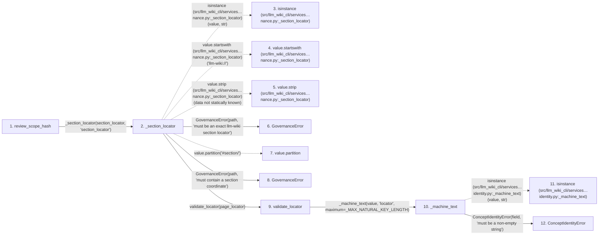

# review_scope_hash

**Entry point:** `review_scope_hash` (`api`)
**Source:** [knowledge_governance](../modules/knowledge_governance.md)
**Modules touched:** [concept_identity](../modules/concept_identity.md), [knowledge_evidence](../modules/knowledge_evidence.md), [knowledge_governance](../modules/knowledge_governance.md), [validation](../modules/validation.md), and 2 more

**Complete modules touched:**

- [concept_identity](../modules/concept_identity.md)
- [knowledge_evidence](../modules/knowledge_evidence.md)
- [knowledge_governance](../modules/knowledge_governance.md)
- [validation](../modules/validation.md)
- [wiki_media](../modules/wiki_media.md)
- [wiki_surface](../modules/wiki_surface.md)

## Call sequence

<!-- Auto-generated from static call edges. Dashed arrows are external or unresolved calls. Reviewed runtime conditions and side effects belong in Behavior. -->

```mermaid
sequenceDiagram
    participant p0 as review_scope_hash
    participant p1 as _section_locator
    participant p2 as isinstance (src/llm_wiki_cli/services…nance.py:_section_locator)
    participant p3 as value.startswith (src/llm_wiki_cli/services…nance.py:_section_locator)
    participant p4 as value.strip (src/llm_wiki_cli/services…nance.py:_section_locator)
    participant p5 as GovernanceError
    participant p6 as value.partition
    participant p7 as validate_locator
    participant p8 as _machine_text
    participant p9 as isinstance (src/llm_wiki_cli/services…identity.py:_machine_text)
    participant p10 as ConceptIdentityError
    participant p11 as len (src/llm_wiki_cli/services…identity.py:_machine_text)
    participant p12 as value.strip (src/llm_wiki_cli/services…identity.py:_machine_text)
    participant p13 as any (src/llm_wiki_cli/services…identity.py:_machine_text)
    participant p14 as character.isspace
    participant p15 as unicodedata.normalize
    participant p16 as unicodedata.category(…).startswith
    participant p17 as unicodedata.category
    participant p18 as _contains_uri_userinfo
    participant p19 as urlsplit (src/llm_wiki_cli/services…py:_contains_uri_userinfo)
    participant p20 as _looks_absolute_path
    participant p21 as value.startswith (src/llm_wiki_cli/services…y.py:_looks_absolute_path)
    participant p22 as _WINDOWS_ABSOLUTE_RE.match
    participant p23 as validate_exact_page_coordinate
    p0->>p1: _section_locator
    p1-->>p2: isinstance (src/llm_wiki_cli/services…nance.py:_section_locator)
    p1-->>p3: value.startswith (src/llm_wiki_cli/services…nance.py:_section_locator)
    p1-->>p4: value.strip (src/llm_wiki_cli/services…nance.py:_section_locator)
    p1->>p5: GovernanceError
    p1-->>p6: value.partition
    p1->>p5: GovernanceError
    p1->>p7: validate_locator
    p7->>p8: _machine_text
    p8-->>p9: isinstance (src/llm_wiki_cli/services…identity.py:_machine_text)
    p8->>p10: ConceptIdentityError
    p8-->>p11: len (src/llm_wiki_cli/services…identity.py:_machine_text)
    p8->>p10: ConceptIdentityError
    p8-->>p12: value.strip (src/llm_wiki_cli/services…identity.py:_machine_text)
    p8-->>p13: any (src/llm_wiki_cli/services…identity.py:_machine_text)
    p8-->>p14: character.isspace
    p8->>p10: ConceptIdentityError
    p8-->>p15: unicodedata.normalize
    p8->>p10: ConceptIdentityError
    p8-->>p13: any (src/llm_wiki_cli/services…identity.py:_machine_text)
    p8-->>p16: unicodedata.category(…).startswith
    p8-->>p17: unicodedata.category
    p8->>p10: ConceptIdentityError
    p7->>p18: _contains_uri_userinfo
    p18-->>p19: urlsplit (src/llm_wiki_cli/services…py:_contains_uri_userinfo)
    p7->>p20: _looks_absolute_path
    p20-->>p21: value.startswith (src/llm_wiki_cli/services…y.py:_looks_absolute_path)
    p20-->>p22: _WINDOWS_ABSOLUTE_RE.match
    p7->>p10: ConceptIdentityError
    p7->>p23: validate_exact_page_coordinate
```

> Call sequence diagram shows 30 of 121 interactions; 91 omitted to keep the visualization within the 30-interaction and generated-diagram limits.

> Trace truncated at the depth limit; deeper calls are omitted.

## Data flow

<!-- Auto-generated static analysis. Treat values and boundaries as best-effort hints, not runtime proof. -->

```mermaid
flowchart LR
    s1["1. review_scope_hash"]
    s2["2. _section_locator"]
    s3["3. isinstance (src/llm_wiki_cli/services…nance.py:_section_locator)"]
    s4["4. value.startswith (src/llm_wiki_cli/services…nance.py:_section_locator)"]
    s5["5. value.strip (src/llm_wiki_cli/services…nance.py:_section_locator)"]
    s6["6. GovernanceError"]
    s7["7. value.partition"]
    s8["8. GovernanceError"]
    s9["9. validate_locator"]
    s10["10. _machine_text"]
    s11["11. isinstance (src/llm_wiki_cli/services…identity.py:_machine_text)"]
    s12["12. ConceptIdentityError"]
    s1 -->|"_section_locator(section_locator, 'section_locator')"| s2
    s2 -. "isinstance (src/llm_wiki_cli/services…nance.py:_section_locator)(value, str)" .-> s3
    s2 -. "value.startswith (src/llm_wiki_cli/services…nance.py:_section_locator)('llm-wiki://')" .-> s4
    s2 -. "value.strip (src/llm_wiki_cli/services…nance.py:_section_locator)(data not statically known)" .-> s5
    s2 -->|"GovernanceError(path, 'must be an exact llm-wiki section locator')"| s6
    s2 -. "value.partition('#35;section/')" .-> s7
    s2 -->|"GovernanceError(path, 'must contain a section coordinate')"| s8
    s2 -->|"validate_locator(page_locator)"| s9
    s9 -->|"_machine_text(value, 'locator', maximum=_MAX_NATURAL_KEY_LENGTH)"| s10
    s10 -. "isinstance (src/llm_wiki_cli/services…identity.py:_machine_text)(value, str)" .-> s11
    s10 -->|"ConceptIdentityError(field, 'must be a non-empty string')"| s12
    click s1 "../modules/knowledge_governance.md"
    click s2 "../modules/knowledge_governance.md"
    click s6 "../modules/knowledge_governance.md"
    click s8 "../modules/knowledge_governance.md"
    click s9 "../modules/concept_identity.md"
    click s10 "../modules/concept_identity.md"
    click s12 "../modules/concept_identity.md"
```

### Step data

| Step | Inputs | Reads | Writes | Returns |
|---|---|---|---|---|
| `review_scope_hash` | `knowledge: KnowledgeIndex`, `section_locator: str` | - | - | `semantic_hash` |
| `_section_locator` | `value: object`, `path: str` | `ConceptIdentityError` | - | `value` |
| `isinstance (src/llm_wiki_cli/services…nance.py:_section_locator)` | - | - | - | - |
| `value.startswith (src/llm_wiki_cli/services…nance.py:_section_locator)` | - | - | - | - |
| `value.strip (src/llm_wiki_cli/services…nance.py:_section_locator)` | - | - | - | - |
| `GovernanceError` | - | - | - | - |
| `value.partition` | - | - | - | - |
| `GovernanceError` | - | - | - | - |
| `validate_locator` | `value: object` | `_MAX_NATURAL_KEY_LENGTH`, `WikiSurfaceError` | - | `normalized` |
| `_machine_text` | `value: object`, `field: str`, `maximum: int` | - | - | `value` |
| `isinstance (src/llm_wiki_cli/services…identity.py:_machine_text)` | - | - | - | - |
| `ConceptIdentityError` | - | - | - | - |

### Call data

| From | To | Line | Call |
|---|---|---:|---|
| review_scope_hash | _section_locator | 1549 | `_section_locator(section_locator, 'section_locator')` |
| _section_locator | isinstance (src/llm_wiki_cli/services…nance.py:_section_locator) | 3314 | `isinstance(value, str)` |
| _section_locator | value.startswith (src/llm_wiki_cli/services…nance.py:_section_locator) | 3315 | `value.startswith('llm-wiki://')` |
| _section_locator | value.strip (src/llm_wiki_cli/services…nance.py:_section_locator) | 3318 | `value.strip(data not statically known)` |
| _section_locator | GovernanceError | 3320 | `GovernanceError(path, 'must be an exact llm-wiki section locator')` |
| _section_locator | value.partition | 3324 | `value.partition('#section/')` |
| _section_locator | GovernanceError | 3326 | `GovernanceError(path, 'must contain a section coordinate')` |
| _section_locator | validate_locator | 3328 | `validate_locator(page_locator)` |
| validate_locator | _machine_text | 438 | `_machine_text(value, 'locator', maximum=_MAX_NATURAL_KEY_LENGTH)` |
| _machine_text | isinstance (src/llm_wiki_cli/services…identity.py:_machine_text) | 942 | `isinstance(value, str)` |
| _machine_text | ConceptIdentityError | 943 | `ConceptIdentityError(field, 'must be a non-empty string')` |

### Boundary effects

*No boundary effects detected.*

### Static analysis gaps

| Kind | Step | Target | Line |
|---|---|---|---:|
| external_call | `_section_locator` | `isinstance` | 3314 |
| unresolved_call | `_section_locator` | `value.startswith` | 3315 |
| unresolved_call | `_section_locator` | `value.strip` | 3318 |
| unresolved_call | `_section_locator` | `value.partition` | 3324 |
| external_call | `_machine_text` | `isinstance` | 942 |
| step_limit | `review_scope_hash` | `first 12 steps` | 0 |
| truncated_flow | `review_scope_hash` | `depth limit` | 0 |

## Behavior

This flow starts at `review_scope_hash` and is classified as `api`. The generated call and data-flow sections are bounded static projections; runtime conditions and side effects require source-level confirmation.
