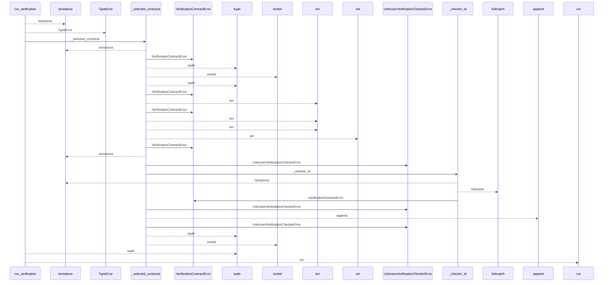
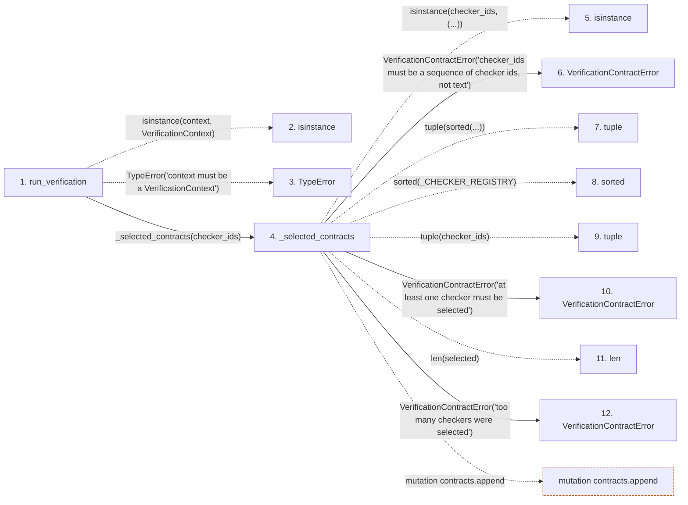

# run_verification

**Entry point:** `run_verification` (`api`)
**Source:** [verification_contracts](../modules/verification_contracts.md)
**Modules touched:** [verification_contracts](../modules/verification_contracts.md)

## Call sequence

<!-- Auto-generated from static call edges. Dashed arrows are external or unresolved calls. Reviewed runtime conditions and side effects belong in Behavior. -->

## Data flow

<!-- Auto-generated static analysis. Treat values and boundaries as best-effort hints, not runtime proof. -->

### Step data

| Step | Inputs | Reads | Writes | Returns |
|---|---|---|---|---|
| `run_verification` | `context: VerificationContext`, `checker_ids: Sequence[str] \| None` | `VerificationContext` | - | `tuple(...)` |
| `isinstance` | - | - | - | - |
| `TypeError` | - | - | - | - |
| `_selected_contracts` | `checker_ids: Sequence[str] \| None` | `_CHECKER_REGISTRY`, `MAX_CHECKS_PER_RECEIPT`, `VerificationContractError`, `_CHECKER_REGISTRY` | - | `tuple(...)` |
| `isinstance` | - | - | - | - |
| `VerificationContractError` | - | - | - | - |
| `tuple` | - | - | - | - |
| `sorted` | - | - | - | - |
| `tuple` | - | - | - | - |
| `VerificationContractError` | - | - | - | - |
| `len` | - | - | - | - |
| `VerificationContractError` | - | - | - | - |

### Call data

| From | To | Line | Call |
|---|---|---:|---|
| run_verification | isinstance | 719 | `isinstance(context, VerificationContext)` |
| run_verification | TypeError | 720 | `TypeError('context must be a VerificationContext')` |
| run_verification | _selected_contracts | 721 | `_selected_contracts(checker_ids)` |
| _selected_contracts | isinstance | 681 | `isinstance(checker_ids, (...))` |
| _selected_contracts | VerificationContractError | 682 | `VerificationContractError('checker_ids must be a sequence of checker ids, not text')` |
| _selected_contracts | tuple | 686 | `tuple(sorted(...))` |
| _selected_contracts | sorted | 686 | `sorted(_CHECKER_REGISTRY)` |
| _selected_contracts | tuple | 688 | `tuple(checker_ids)` |
| _selected_contracts | VerificationContractError | 691 | `VerificationContractError('at least one checker must be selected')` |
| _selected_contracts | len | 692 | `len(selected)` |
| _selected_contracts | VerificationContractError | 693 | `VerificationContractError('too many checkers were selected')` |

### Boundary effects

| Kind | Target | Step | Line |
|---|---|---|---:|
| mutation | `contracts.append` | `_selected_contracts` | 707 |

### Static analysis gaps

| Kind | Step | Target | Line |
|---|---|---|---:|
| unresolved_call | `run_verification` | `isinstance` | 719 |
| unresolved_call | `run_verification` | `TypeError` | 720 |
| unresolved_call | `_selected_contracts` | `isinstance` | 681 |
| unresolved_call | `_selected_contracts` | `sorted` | 686 |
| step_limit | `run_verification` | `first 12 steps` | 0 |

## Behavior

This flow starts at `run_verification` and is classified as `api`. The generated call and data-flow sections are bounded static projections; runtime conditions and side effects require source-level confirmation.
