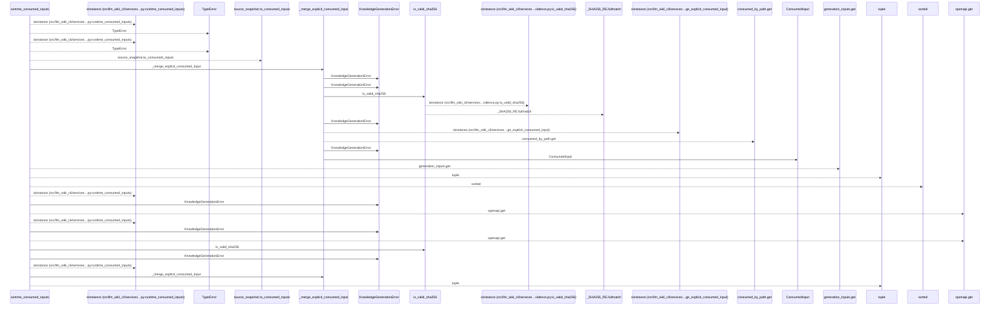
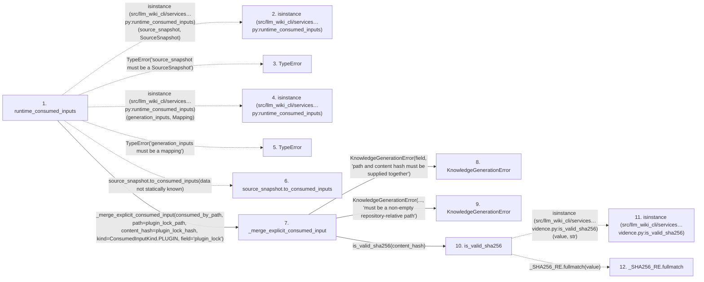

# runtime_consumed_inputs

**Entry point:** `runtime_consumed_inputs` (`api`)
**Source:** [knowledge_orchestration](../modules/knowledge_orchestration.md)
**Modules touched:** [knowledge_envelope](../modules/knowledge_envelope.md), [knowledge_evidence](../modules/knowledge_evidence.md), [knowledge_generation](../modules/knowledge_generation.md), and 1 more

**Complete modules touched:**

- [knowledge_envelope](../modules/knowledge_envelope.md)
- [knowledge_evidence](../modules/knowledge_evidence.md)
- [knowledge_generation](../modules/knowledge_generation.md)
- [knowledge_orchestration](../modules/knowledge_orchestration.md)

## Call sequence

<!-- Auto-generated from static call edges. Dashed arrows are external or unresolved calls. Reviewed runtime conditions and side effects belong in Behavior. -->

> Call sequence diagram shows 30 of 31 interactions; 1 omitted to keep the visualization within the 30-interaction and generated-diagram limits.

## Data flow

<!-- Auto-generated static analysis. Treat values and boundaries as best-effort hints, not runtime proof. -->

### Step data

| Step | Inputs | Reads | Writes | Returns |
|---|---|---|---|---|
| `runtime_consumed_inputs` | `source_snapshot: SourceSnapshot`, `generation_inputs: Mapping[str, object]`, `plugin_lock_path: str \| None`, `plugin_lock_hash: str \| None` | `SourceSnapshot`, `Mapping`, `ConsumedInputKind`, `Mapping`, `ConsumedInputKind` | - | `tuple(...)`, `tuple(...)` |
| `isinstance (src/llm_wiki_cli/services…py:runtime_consumed_inputs)` | - | - | - | - |
| `TypeError` | - | - | - | - |
| `isinstance (src/llm_wiki_cli/services…py:runtime_consumed_inputs)` | - | - | - | - |
| `TypeError` | - | - | - | - |
| `source_snapshot.to_consumed_inputs` | - | - | - | - |
| `_merge_explicit_consumed_input` | `consumed_by_path: dict[str, ConsumedInput]`, `path: str \| None`, `content_hash: str \| None`, `kind: ConsumedInputKind`, `field: str` | - | `consumed_by_path[...]` | `none` |
| `KnowledgeGenerationError` | - | - | - | - |
| `KnowledgeGenerationError` | - | - | - | - |
| `is_valid_sha256` | `value: object` | - | - | `...` |
| `isinstance (src/llm_wiki_cli/services…vidence.py:is_valid_sha256)` | - | - | - | - |
| `_SHA256_RE.fullmatch` | - | - | - | - |

### Call data

| From | To | Line | Call |
|---|---|---:|---|
| runtime_consumed_inputs | isinstance (src/llm_wiki_cli/services…py:runtime_consumed_inputs) | 1396 | `isinstance(source_snapshot, SourceSnapshot)` |
| runtime_consumed_inputs | TypeError | 1397 | `TypeError('source_snapshot must be a SourceSnapshot')` |
| runtime_consumed_inputs | isinstance (src/llm_wiki_cli/services…py:runtime_consumed_inputs) | 1398 | `isinstance(generation_inputs, Mapping)` |
| runtime_consumed_inputs | TypeError | 1399 | `TypeError('generation_inputs must be a mapping')` |
| runtime_consumed_inputs | source_snapshot.to_consumed_inputs | 1401 | `source_snapshot.to_consumed_inputs(data not statically known)` |
| runtime_consumed_inputs | _merge_explicit_consumed_input | 1403 | `_merge_explicit_consumed_input(consumed_by_path, path=plugin_lock_path, content_hash=plugin_lock_hash, kind=ConsumedInputKind.PLUGIN, field='plugin_lock')` |
| _merge_explicit_consumed_input | KnowledgeGenerationError | 1469 | `KnowledgeGenerationError(field, 'path and content hash must be supplied together')` |
| _merge_explicit_consumed_input | KnowledgeGenerationError | 1476 | `KnowledgeGenerationError(..., 'must be a non-empty repository-relative path')` |
| _merge_explicit_consumed_input | is_valid_sha256 | 1480 | `is_valid_sha256(content_hash)` |
| is_valid_sha256 | isinstance (src/llm_wiki_cli/services…vidence.py:is_valid_sha256) | 153 | `isinstance(value, str)` |
| is_valid_sha256 | _SHA256_RE.fullmatch | 153 | `_SHA256_RE.fullmatch(value)` |

### Boundary effects

*No boundary effects detected.*

### Static analysis gaps

| Kind | Step | Target | Line |
|---|---|---|---:|
| external_call | `runtime_consumed_inputs` | `isinstance` | 1396 |
| external_call | `runtime_consumed_inputs` | `TypeError` | 1397 |
| external_call | `runtime_consumed_inputs` | `isinstance` | 1398 |
| external_call | `runtime_consumed_inputs` | `TypeError` | 1399 |
| unresolved_call | `runtime_consumed_inputs` | `source_snapshot.to_consumed_inputs` | 1401 |
| external_call | `is_valid_sha256` | `isinstance` | 153 |
| unresolved_call | `is_valid_sha256` | `_SHA256_RE.fullmatch` | 153 |
| step_limit | `runtime_consumed_inputs` | `first 12 steps` | 0 |

## Behavior

This flow starts at `runtime_consumed_inputs` and is classified as `api`. The generated call and data-flow sections are bounded static projections; runtime conditions and side effects require source-level confirmation.
