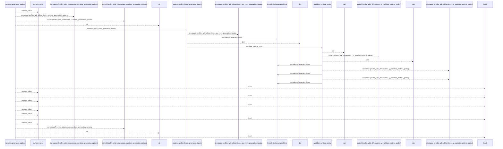
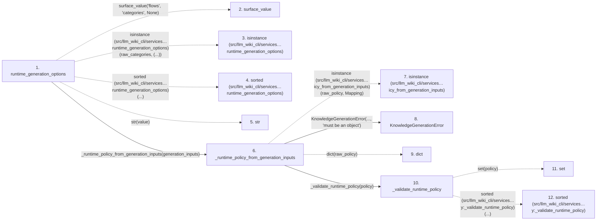

# runtime_generation_options

**Entry point:** `runtime_generation_options` (`api`)
**Source:** [knowledge_orchestration](../modules/knowledge_orchestration.md)
**Modules touched:** [knowledge_generation](../modules/knowledge_generation.md), [knowledge_orchestration](../modules/knowledge_orchestration.md)

## Call sequence

<!-- Auto-generated from static call edges. Dashed arrows are external or unresolved calls. Reviewed runtime conditions and side effects belong in Behavior. -->

## Data flow

<!-- Auto-generated static analysis. Treat values and boundaries as best-effort hints, not runtime proof. -->

### Step data

| Step | Inputs | Reads | Writes | Returns |
|---|---|---|---|---|
| `runtime_generation_options` | `surfaces: Mapping[str, Mapping[str, Any]]`, `generation_inputs: Mapping[str, object] \| None`, `include_tests: Iterable[str] \| None`, `preserve_semantic: bool` | `RUNTIME_GENERATION_OPTION_DEFAULTS`, `RUNTIME_GENERATION_OPTION_DEFAULTS` | - | `{...}` |
| `surface_value` | - | - | - | - |
| `isinstance (src/llm_wiki_cli/services…runtime_generation_options)` | - | - | - | - |
| `sorted (src/llm_wiki_cli/services…runtime_generation_options)` | - | - | - | - |
| `str` | - | - | - | - |
| `_runtime_policy_from_generation_inputs` | `generation_inputs: Mapping[str, object] \| None` | `RUNTIME_GENERATION_INPUT_KEY`, `RUNTIME_GENERATION_INPUT_KEY`, `Mapping`, `RUNTIME_GENERATION_INPUT_KEY` | - | `None`, `policy` |
| `isinstance (src/llm_wiki_cli/services…icy_from_generation_inputs)` | - | - | - | - |
| `KnowledgeGenerationError` | - | - | - | - |
| `dict` | - | - | - | - |
| `_validate_runtime_policy` | `policy: Mapping[str, object]` | `_RUNTIME_POLICY_KEYS`, `_RUNTIME_POLICY_KEYS`, `_RUNTIME_POLICY_KEYS`, `RUNTIME_GENERATION_INPUT_KEY`, `RUNTIME_GENERATION_INPUT_KEY`, `_DEPENDENCY_GRAPH_DETAILS`, `RUNTIME_GENERATION_INPUT_KEY` | - | - |
| `set` | - | - | - | - |
| `sorted (src/llm_wiki_cli/services…y:_validate_runtime_policy)` | - | - | - | - |

### Call data

| From | To | Line | Call |
|---|---|---:|---|
| runtime_generation_options | surface_value | 1080 | `surface_value('flows', 'categories', None)` |
| runtime_generation_options | isinstance (src/llm_wiki_cli/services…runtime_generation_options) | 1083 | `isinstance(raw_categories, (...))` |
| runtime_generation_options | sorted (src/llm_wiki_cli/services…runtime_generation_options) | 1082 | `sorted(...)` |
| runtime_generation_options | str | 1082 | `str(value)` |
| runtime_generation_options | _runtime_policy_from_generation_inputs | 1086 | `_runtime_policy_from_generation_inputs(generation_inputs)` |
| _runtime_policy_from_generation_inputs | isinstance (src/llm_wiki_cli/services…icy_from_generation_inputs) | 1168 | `isinstance(raw_policy, Mapping)` |
| _runtime_policy_from_generation_inputs | KnowledgeGenerationError | 1169 | `KnowledgeGenerationError(..., 'must be an object')` |
| _runtime_policy_from_generation_inputs | dict | 1173 | `dict(raw_policy)` |
| _runtime_policy_from_generation_inputs | _validate_runtime_policy | 1174 | `_validate_runtime_policy(policy)` |
| _validate_runtime_policy | set | 1179 | `set(policy)` |
| _validate_runtime_policy | sorted (src/llm_wiki_cli/services…y:_validate_runtime_policy) | 1181 | `sorted(...)` |

### Boundary effects

*No boundary effects detected.*

### Static analysis gaps

| Kind | Step | Target | Line |
|---|---|---|---:|
| unresolved_call | `runtime_generation_options` | `surface_value` | 1080 |
| external_call | `runtime_generation_options` | `isinstance` | 1083 |
| external_call | `runtime_generation_options` | `sorted` | 1082 |
| external_call | `_runtime_policy_from_generation_inputs` | `isinstance` | 1168 |
| external_call | `_validate_runtime_policy` | `sorted` | 1181 |
| step_limit | `runtime_generation_options` | `first 12 steps` | 0 |

## Behavior

This flow starts at `runtime_generation_options` and is classified as `api`. The generated call and data-flow sections are bounded static projections; runtime conditions and side effects require source-level confirmation.
