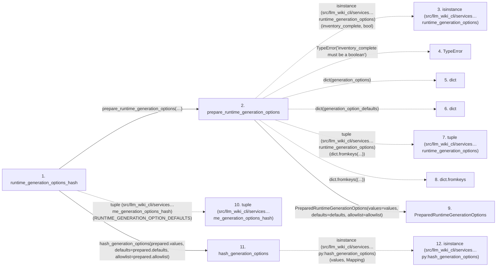

# runtime_generation_options_hash

**Entry point:** `runtime_generation_options_hash` (`api`)
**Source:** [knowledge_orchestration](../modules/knowledge_orchestration.md)
**Modules touched:** [knowledge_envelope](../modules/knowledge_envelope.md), [knowledge_evidence](../modules/knowledge_evidence.md), [knowledge_orchestration](../modules/knowledge_orchestration.md)

## Call sequence

```mermaid
sequenceDiagram
    participant p0 as runtime_generation_options_hash
    participant p1 as prepare_runtime_generation_options
    participant p2 as isinstance (src/llm_wiki_cli/services…runtime_generation_options)
    participant p3 as TypeError
    participant p4 as dict
    participant p5 as tuple (src/llm_wiki_cli/services…runtime_generation_options)
    participant p6 as dict.fromkeys
    participant p7 as PreparedRuntimeGenerationOptions
    participant p8 as tuple (src/llm_wiki_cli/services…me_generation_options_hash)
    participant p9 as hash_generation_options
    participant p10 as isinstance (src/llm_wiki_cli/services…py:hash_generation_options)
    participant p11 as KnowledgeEnvelopeError
    participant p12 as _normalized_allowlist
    participant p13 as isinstance (src/llm_wiki_cli/services…e.py:_normalized_allowlist)
    participant p14 as tuple (src/llm_wiki_cli/services…e.py:_normalized_allowlist)
    participant p15 as any (src/llm_wiki_cli/services…e.py:_normalized_allowlist)
    participant p16 as len
    participant p17 as set (src/llm_wiki_cli/services…e.py:_normalized_allowlist)
    participant p18 as sorted
    participant p19 as _reject_unknown_option_keys
    participant p20 as any (src/llm_wiki_cli/services…reject_unknown_option_keys)
    p0->>p1: prepare_runtime_generation_options
    p1-->>p2: isinstance (src/llm_wiki_cli/services…runtime_generation_options)
    p1-->>p3: TypeError
    p1-->>p4: dict
    p1-->>p4: dict
    p1-->>p5: tuple (src/llm_wiki_cli/services…runtime_generation_options)
    p1-->>p6: dict.fromkeys
    p1->>p7: PreparedRuntimeGenerationOptions
    p0-->>p8: tuple (src/llm_wiki_cli/services…me_generation_options_hash)
    p0->>p9: hash_generation_options
    p9-->>p10: isinstance (src/llm_wiki_cli/services…py:hash_generation_options)
    p9->>p11: KnowledgeEnvelopeError
    p9-->>p10: isinstance (src/llm_wiki_cli/services…py:hash_generation_options)
    p9->>p11: KnowledgeEnvelopeError
    p9->>p12: _normalized_allowlist
    p12-->>p13: isinstance (src/llm_wiki_cli/services…e.py:_normalized_allowlist)
    p12->>p11: KnowledgeEnvelopeError
    p12-->>p14: tuple (src/llm_wiki_cli/services…e.py:_normalized_allowlist)
    p12->>p11: KnowledgeEnvelopeError
    p12-->>p15: any (src/llm_wiki_cli/services…e.py:_normalized_allowlist)
    p12-->>p13: isinstance (src/llm_wiki_cli/services…e.py:_normalized_allowlist)
    p12->>p11: KnowledgeEnvelopeError
    p12-->>p16: len
    p12-->>p16: len
    p12-->>p17: set (src/llm_wiki_cli/services…e.py:_normalized_allowlist)
    p12->>p11: KnowledgeEnvelopeError
    p12-->>p14: tuple (src/llm_wiki_cli/services…e.py:_normalized_allowlist)
    p12-->>p18: sorted
    p9->>p19: _reject_unknown_option_keys
    p19-->>p20: any (src/llm_wiki_cli/services…reject_unknown_option_keys)
```

<!-- Auto-generated from static call edges. Dashed arrows are external or unresolved calls. Reviewed runtime conditions and side effects belong in Behavior. -->

> Call sequence diagram shows 30 of 54 interactions; 24 omitted to keep the visualization within the 30-interaction and generated-diagram limits.

## Data flow

<!-- Auto-generated static analysis. Treat values and boundaries as best-effort hints, not runtime proof. -->

### Step data

| Step | Inputs | Reads | Writes | Returns |
|---|---|---|---|---|
| `runtime_generation_options_hash` | `generation_options: Mapping[str, Any]`, `inventory_complete: bool` | `RUNTIME_GENERATION_OPTION_DEFAULTS`, `RUNTIME_GENERATION_OPTION_DEFAULTS` | - | `hash_generation_options(...)` |
| `prepare_runtime_generation_options` | `generation_options: Mapping[str, Any]`, `generation_option_defaults: Mapping[str, Any]`, `generation_option_allowlist: Sequence[str]`, `inventory_complete: bool` | - | `values[...]`, `defaults[...]` | `PreparedRuntimeGenerationOptions(...)` |
| `isinstance (src/llm_wiki_cli/services…runtime_generation_options)` | - | - | - | - |
| `TypeError` | - | - | - | - |
| `dict` | - | - | - | - |
| `dict` | - | - | - | - |
| `tuple (src/llm_wiki_cli/services…runtime_generation_options)` | - | - | - | - |
| `dict.fromkeys` | - | - | - | - |
| `PreparedRuntimeGenerationOptions` | - | - | - | - |
| `tuple (src/llm_wiki_cli/services…me_generation_options_hash)` | - | - | - | - |
| `hash_generation_options` | `values: Mapping[str, Any]`, `defaults: Mapping[str, Any]`, `allowlist: Iterable[str]` | `Mapping`, `Mapping`, `GENERATION_OPTIONS_DOMAIN` | `effective[...]`, `effective[...]` | `_hash_structured(...)` |
| `isinstance (src/llm_wiki_cli/services…py:hash_generation_options)` | - | - | - | - |

### Call data

| From | To | Line | Call |
|---|---|---:|---|
| runtime_generation_options_hash | prepare_runtime_generation_options | 1126 | `prepare_runtime_generation_options(generation_options, generation_option_defaults=RUNTIME_GENERATION_OPTION_DEFAULTS, generation_option_allowlist=tuple(...), inventory_complete=inventory_complete)` |
| prepare_runtime_generation_options | isinstance (src/llm_wiki_cli/services…runtime_generation_options) | 317 | `isinstance(inventory_complete, bool)` |
| prepare_runtime_generation_options | TypeError | 318 | `TypeError('inventory_complete must be a boolean')` |
| prepare_runtime_generation_options | dict | 319 | `dict(generation_options)` |
| prepare_runtime_generation_options | dict | 321 | `dict(generation_option_defaults)` |
| prepare_runtime_generation_options | tuple (src/llm_wiki_cli/services…runtime_generation_options) | 323 | `tuple(dict.fromkeys(...))` |
| prepare_runtime_generation_options | dict.fromkeys | 324 | `dict.fromkeys((...))` |
| prepare_runtime_generation_options | PreparedRuntimeGenerationOptions | 326 | `PreparedRuntimeGenerationOptions(values=values, defaults=defaults, allowlist=allowlist)` |
| runtime_generation_options_hash | tuple (src/llm_wiki_cli/services…me_generation_options_hash) | 1129 | `tuple(RUNTIME_GENERATION_OPTION_DEFAULTS)` |
| runtime_generation_options_hash | hash_generation_options | 1132 | `hash_generation_options(prepared.values, defaults=prepared.defaults, allowlist=prepared.allowlist)` |
| hash_generation_options | isinstance (src/llm_wiki_cli/services…py:hash_generation_options) | 827 | `isinstance(values, Mapping)` |

### Boundary effects

*No boundary effects detected.*

### Static analysis gaps

| Kind | Step | Target | Line |
|---|---|---|---:|
| external_call | `prepare_runtime_generation_options` | `isinstance` | 317 |
| external_call | `prepare_runtime_generation_options` | `TypeError` | 318 |
| external_call | `prepare_runtime_generation_options` | `dict.fromkeys` | 324 |
| external_call | `hash_generation_options` | `isinstance` | 827 |
| step_limit | `runtime_generation_options_hash` | `first 12 steps` | 0 |

## Behavior

This flow starts at `runtime_generation_options_hash` and is classified as `api`. The generated call and data-flow sections are bounded static projections; runtime conditions and side effects require source-level confirmation.
