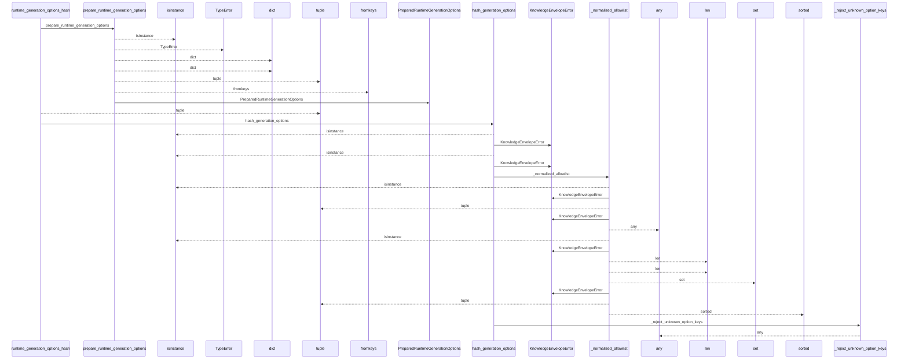
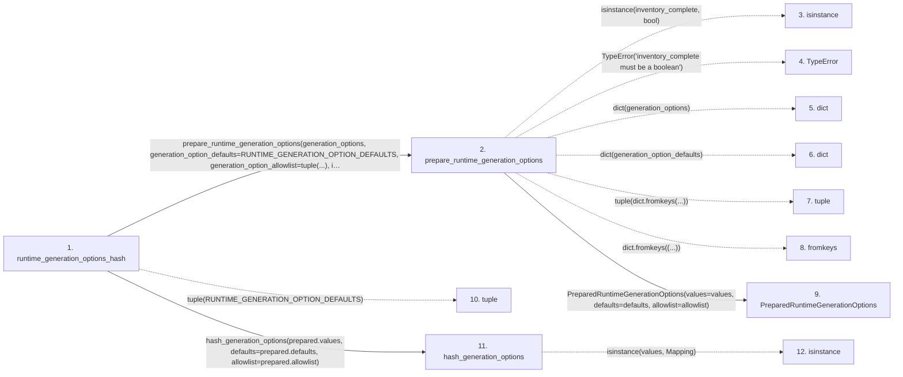

# runtime_generation_options_hash

**Entry point:** `runtime_generation_options_hash` (`api`)
**Source:** [knowledge_orchestration](../modules/knowledge_orchestration.md)
**Modules touched:** [knowledge_envelope](../modules/knowledge_envelope.md), [knowledge_evidence](../modules/knowledge_evidence.md), [knowledge_orchestration](../modules/knowledge_orchestration.md)

## Call sequence

<!-- Auto-generated from static call edges. Dashed arrows are external or unresolved calls. Reviewed runtime conditions and side effects belong in Behavior. -->

> Call sequence diagram shows 30 of 54 interactions; 24 omitted to keep the visualization within the 30-interaction and generated-diagram limits.

## Data flow

<!-- Auto-generated static analysis. Treat values and boundaries as best-effort hints, not runtime proof. -->

### Step data

| Step | Inputs | Reads | Writes | Returns |
|---|---|---|---|---|
| `runtime_generation_options_hash` | `generation_options: Mapping[str, Any]`, `inventory_complete: bool` | `RUNTIME_GENERATION_OPTION_DEFAULTS`, `RUNTIME_GENERATION_OPTION_DEFAULTS` | - | `hash_generation_options(...)` |
| `prepare_runtime_generation_options` | `generation_options: Mapping[str, Any]`, `generation_option_defaults: Mapping[str, Any]`, `generation_option_allowlist: Sequence[str]`, `inventory_complete: bool` | - | `values[...]`, `defaults[...]` | `PreparedRuntimeGenerationOptions(...)` |
| `isinstance` | - | - | - | - |
| `TypeError` | - | - | - | - |
| `dict` | - | - | - | - |
| `dict` | - | - | - | - |
| `tuple` | - | - | - | - |
| `fromkeys` | - | - | - | - |
| `PreparedRuntimeGenerationOptions` | - | - | - | - |
| `tuple` | - | - | - | - |
| `hash_generation_options` | `values: Mapping[str, Any]`, `defaults: Mapping[str, Any]`, `allowlist: Iterable[str]` | `Mapping`, `Mapping`, `GENERATION_OPTIONS_DOMAIN` | `effective[...]`, `effective[...]` | `_hash_structured(...)` |
| `isinstance` | - | - | - | - |

### Call data

| From | To | Line | Call |
|---|---|---:|---|
| runtime_generation_options_hash | prepare_runtime_generation_options | 960 | `prepare_runtime_generation_options(generation_options, generation_option_defaults=RUNTIME_GENERATION_OPTION_DEFAULTS, generation_option_allowlist=tuple(...), inventory_complete=inventory_complete)` |
| prepare_runtime_generation_options | isinstance | 219 | `isinstance(inventory_complete, bool)` |
| prepare_runtime_generation_options | TypeError | 220 | `TypeError('inventory_complete must be a boolean')` |
| prepare_runtime_generation_options | dict | 221 | `dict(generation_options)` |
| prepare_runtime_generation_options | dict | 223 | `dict(generation_option_defaults)` |
| prepare_runtime_generation_options | tuple | 225 | `tuple(dict.fromkeys(...))` |
| prepare_runtime_generation_options | fromkeys | 226 | `dict.fromkeys((...))` |
| prepare_runtime_generation_options | PreparedRuntimeGenerationOptions | 228 | `PreparedRuntimeGenerationOptions(values=values, defaults=defaults, allowlist=allowlist)` |
| runtime_generation_options_hash | tuple | 963 | `tuple(RUNTIME_GENERATION_OPTION_DEFAULTS)` |
| runtime_generation_options_hash | hash_generation_options | 966 | `hash_generation_options(prepared.values, defaults=prepared.defaults, allowlist=prepared.allowlist)` |
| hash_generation_options | isinstance | 818 | `isinstance(values, Mapping)` |

### Boundary effects

*No boundary effects detected.*

### Static analysis gaps

| Kind | Step | Target | Line |
|---|---|---|---:|
| unresolved_call | `prepare_runtime_generation_options` | `isinstance` | 219 |
| unresolved_call | `prepare_runtime_generation_options` | `TypeError` | 220 |
| unresolved_call | `prepare_runtime_generation_options` | `dict.fromkeys` | 226 |
| unresolved_call | `hash_generation_options` | `isinstance` | 818 |
| step_limit | `runtime_generation_options_hash` | `first 12 steps` | 0 |

## Behavior

This flow starts at `runtime_generation_options_hash` and is classified as `api`. The generated call and data-flow sections are bounded static projections; runtime conditions and side effects require source-level confirmation.
