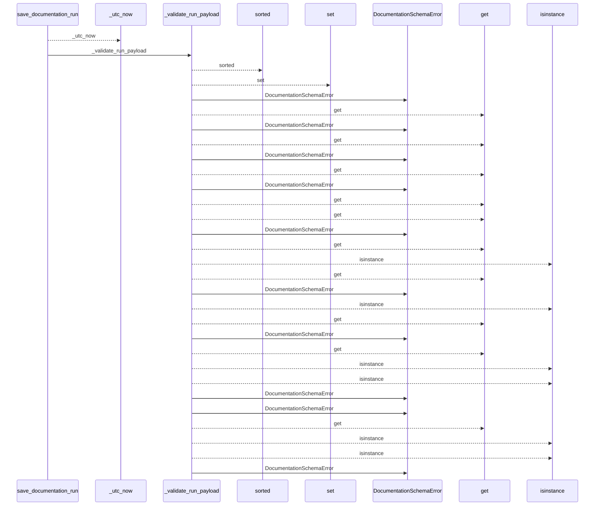
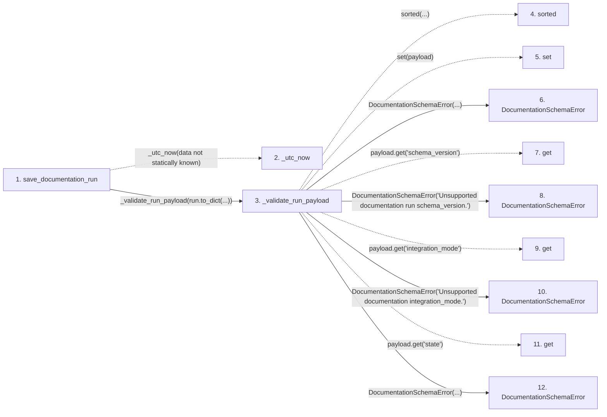

# save_documentation_run

**Entry point:** `save_documentation_run` (`api`)
**Source:** [workspace](../modules/workspace.md)
**Modules touched:** [config](../modules/config.md), [documentation_policy](../modules/documentation_policy.md), [documentation_run_contracts](../modules/documentation_run_contracts.md), and 6 more

**Complete modules touched:**

- [config](../modules/config.md)
- [documentation_policy](../modules/documentation_policy.md)
- [documentation_run_contracts](../modules/documentation_run_contracts.md)
- [documentation_run_schema](../modules/documentation_run_schema.md)
- [filesystem_guard](../modules/filesystem_guard.md)
- [io](../modules/io.md)
- [source_selection](../modules/source_selection.md)
- [validation](../modules/validation.md)
- [workspace](../modules/workspace.md)

## Call sequence

<!-- Auto-generated from static call edges. Dashed arrows are external or unresolved calls. Reviewed runtime conditions and side effects belong in Behavior. -->

> Call sequence diagram shows 30 of 913 interactions; 883 omitted to keep the visualization within the 30-interaction and generated-diagram limits.

> Trace truncated at the depth limit; deeper calls are omitted.

## Data flow

<!-- Auto-generated static analysis. Treat values and boundaries as best-effort hints, not runtime proof. -->

### Step data

| Step | Inputs | Reads | Writes | Returns |
|---|---|---|---|---|
| `save_documentation_run` | `workspace: str \| Path`, `run: DocumentationRun` | - | `run.updated_at` | `run` |
| `_utc_now` | - | - | - | - |
| `_validate_run_payload` | `payload: Mapping[str, Any]` | - | - | - |
| `sorted` | - | - | - | - |
| `set` | - | - | - | - |
| `DocumentationSchemaError` | - | - | - | - |
| `get` | - | - | - | - |
| `DocumentationSchemaError` | - | - | - | - |
| `get` | - | - | - | - |
| `DocumentationSchemaError` | - | - | - | - |
| `get` | - | - | - | - |
| `DocumentationSchemaError` | - | - | - | - |

### Call data

| From | To | Line | Call |
|---|---|---:|---|
| save_documentation_run | _utc_now | 36 | `_utc_now(data not statically known)` |
| save_documentation_run | _validate_run_payload | 37 | `_validate_run_payload(run.to_dict(...))` |
| _validate_run_payload | sorted | 163 | `sorted(...)` |
| _validate_run_payload | set | 163 | `set(payload)` |
| _validate_run_payload | DocumentationSchemaError | 165 | `DocumentationSchemaError(...)` |
| _validate_run_payload | get | 168 | `payload.get('schema_version')` |
| _validate_run_payload | DocumentationSchemaError | 169 | `DocumentationSchemaError('Unsupported documentation run schema_version.')` |
| _validate_run_payload | get | 170 | `payload.get('integration_mode')` |
| _validate_run_payload | DocumentationSchemaError | 171 | `DocumentationSchemaError('Unsupported documentation integration_mode.')` |
| _validate_run_payload | get | 172 | `payload.get('state')` |
| _validate_run_payload | DocumentationSchemaError | 173 | `DocumentationSchemaError(...)` |

### Boundary effects

*No boundary effects detected.*

### Static analysis gaps

| Kind | Step | Target | Line |
|---|---|---|---:|
| unresolved_call | `save_documentation_run` | `_utc_now` | 36 |
| unresolved_call | `_validate_run_payload` | `sorted` | 163 |
| unresolved_call | `_validate_run_payload` | `payload.get` | 168 |
| unresolved_call | `_validate_run_payload` | `payload.get` | 170 |
| unresolved_call | `_validate_run_payload` | `payload.get` | 172 |
| step_limit | `save_documentation_run` | `first 12 steps` | 0 |
| truncated_flow | `save_documentation_run` | `depth limit` | 0 |

## Behavior

This flow starts at `save_documentation_run` and is classified as `api`. The generated call and data-flow sections are bounded static projections; runtime conditions and side effects require source-level confirmation.
