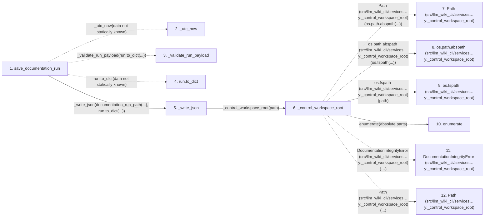

# save_documentation_run

**Entry point:** `save_documentation_run` (`api`)
**Source:** [workspace](../modules/workspace.md)
**Modules touched:** [workspace](../modules/workspace.md)

## Call sequence

```mermaid
sequenceDiagram
    participant p0 as save_documentation_run
    participant p1 as _utc_now
    participant p2 as _validate_run_payload
    participant p3 as run.to_dict
    participant p4 as _write_json
    participant p5 as _control_workspace_root
    participant p6 as Path (src/llm_wiki_cli/services…y:_control_workspace_root)
    participant p7 as os.path.abspath (src/llm_wiki_cli/services…y:_control_workspace_root)
    participant p8 as os.fspath (src/llm_wiki_cli/services…y:_control_workspace_root)
    participant p9 as enumerate
    participant p10 as DocumentationIntegrityError (src/llm_wiki_cli/services…y:_control_workspace_root)
    participant p11 as _write_workspace_text
    participant p12 as Path (src/llm_wiki_cli/services….py:_write_workspace_text)
    participant p13 as os.path.abspath (src/llm_wiki_cli/services….py:_write_workspace_text)
    participant p14 as os.fspath (src/llm_wiki_cli/services….py:_write_workspace_text)
    participant p15 as target.relative_to
    participant p16 as DocumentationIntegrityError (src/llm_wiki_cli/services….py:_write_workspace_text)
    participant p17 as _assert_existing_workspace_layout_safe
    participant p18 as os.path.lexists (src/llm_wiki_cli/services…ing_workspace_layout_safe)
    participant p19 as _assert_safe_workspace_directory
    participant p20 as directory.lstat
    participant p21 as DocumentationIntegrityError (src/llm_wiki_cli/services…_safe_workspace_directory)
    participant p22 as bool (src/llm_wiki_cli/services…_safe_workspace_directory)
    participant p23 as getattr (src/llm_wiki_cli/services…_safe_workspace_directory)
    participant p24 as stat.S_ISLNK (src/llm_wiki_cli/services…_safe_workspace_directory)
    p0-->>p1: _utc_now
    p0-->>p2: _validate_run_payload
    p0-->>p3: run.to_dict
    p0->>p4: _write_json
    p4->>p5: _control_workspace_root
    p5-->>p6: Path (src/llm_wiki_cli/services…y:_control_workspace_root)
    p5-->>p7: os.path.abspath (src/llm_wiki_cli/services…y:_control_workspace_root)
    p5-->>p8: os.fspath (src/llm_wiki_cli/services…y:_control_workspace_root)
    p5-->>p9: enumerate
    p5-->>p10: DocumentationIntegrityError (src/llm_wiki_cli/services…y:_control_workspace_root)
    p5-->>p6: Path (src/llm_wiki_cli/services…y:_control_workspace_root)
    p4->>p11: _write_workspace_text
    p11-->>p12: Path (src/llm_wiki_cli/services….py:_write_workspace_text)
    p11-->>p13: os.path.abspath (src/llm_wiki_cli/services….py:_write_workspace_text)
    p11-->>p14: os.fspath (src/llm_wiki_cli/services….py:_write_workspace_text)
    p11-->>p12: Path (src/llm_wiki_cli/services….py:_write_workspace_text)
    p11-->>p13: os.path.abspath (src/llm_wiki_cli/services….py:_write_workspace_text)
    p11-->>p14: os.fspath (src/llm_wiki_cli/services….py:_write_workspace_text)
    p11-->>p15: target.relative_to
    p11-->>p16: DocumentationIntegrityError (src/llm_wiki_cli/services….py:_write_workspace_text)
    p11->>p17: _assert_existing_workspace_layout_safe
    p17-->>p18: os.path.lexists (src/llm_wiki_cli/services…ing_workspace_layout_safe)
    p17->>p19: _assert_safe_workspace_directory
    p19-->>p20: directory.lstat
    p19-->>p21: DocumentationIntegrityError (src/llm_wiki_cli/services…_safe_workspace_directory)
    p19-->>p22: bool (src/llm_wiki_cli/services…_safe_workspace_directory)
    p19-->>p23: getattr (src/llm_wiki_cli/services…_safe_workspace_directory)
    p19-->>p22: bool (src/llm_wiki_cli/services…_safe_workspace_directory)
    p19-->>p23: getattr (src/llm_wiki_cli/services…_safe_workspace_directory)
    p19-->>p24: stat.S_ISLNK (src/llm_wiki_cli/services…_safe_workspace_directory)
```

<!-- Auto-generated from static call edges. Dashed arrows are external or unresolved calls. Reviewed runtime conditions and side effects belong in Behavior. -->

> Call sequence diagram shows 30 of 193 interactions; 163 omitted to keep the visualization within the 30-interaction and generated-diagram limits.

## Data flow

<!-- Auto-generated static analysis. Treat values and boundaries as best-effort hints, not runtime proof. -->

### Step data

| Step | Inputs | Reads | Writes | Returns |
|---|---|---|---|---|
| `save_documentation_run` | `workspace: str \| Path`, `run: DocumentationRun` | - | `run.updated_at` | `run` |
| `_utc_now` | - | - | - | - |
| `_validate_run_payload` | - | - | - | - |
| `run.to_dict` | - | - | - | - |
| `_write_json` | `path: Path`, `payload: Mapping[str, Any]` | - | - | - |
| `_control_workspace_root` | `path: Path` | - | - | `Path(...)` |
| `Path (src/llm_wiki_cli/services…y:_control_workspace_root)` | - | - | - | - |
| `os.path.abspath (src/llm_wiki_cli/services…y:_control_workspace_root)` | - | - | - | - |
| `os.fspath (src/llm_wiki_cli/services…y:_control_workspace_root)` | - | - | - | - |
| `enumerate` | - | - | - | - |
| `DocumentationIntegrityError (src/llm_wiki_cli/services…y:_control_workspace_root)` | - | - | - | - |
| `Path (src/llm_wiki_cli/services…y:_control_workspace_root)` | - | - | - | - |

### Call data

| From | To | Line | Call |
|---|---|---:|---|
| save_documentation_run | _utc_now | 36 | `_utc_now(data not statically known)` |
| save_documentation_run | _validate_run_payload | 37 | `_validate_run_payload(run.to_dict(...))` |
| save_documentation_run | run.to_dict | 37 | `run.to_dict(data not statically known)` |
| save_documentation_run | _write_json | 38 | `_write_json(documentation_run_path(...), run.to_dict(...))` |
| _write_json | _control_workspace_root | 745 | `_control_workspace_root(path)` |
| _control_workspace_root | Path (src/llm_wiki_cli/services…y:_control_workspace_root) | 754 | `Path(os.path.abspath(...))` |
| _control_workspace_root | os.path.abspath (src/llm_wiki_cli/services…y:_control_workspace_root) | 754 | `os.path.abspath(os.fspath(...))` |
| _control_workspace_root | os.fspath (src/llm_wiki_cli/services…y:_control_workspace_root) | 754 | `os.fspath(path)` |
| _control_workspace_root | enumerate | 757 | `enumerate(absolute.parts)` |
| _control_workspace_root | DocumentationIntegrityError (src/llm_wiki_cli/services…y:_control_workspace_root) | 761 | `DocumentationIntegrityError('Lifecycle JSON writes must remain under the documentation control directory.')` |
| _control_workspace_root | Path (src/llm_wiki_cli/services…y:_control_workspace_root) | 764 | `Path(...)` |

### Boundary effects

*No boundary effects detected.*

### Static analysis gaps

| Kind | Step | Target | Line |
|---|---|---|---:|
| unresolved_call | `save_documentation_run` | `_utc_now` | 36 |
| unresolved_call | `save_documentation_run` | `_validate_run_payload` | 37 |
| unresolved_call | `save_documentation_run` | `run.to_dict` | 37 |
| unresolved_call | `_control_workspace_root` | `os.path.abspath` | 754 |
| unresolved_call | `_control_workspace_root` | `os.fspath` | 754 |
| unresolved_call | `_control_workspace_root` | `enumerate` | 757 |
| unresolved_call | `_control_workspace_root` | `DocumentationIntegrityError` | 761 |
| step_limit | `save_documentation_run` | `first 12 steps` | 0 |

## Behavior

This flow starts at `save_documentation_run` and is classified as `api`. The generated call and data-flow sections are bounded static projections; runtime conditions and side effects require source-level confirmation.
