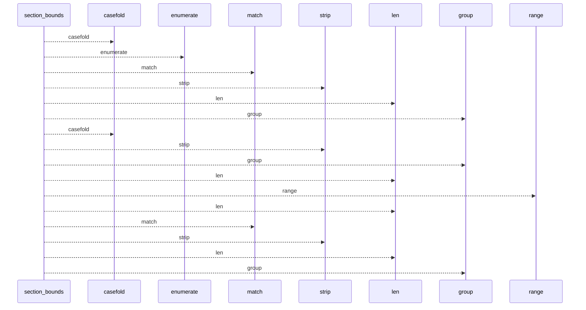
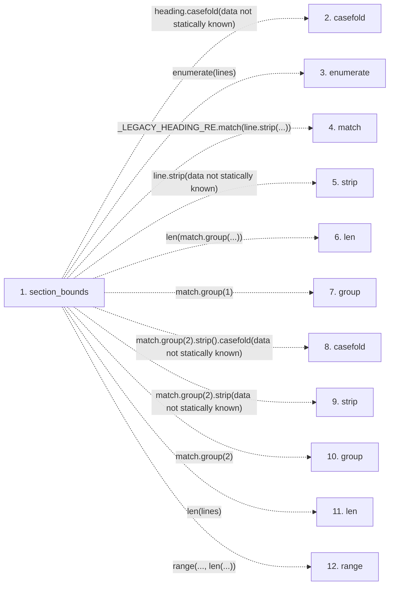

# section_bounds

**Entry point:** `section_bounds` (`api`)
**Source:** [markdown_sections](../modules/markdown_sections.md)
**Modules touched:** [markdown_sections](../modules/markdown_sections.md)

## Call sequence

<!-- Auto-generated from static call edges. Dashed arrows are external or unresolved calls. Reviewed runtime conditions and side effects belong in Behavior. -->

## Data flow

<!-- Auto-generated static analysis. Treat values and boundaries as best-effort hints, not runtime proof. -->

### Step data

| Step | Inputs | Reads | Writes | Returns |
|---|---|---|---|---|
| `section_bounds` | `lines: list[str]`, `heading: str` | - | - | `(...)`, `None` |
| `casefold` | - | - | - | - |
| `enumerate` | - | - | - | - |
| `match` | - | - | - | - |
| `strip` | - | - | - | - |
| `len` | - | - | - | - |
| `group` | - | - | - | - |
| `casefold` | - | - | - | - |
| `strip` | - | - | - | - |
| `group` | - | - | - | - |
| `len` | - | - | - | - |
| `range` | - | - | - | - |

### Call data

| From | To | Line | Call |
|---|---|---:|---|
| section_bounds | casefold | 661 | `heading.casefold(data not statically known)` |
| section_bounds | enumerate | 662 | `enumerate(lines)` |
| section_bounds | match | 663 | `_LEGACY_HEADING_RE.match(line.strip(...))` |
| section_bounds | strip | 663 | `line.strip(data not statically known)` |
| section_bounds | len | 666 | `len(match.group(...))` |
| section_bounds | group | 666 | `match.group(1)` |
| section_bounds | casefold | 667 | `match.group(2).strip().casefold(data not statically known)` |
| section_bounds | strip | 667 | `match.group(2).strip(data not statically known)` |
| section_bounds | group | 667 | `match.group(2)` |
| section_bounds | len | 670 | `len(lines)` |
| section_bounds | range | 671 | `range(..., len(...))` |

### Boundary effects

*No boundary effects detected.*

### Static analysis gaps

| Kind | Step | Target | Line |
|---|---|---|---:|
| unresolved_call | `section_bounds` | `heading.casefold` | 661 |
| unresolved_call | `section_bounds` | `enumerate` | 662 |
| unresolved_call | `section_bounds` | `_LEGACY_HEADING_RE.match` | 663 |
| unresolved_call | `section_bounds` | `line.strip` | 663 |
| unresolved_call | `section_bounds` | `match.group` | 666 |
| unresolved_call | `section_bounds` | `match.group(2).strip().casefold` | 667 |
| unresolved_call | `section_bounds` | `match.group(2).strip` | 667 |
| unresolved_call | `section_bounds` | `match.group` | 667 |
| unresolved_call | `section_bounds` | `range` | 671 |
| step_limit | `section_bounds` | `first 12 steps` | 0 |

## Behavior

This flow starts at `section_bounds` and is classified as `api`. The generated call and data-flow sections are bounded static projections; runtime conditions and side effects require source-level confirmation.
