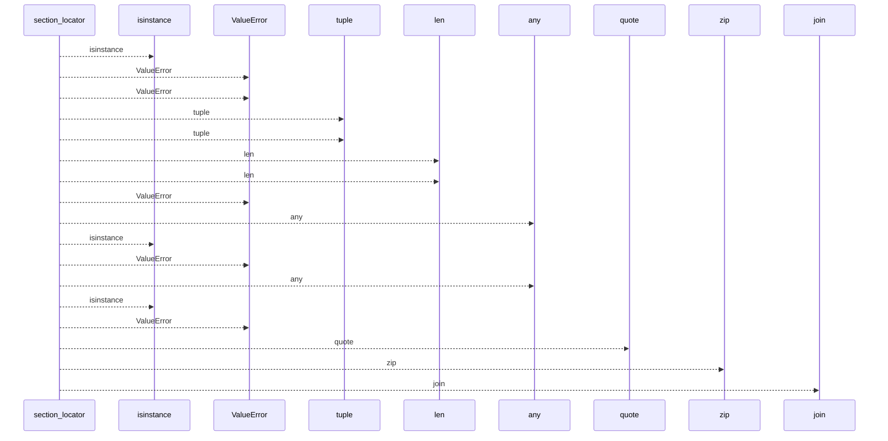
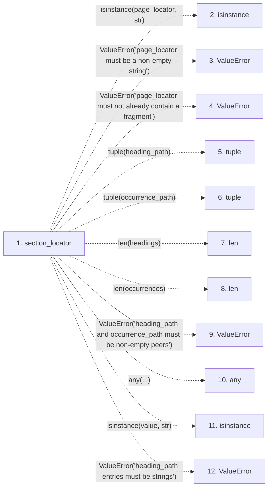

# section_locator

**Entry point:** `section_locator` (`api`)
**Source:** [markdown_sections](../modules/markdown_sections.md)
**Modules touched:** [markdown_sections](../modules/markdown_sections.md)

## Call sequence

<!-- Auto-generated from static call edges. Dashed arrows are external or unresolved calls. Reviewed runtime conditions and side effects belong in Behavior. -->

## Data flow

<!-- Auto-generated static analysis. Treat values and boundaries as best-effort hints, not runtime proof. -->

### Step data

| Step | Inputs | Reads | Writes | Returns |
|---|---|---|---|---|
| `section_locator` | `page_locator: str`, `heading_path: Iterable[str]`, `occurrence_path: Iterable[int]` | - | - | `...` |
| `isinstance` | - | - | - | - |
| `ValueError` | - | - | - | - |
| `ValueError` | - | - | - | - |
| `tuple` | - | - | - | - |
| `tuple` | - | - | - | - |
| `len` | - | - | - | - |
| `len` | - | - | - | - |
| `ValueError` | - | - | - | - |
| `any` | - | - | - | - |
| `isinstance` | - | - | - | - |
| `ValueError` | - | - | - | - |

### Call data

| From | To | Line | Call |
|---|---|---:|---|
| section_locator | isinstance | 300 | `isinstance(page_locator, str)` |
| section_locator | ValueError | 301 | `ValueError('page_locator must be a non-empty string')` |
| section_locator | ValueError | 303 | `ValueError('page_locator must not already contain a fragment')` |
| section_locator | tuple | 304 | `tuple(heading_path)` |
| section_locator | tuple | 305 | `tuple(occurrence_path)` |
| section_locator | len | 306 | `len(headings)` |
| section_locator | len | 306 | `len(occurrences)` |
| section_locator | ValueError | 307 | `ValueError('heading_path and occurrence_path must be non-empty peers')` |
| section_locator | any | 308 | `any(...)` |
| section_locator | isinstance | 308 | `isinstance(value, str)` |
| section_locator | ValueError | 309 | `ValueError('heading_path entries must be strings')` |

### Boundary effects

*No boundary effects detected.*

### Static analysis gaps

| Kind | Step | Target | Line |
|---|---|---|---:|
| unresolved_call | `section_locator` | `isinstance` | 300 |
| unresolved_call | `section_locator` | `ValueError` | 301 |
| unresolved_call | `section_locator` | `ValueError` | 303 |
| unresolved_call | `section_locator` | `ValueError` | 307 |
| unresolved_call | `section_locator` | `any` | 308 |
| unresolved_call | `section_locator` | `isinstance` | 308 |
| unresolved_call | `section_locator` | `ValueError` | 309 |
| step_limit | `section_locator` | `first 12 steps` | 0 |

## Behavior

This flow starts at `section_locator` and is classified as `api`. The generated call and data-flow sections are bounded static projections; runtime conditions and side effects require source-level confirmation.
