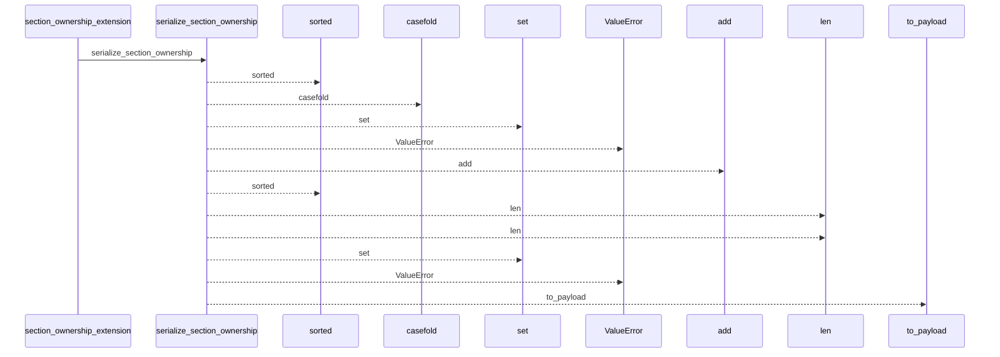
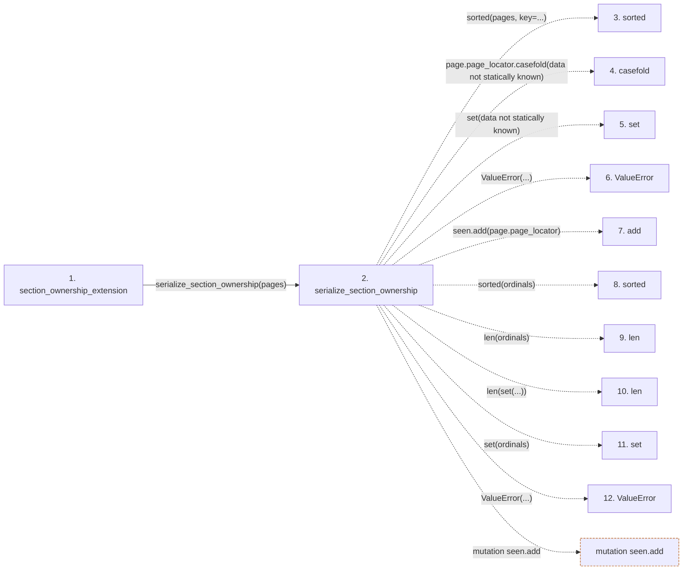

# section_ownership_extension

**Entry point:** `section_ownership_extension` (`api`)
**Source:** [section_ownership](../modules/section_ownership.md)
**Modules touched:** [section_ownership](../modules/section_ownership.md)

## Call sequence

<!-- Auto-generated from static call edges. Dashed arrows are external or unresolved calls. Reviewed runtime conditions and side effects belong in Behavior. -->

## Data flow

<!-- Auto-generated static analysis. Treat values and boundaries as best-effort hints, not runtime proof. -->

### Step data

| Step | Inputs | Reads | Writes | Returns |
|---|---|---|---|---|
| `section_ownership_extension` | `pages: Iterable[PageSectionObservations]` | `SECTION_OWNERSHIP_EXTENSION_KEY` | - | `{...}` |
| `serialize_section_ownership` | `pages: Iterable[PageSectionObservations]` | `SECTION_OWNERSHIP_SCHEMA_VERSION` | - | `{...}` |
| `sorted` | - | - | - | - |
| `casefold` | - | - | - | - |
| `set` | - | - | - | - |
| `ValueError` | - | - | - | - |
| `add` | - | - | - | - |
| `sorted` | - | - | - | - |
| `len` | - | - | - | - |
| `len` | - | - | - | - |
| `set` | - | - | - | - |
| `ValueError` | - | - | - | - |

### Call data

| From | To | Line | Call |
|---|---|---:|---|
| section_ownership_extension | serialize_section_ownership | 1141 | `serialize_section_ownership(pages)` |
| serialize_section_ownership | sorted | 616 | `sorted(pages, key=...)` |
| serialize_section_ownership | casefold | 618 | `page.page_locator.casefold(data not statically known)` |
| serialize_section_ownership | set | 620 | `set(data not statically known)` |
| serialize_section_ownership | ValueError | 623 | `ValueError(...)` |
| serialize_section_ownership | add | 624 | `seen.add(page.page_locator)` |
| serialize_section_ownership | sorted | 626 | `sorted(ordinals)` |
| serialize_section_ownership | len | 626 | `len(ordinals)` |
| serialize_section_ownership | len | 626 | `len(set(...))` |
| serialize_section_ownership | set | 626 | `set(ordinals)` |
| serialize_section_ownership | ValueError | 627 | `ValueError(...)` |

### Boundary effects

| Kind | Target | Step | Line |
|---|---|---|---:|
| mutation | `seen.add` | `serialize_section_ownership` | 624 |

### Static analysis gaps

| Kind | Step | Target | Line |
|---|---|---|---:|
| unresolved_call | `serialize_section_ownership` | `sorted` | 616 |
| unresolved_call | `serialize_section_ownership` | `page.page_locator.casefold` | 618 |
| unresolved_call | `serialize_section_ownership` | `ValueError` | 623 |
| unresolved_call | `serialize_section_ownership` | `sorted` | 626 |
| unresolved_call | `serialize_section_ownership` | `ValueError` | 627 |
| step_limit | `section_ownership_extension` | `first 12 steps` | 0 |

## Behavior

This flow starts at `section_ownership_extension` and is classified as `api`. The generated call and data-flow sections are bounded static projections; runtime conditions and side effects require source-level confirmation.
