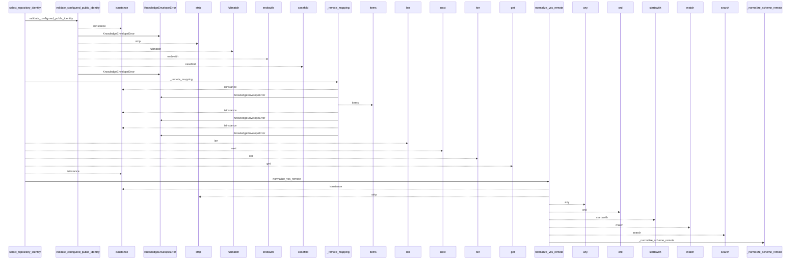
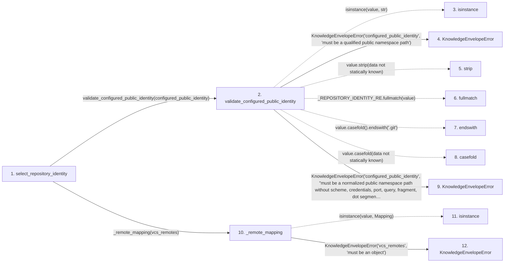

# select_repository_identity

**Entry point:** `select_repository_identity` (`api`)
**Source:** [knowledge_envelope](../modules/knowledge_envelope.md)
**Modules touched:** [knowledge_envelope](../modules/knowledge_envelope.md)

## Call sequence

<!-- Auto-generated from static call edges. Dashed arrows are external or unresolved calls. Reviewed runtime conditions and side effects belong in Behavior. -->

> Call sequence diagram shows 30 of 54 interactions; 24 omitted to keep the visualization within the 30-interaction and generated-diagram limits.

## Data flow

<!-- Auto-generated static analysis. Treat values and boundaries as best-effort hints, not runtime proof. -->

### Step data

| Step | Inputs | Reads | Writes | Returns |
|---|---|---|---|---|
| `select_repository_identity` | `configured_public_identity: str \| None`, `vcs_remotes: Mapping[str, str \| None]`, `upstream_remote: str \| None` | `RepositoryIdentitySource`, `RepositoryIdentitySource`, `RepositoryIdentitySource`, `RepositoryIdentitySource` | - | `(...)`, `(...)`, `(...)`, `(...)` |
| `validate_configured_public_identity` | `value: object` | - | - | `value` |
| `isinstance` | - | - | - | - |
| `KnowledgeEnvelopeError` | - | - | - | - |
| `strip` | - | - | - | - |
| `fullmatch` | - | - | - | - |
| `endswith` | - | - | - | - |
| `casefold` | - | - | - | - |
| `KnowledgeEnvelopeError` | - | - | - | - |
| `_remote_mapping` | `value: Mapping[str, str \| None]` | `Mapping` | `result[...]` | `result` |
| `isinstance` | - | - | - | - |
| `KnowledgeEnvelopeError` | - | - | - | - |

### Call data

| From | To | Line | Call |
|---|---|---:|---|
| select_repository_identity | validate_configured_public_identity | 656 | `validate_configured_public_identity(configured_public_identity)` |
| validate_configured_public_identity | isinstance | 685 | `isinstance(value, str)` |
| validate_configured_public_identity | KnowledgeEnvelopeError | 686 | `KnowledgeEnvelopeError('configured_public_identity', 'must be a qualified public namespace path')` |
| validate_configured_public_identity | strip | 691 | `value.strip(data not statically known)` |
| validate_configured_public_identity | fullmatch | 692 | `_REPOSITORY_IDENTITY_RE.fullmatch(value)` |
| validate_configured_public_identity | endswith | 693 | `value.casefold().endswith('.git')` |
| validate_configured_public_identity | casefold | 693 | `value.casefold(data not statically known)` |
| validate_configured_public_identity | KnowledgeEnvelopeError | 695 | `KnowledgeEnvelopeError('configured_public_identity', "must be a normalized public namespace path without scheme, credentials, port, query, fragment, dot segment, or '.git' suffix")` |
| select_repository_identity | _remote_mapping | 661 | `_remote_mapping(vcs_remotes)` |
| _remote_mapping | isinstance | 1414 | `isinstance(value, Mapping)` |
| _remote_mapping | KnowledgeEnvelopeError | 1415 | `KnowledgeEnvelopeError('vcs_remotes', 'must be an object')` |

### Boundary effects

*No boundary effects detected.*

### Static analysis gaps

| Kind | Step | Target | Line |
|---|---|---|---:|
| unresolved_call | `validate_configured_public_identity` | `isinstance` | 685 |
| unresolved_call | `validate_configured_public_identity` | `value.strip` | 691 |
| unresolved_call | `validate_configured_public_identity` | `_REPOSITORY_IDENTITY_RE.fullmatch` | 692 |
| unresolved_call | `validate_configured_public_identity` | `value.casefold().endswith` | 693 |
| unresolved_call | `validate_configured_public_identity` | `value.casefold` | 693 |
| unresolved_call | `_remote_mapping` | `isinstance` | 1414 |
| step_limit | `select_repository_identity` | `first 12 steps` | 0 |

## Behavior

This flow starts at `select_repository_identity` and is classified as `api`. The generated call and data-flow sections are bounded static projections; runtime conditions and side effects require source-level confirmation.
