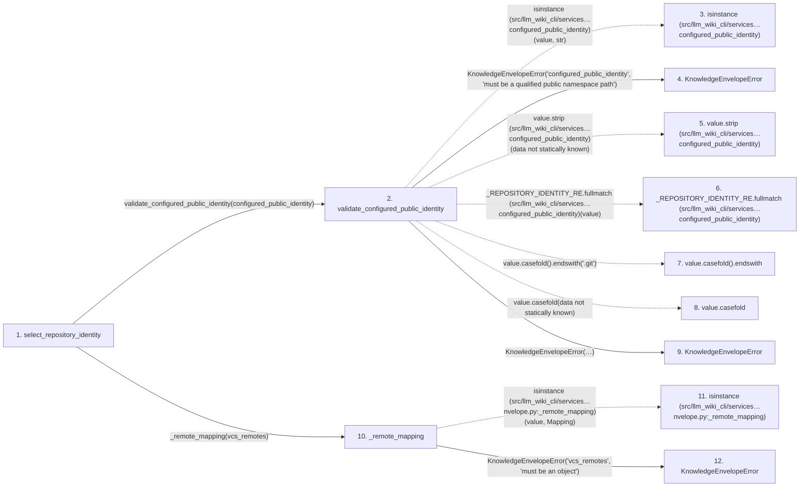

# select_repository_identity

**Entry point:** `select_repository_identity` (`api`)
**Source:** [knowledge_envelope](../modules/knowledge_envelope.md)
**Modules touched:** [knowledge_envelope](../modules/knowledge_envelope.md)

## Call sequence

```mermaid
sequenceDiagram
    participant p0 as select_repository_identity
    participant p1 as validate_configured_public_identity
    participant p2 as isinstance (src/llm_wiki_cli/services…configured_public_identity)
    participant p3 as KnowledgeEnvelopeError
    participant p4 as value.strip (src/llm_wiki_cli/services…configured_public_identity)
    participant p5 as _REPOSITORY_IDENTITY_RE.fullmatch (src/llm_wiki_cli/services…configured_public_identity)
    participant p6 as value.casefold().endswith
    participant p7 as value.casefold
    participant p8 as _remote_mapping
    participant p9 as isinstance (src/llm_wiki_cli/services…nvelope.py:_remote_mapping)
    participant p10 as value.items
    participant p11 as len
    participant p12 as next
    participant p13 as iter
    participant p14 as remotes.get
    participant p15 as isinstance (src/llm_wiki_cli/services…select_repository_identity)
    participant p16 as normalize_vcs_remote
    participant p17 as isinstance (src/llm_wiki_cli/services…pe.py:normalize_vcs_remote)
    participant p18 as value.strip (src/llm_wiki_cli/services…pe.py:normalize_vcs_remote)
    participant p19 as any (src/llm_wiki_cli/services…pe.py:normalize_vcs_remote)
    participant p20 as ord
    participant p21 as value.startswith
    participant p22 as _WINDOWS_DRIVE_PREFIX_RE.match
    participant p23 as _MALFORMED_PERCENT_RE.search
    participant p24 as _normalize_scheme_remote
    p0->>p1: validate_configured_public_identity
    p1-->>p2: isinstance (src/llm_wiki_cli/services…configured_public_identity)
    p1->>p3: KnowledgeEnvelopeError
    p1-->>p4: value.strip (src/llm_wiki_cli/services…configured_public_identity)
    p1-->>p5: _REPOSITORY_IDENTITY_RE.fullmatch (src/llm_wiki_cli/services…configured_public_identity)
    p1-->>p6: value.casefold().endswith
    p1-->>p7: value.casefold
    p1->>p3: KnowledgeEnvelopeError
    p0->>p8: _remote_mapping
    p8-->>p9: isinstance (src/llm_wiki_cli/services…nvelope.py:_remote_mapping)
    p8->>p3: KnowledgeEnvelopeError
    p8-->>p10: value.items
    p8-->>p9: isinstance (src/llm_wiki_cli/services…nvelope.py:_remote_mapping)
    p8->>p3: KnowledgeEnvelopeError
    p8-->>p9: isinstance (src/llm_wiki_cli/services…nvelope.py:_remote_mapping)
    p8->>p3: KnowledgeEnvelopeError
    p0-->>p11: len
    p0-->>p12: next
    p0-->>p13: iter
    p0-->>p14: remotes.get
    p0-->>p15: isinstance (src/llm_wiki_cli/services…select_repository_identity)
    p0->>p16: normalize_vcs_remote
    p16-->>p17: isinstance (src/llm_wiki_cli/services…pe.py:normalize_vcs_remote)
    p16-->>p18: value.strip (src/llm_wiki_cli/services…pe.py:normalize_vcs_remote)
    p16-->>p19: any (src/llm_wiki_cli/services…pe.py:normalize_vcs_remote)
    p16-->>p20: ord
    p16-->>p21: value.startswith
    p16-->>p22: _WINDOWS_DRIVE_PREFIX_RE.match
    p16-->>p23: _MALFORMED_PERCENT_RE.search
    p16->>p24: _normalize_scheme_remote
```

<!-- Auto-generated from static call edges. Dashed arrows are external or unresolved calls. Reviewed runtime conditions and side effects belong in Behavior. -->

> Call sequence diagram shows 30 of 54 interactions; 24 omitted to keep the visualization within the 30-interaction and generated-diagram limits.

## Data flow

<!-- Auto-generated static analysis. Treat values and boundaries as best-effort hints, not runtime proof. -->

### Step data

| Step | Inputs | Reads | Writes | Returns |
|---|---|---|---|---|
| `select_repository_identity` | `configured_public_identity: str \| None`, `vcs_remotes: Mapping[str, str \| None]`, `upstream_remote: str \| None` | `RepositoryIdentitySource`, `RepositoryIdentitySource`, `RepositoryIdentitySource`, `RepositoryIdentitySource` | - | `(...)`, `(...)`, `(...)`, `(...)` |
| `validate_configured_public_identity` | `value: object` | - | - | `value` |
| `isinstance (src/llm_wiki_cli/services…configured_public_identity)` | - | - | - | - |
| `KnowledgeEnvelopeError` | - | - | - | - |
| `value.strip (src/llm_wiki_cli/services…configured_public_identity)` | - | - | - | - |
| `_REPOSITORY_IDENTITY_RE.fullmatch (src/llm_wiki_cli/services…configured_public_identity)` | - | - | - | - |
| `value.casefold().endswith` | - | - | - | - |
| `value.casefold` | - | - | - | - |
| `KnowledgeEnvelopeError` | - | - | - | - |
| `_remote_mapping` | `value: Mapping[str, str \| None]` | `Mapping` | `result[...]` | `result` |
| `isinstance (src/llm_wiki_cli/services…nvelope.py:_remote_mapping)` | - | - | - | - |
| `KnowledgeEnvelopeError` | - | - | - | - |

### Call data

| From | To | Line | Call |
|---|---|---:|---|
| select_repository_identity | validate_configured_public_identity | 658 | `validate_configured_public_identity(configured_public_identity)` |
| validate_configured_public_identity | isinstance (src/llm_wiki_cli/services…configured_public_identity) | 687 | `isinstance(value, str)` |
| validate_configured_public_identity | KnowledgeEnvelopeError | 688 | `KnowledgeEnvelopeError('configured_public_identity', 'must be a qualified public namespace path')` |
| validate_configured_public_identity | value.strip (src/llm_wiki_cli/services…configured_public_identity) | 693 | `value.strip(data not statically known)` |
| validate_configured_public_identity | _REPOSITORY_IDENTITY_RE.fullmatch (src/llm_wiki_cli/services…configured_public_identity) | 694 | `_REPOSITORY_IDENTITY_RE.fullmatch(value)` |
| validate_configured_public_identity | value.casefold().endswith | 695 | `value.casefold().endswith('.git')` |
| validate_configured_public_identity | value.casefold | 695 | `value.casefold(data not statically known)` |
| validate_configured_public_identity | KnowledgeEnvelopeError | 697 | `KnowledgeEnvelopeError('configured_public_identity', "must be a normalized public namespace path without scheme, credentials, port, query, fragment, dot segment, or '.git' suffix")` |
| select_repository_identity | _remote_mapping | 663 | `_remote_mapping(vcs_remotes)` |
| _remote_mapping | isinstance (src/llm_wiki_cli/services…nvelope.py:_remote_mapping) | 1429 | `isinstance(value, Mapping)` |
| _remote_mapping | KnowledgeEnvelopeError | 1430 | `KnowledgeEnvelopeError('vcs_remotes', 'must be an object')` |

### Boundary effects

*No boundary effects detected.*

### Static analysis gaps

| Kind | Step | Target | Line |
|---|---|---|---:|
| external_call | `validate_configured_public_identity` | `isinstance` | 687 |
| unresolved_call | `validate_configured_public_identity` | `value.strip` | 693 |
| unresolved_call | `validate_configured_public_identity` | `_REPOSITORY_IDENTITY_RE.fullmatch` | 694 |
| unresolved_call | `validate_configured_public_identity` | `value.casefold().endswith` | 695 |
| unresolved_call | `validate_configured_public_identity` | `value.casefold` | 695 |
| external_call | `_remote_mapping` | `isinstance` | 1429 |
| step_limit | `select_repository_identity` | `first 12 steps` | 0 |

## Behavior

This flow starts at `select_repository_identity` and is classified as `api`. The generated call and data-flow sections are bounded static projections; runtime conditions and side effects require source-level confirmation.
