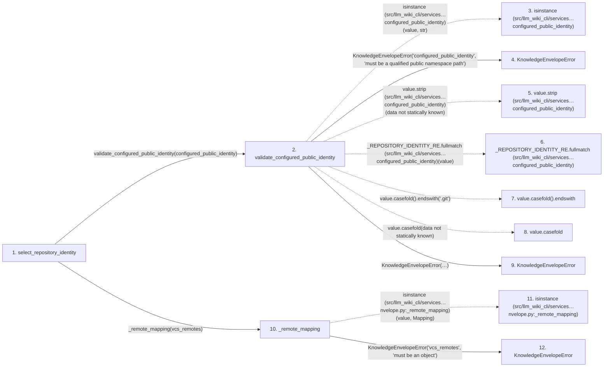

# select_repository_identity

**Entry point:** `select_repository_identity` (`api`)
**Source:** [knowledge_envelope](../modules/knowledge_envelope.md)
**Modules touched:** [knowledge_envelope](../modules/knowledge_envelope.md)

## Call sequence

> Static overview in presentation order, not runtime execution order. Arrows retain captured callers; representative internal continuations and boundary examples precede repeated helper detail.

<!-- Auto-generated from static call edges. Dashed arrows are external or unresolved calls. Reviewed runtime conditions and side effects belong in Behavior. -->

```mermaid
sequenceDiagram
    participant p0 as select_repository_identity
    participant p1 as validate_configured_public_identity
    participant p2 as _remote_mapping
    participant p3 as normalize_vcs_remote
    participant p4 as KnowledgeEnvelopeError
    participant p5 as _normalize_scheme_remote
    participant p6 as _normalize_scp_remote
    participant p7 as _normalized_remote_identity
    participant p8 as len
    participant p9 as remotes.get
    participant p10 as next
    participant p11 as iter
    participant p12 as isinstance (src/llm_wiki_cli/services…select_repository_identity)
    participant p13 as isinstance (src/llm_wiki_cli/services…configured_public_identity)
    participant p14 as isinstance (src/llm_wiki_cli/services…nvelope.py:_remote_mapping)
    participant p15 as isinstance (src/llm_wiki_cli/services…pe.py:normalize_vcs_remote)
    participant p16 as value.strip (src/llm_wiki_cli/services…pe.py:normalize_vcs_remote)
    participant p17 as value.strip (src/llm_wiki_cli/services…configured_public_identity)
    participant p18 as value.items
    participant p19 as any (src/llm_wiki_cli/services…pe.py:normalize_vcs_remote)
    participant p20 as _REPOSITORY_IDENTITY_RE.fullmatch (src/llm_wiki_cli/services…configured_public_identity)
    participant p21 as ord
    participant p22 as value.casefold().endswith
    participant p23 as value.startswith
    participant p24 as value.casefold
    participant p25 as _WINDOWS_DRIVE_PREFIX_RE.match
    participant p26 as _MALFORMED_PERCENT_RE.search
    participant p27 as urlsplit
    participant p28 as _SCP_REMOTE_RE.fullmatch
    p0->>p1: validate_configured_public_identity
    p0->>p2: _remote_mapping
    p0->>p3: normalize_vcs_remote
    p1->>p4: KnowledgeEnvelopeError
    p3->>p5: _normalize_scheme_remote
    p3->>p6: _normalize_scp_remote
    p3->>p7: _normalized_remote_identity
    p0-->>p8: len(remotes)
    p0-->>p9: remotes.get(selected)
    p0-->>p10: next(iter(...))
    p0-->>p11: iter(remotes)
    p0-->>p12: isinstance (src/llm_wiki_cli/services…select_repository_identity)(remote, str)
    p1-->>p13: isinstance (src/llm_wiki_cli/services…configured_public_identity)(value, str)
    p2-->>p14: isinstance (src/llm_wiki_cli/services…nvelope.py:_remote_mapping)(value, Mapping)
    p3-->>p15: isinstance (src/llm_wiki_cli/services…pe.py:normalize_vcs_remote)(value, str)
    p3-->>p16: value.strip (src/llm_wiki_cli/services…pe.py:normalize_vcs_remote)
    p1-->>p17: value.strip (src/llm_wiki_cli/services…configured_public_identity)
    p2-->>p18: value.items
    p3-->>p19: any (src/llm_wiki_cli/services…pe.py:normalize_vcs_remote)(...)
    p1-->>p20: _REPOSITORY_IDENTITY_RE.fullmatch (src/llm_wiki_cli/services…configured_public_identity)(value)
    p2-->>p14: isinstance (src/llm_wiki_cli/services…nvelope.py:_remote_mapping)(name, str)
    p3-->>p21: ord(char)
    p1-->>p22: value.casefold().endswith('.git')
    p3-->>p23: value.startswith((...))
    p1-->>p24: value.casefold
    p2-->>p14: isinstance (src/llm_wiki_cli/services…nvelope.py:_remote_mapping)(remote, str)
    p3-->>p25: _WINDOWS_DRIVE_PREFIX_RE.match(value)
    p3-->>p26: _MALFORMED_PERCENT_RE.search(value)
    p5-->>p27: urlsplit(value)
    p6-->>p28: _SCP_REMOTE_RE.fullmatch(value)
```

> Call sequence diagram shows 30 of 54 interactions; 24 omitted to keep the visualization within the 30-interaction and generated-diagram limits, with uncertain identities omitted rather than inferred.

> Captured boundary calls: external 12 of 14 (2 omitted); unresolved 11 of 29 (18 omitted). These counts cover the captured static trace.

Omitted captured detail, grouped by actual caller occurrence and target module:

| Caller | Parent step | Target module | Kind | Omitted interactions |
| --- | --- | --- | --- | --- |
| `src/llm_wiki_cli/services/knowledge_envelope.py:validate_configured_public_identity` | 2 | [src/llm_wiki_cli/services/knowledge_envelope.py](../modules/knowledge_envelope.md) | internal | 1 |
| `src/llm_wiki_cli/services/knowledge_envelope.py:_remote_mapping` | 10 | [src/llm_wiki_cli/services/knowledge_envelope.py](../modules/knowledge_envelope.md) | internal | 3 |
| `src/llm_wiki_cli/services/knowledge_envelope.py:_normalize_scheme_remote` | 31 | - | unresolved | 4 |
| `src/llm_wiki_cli/services/knowledge_envelope.py:_normalize_scp_remote` | 37 | - | unresolved | 5 |
| `src/llm_wiki_cli/services/knowledge_envelope.py:_normalized_remote_identity` | 44 | - | external | 2 |
| `src/llm_wiki_cli/services/knowledge_envelope.py:_normalized_remote_identity` | 44 | - | unresolved | 9 |
> Detailed flow queries retain their own coverage and limits; omitted paths may execute at runtime.

## Data flow

<!-- Auto-generated static analysis. Treat values and boundaries as best-effort hints, not runtime proof. -->

### Analysis coverage

**Effect analysis partially available.** Flow assembly and source effect analysis are separate; empty observations do not prove an empty handler body.

Source steps: 12; effect analysis evaluated: 7, partial: 0, unavailable: 5. Counts include steps omitted from the displayed trace.

Collector observations for 7 source steps with known totals: observed: 39, emitted: 39, omitted: 0. Unavailable totals are excluded.

- Callable record unavailable; the selected entry symbol has no represented callable body.
- Effect collector totals unavailable; observed counts cover captured records only.

| Step | Callable record | Effect analysis | Collector totals | Observed | Emitted | Omitted |
|---|---|---|---|---:|---:|---:|
| `select_repository_identity` | `available` | `evaluated` | `available` | `11` | `11` | `0` |
| `validate_configured_public_identity` | `available` | `evaluated` | `available` | `2` | `2` | `0` |
| `isinstance (src/llm_wiki_cli/services…configured_public_identity)` | `not_applicable` | `not_applicable` | `not_applicable` | — | — | — |
| `KnowledgeEnvelopeError` | `unavailable` | `unavailable` | `unavailable` | — | — | — |
| `value.strip (src/llm_wiki_cli/services…configured_public_identity)` | `not_applicable` | `not_applicable` | `not_applicable` | — | — | — |
| `_REPOSITORY_IDENTITY_RE.fullmatch (src/llm_wiki_cli/services…configured_public_identity)` | `not_applicable` | `not_applicable` | `not_applicable` | — | — | — |
| `value.casefold().endswith` | `not_applicable` | `not_applicable` | `not_applicable` | — | — | — |
| `value.casefold` | `not_applicable` | `not_applicable` | `not_applicable` | — | — | — |
| `KnowledgeEnvelopeError` | `unavailable` | `unavailable` | `unavailable` | — | — | — |
| `_remote_mapping` | `available` | `evaluated` | `available` | `4` | `4` | `0` |
| `isinstance (src/llm_wiki_cli/services…nvelope.py:_remote_mapping)` | `not_applicable` | `not_applicable` | `not_applicable` | — | — | — |
| `KnowledgeEnvelopeError` | `unavailable` | `unavailable` | `unavailable` | — | — | — |

```mermaid
flowchart LR
    s1["1. select_repository_identity"]
    s2["2. validate_configured_public_identity"]
    s3["3. isinstance (src/llm_wiki_cli/services…configured_public_identity)"]
    s4["4. KnowledgeEnvelopeError"]
    s5["5. value.strip (src/llm_wiki_cli/services…configured_public_identity)"]
    s6["6. _REPOSITORY_IDENTITY_RE.fullmatch (src/llm_wiki_cli/services…configured_public_identity)"]
    s7["7. value.casefold().endswith"]
    s8["8. value.casefold"]
    s9["9. KnowledgeEnvelopeError"]
    s10["10. _remote_mapping"]
    s11["11. isinstance (src/llm_wiki_cli/services…nvelope.py:_remote_mapping)"]
    s12["12. KnowledgeEnvelopeError"]
    s1 -->|"validate_configured_public_identity(configured_public_identity)"| s2
    s2 -. "isinstance (src/llm_wiki_cli/services…configured_public_identity)(value, str)" .-> s3
    s2 -->|"KnowledgeEnvelopeError('configured_public_identity', 'must be a qualified public namespace path')"| s4
    s2 -. "value.strip (src/llm_wiki_cli/services…configured_public_identity)(data not statically known)" .-> s5
    s2 -. "_REPOSITORY_IDENTITY_RE.fullmatch (src/llm_wiki_cli/services…configured_public_identity)(value)" .-> s6
    s2 -. "value.casefold().endswith('.git')" .-> s7
    s2 -. "value.casefold(data not statically known)" .-> s8
    s2 -->|"KnowledgeEnvelopeError(…)"| s9
    s1 -->|"_remote_mapping(vcs_remotes)"| s10
    s10 -. "isinstance (src/llm_wiki_cli/services…nvelope.py:_remote_mapping)(value, Mapping)" .-> s11
    s10 -->|"KnowledgeEnvelopeError('vcs_remotes', 'must be an object')"| s12
    click s1 "../modules/knowledge_envelope.md"
    click s2 "../modules/knowledge_envelope.md"
    click s4 "../modules/knowledge_envelope.md"
    click s9 "../modules/knowledge_envelope.md"
    click s10 "../modules/knowledge_envelope.md"
    click s12 "../modules/knowledge_envelope.md"
```

### Step data

| Step | Inputs | Reads | Writes | Returns |
|---|---|---|---|---|
| `select_repository_identity` | `configured_public_identity: str \| None`, `vcs_remotes: Mapping[str, str \| None]`, `upstream_remote: str \| None` | `RepositoryIdentitySource`, `RepositoryIdentitySource`, `RepositoryIdentitySource`, `RepositoryIdentitySource` | - | `(...)`, `(...)`, `(...)`, `(...)` |
| `validate_configured_public_identity` | `value: object` | - | - | `value` |
| `isinstance (src/llm_wiki_cli/services…configured_public_identity)` | - | - | - | - |
| `KnowledgeEnvelopeError` | - | - | - | - |
| `value.strip (src/llm_wiki_cli/services…configured_public_identity)` | - | - | - | - |
| `_REPOSITORY_IDENTITY_RE.fullmatch (src/llm_wiki_cli/services…configured_public_identity)` | - | - | - | - |
| `value.casefold().endswith` | - | - | - | - |
| `value.casefold` | - | - | - | - |
| `KnowledgeEnvelopeError` | - | - | - | - |
| `_remote_mapping` | `value: Mapping[str, str \| None]` | `Mapping` | `result[...]` | `result` |
| `isinstance (src/llm_wiki_cli/services…nvelope.py:_remote_mapping)` | - | - | - | - |
| `KnowledgeEnvelopeError` | - | - | - | - |

### Call data

| From | To | Line | Call |
|---|---|---:|---|
| select_repository_identity | validate_configured_public_identity | 658 | `validate_configured_public_identity(configured_public_identity)` |
| validate_configured_public_identity | isinstance (src/llm_wiki_cli/services…configured_public_identity) | 687 | `isinstance(value, str)` |
| validate_configured_public_identity | KnowledgeEnvelopeError | 688 | `KnowledgeEnvelopeError('configured_public_identity', 'must be a qualified public namespace path')` |
| validate_configured_public_identity | value.strip (src/llm_wiki_cli/services…configured_public_identity) | 693 | `value.strip(data not statically known)` |
| validate_configured_public_identity | _REPOSITORY_IDENTITY_RE.fullmatch (src/llm_wiki_cli/services…configured_public_identity) | 694 | `_REPOSITORY_IDENTITY_RE.fullmatch(value)` |
| validate_configured_public_identity | value.casefold().endswith | 695 | `value.casefold().endswith('.git')` |
| validate_configured_public_identity | value.casefold | 695 | `value.casefold(data not statically known)` |
| validate_configured_public_identity | KnowledgeEnvelopeError | 697 | `KnowledgeEnvelopeError('configured_public_identity', "must be a normalized public namespace path without scheme, credentials, port, query, fragment, dot segment, or '.git' suffix")` |
| select_repository_identity | _remote_mapping | 663 | `_remote_mapping(vcs_remotes)` |
| _remote_mapping | isinstance (src/llm_wiki_cli/services…nvelope.py:_remote_mapping) | 1433 | `isinstance(value, Mapping)` |
| _remote_mapping | KnowledgeEnvelopeError | 1434 | `KnowledgeEnvelopeError('vcs_remotes', 'must be an object')` |

### Boundary effects

*No boundary-effect observations were captured in this static trace.*

### Static analysis gaps

| Kind | Step | Target | Line |
|---|---|---|---:|
| external_call | `validate_configured_public_identity` | `isinstance` | 687 |
| unresolved_call | `validate_configured_public_identity` | `value.strip` | 693 |
| unresolved_call | `validate_configured_public_identity` | `_REPOSITORY_IDENTITY_RE.fullmatch` | 694 |
| unresolved_call | `validate_configured_public_identity` | `value.casefold().endswith` | 695 |
| unresolved_call | `validate_configured_public_identity` | `value.casefold` | 695 |
| external_call | `_remote_mapping` | `isinstance` | 1433 |
| step_limit | `select_repository_identity` | `first 12 steps` | 0 |

## Behavior

This flow starts at `select_repository_identity` and is classified as `api`. The generated call and data-flow sections are bounded static projections; runtime conditions and side effects require source-level confirmation.
