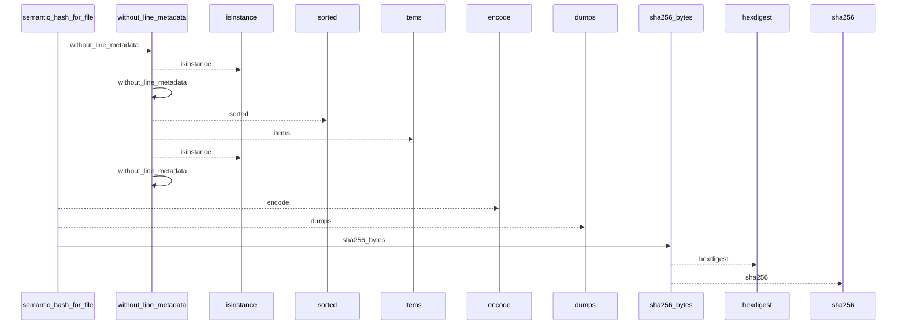
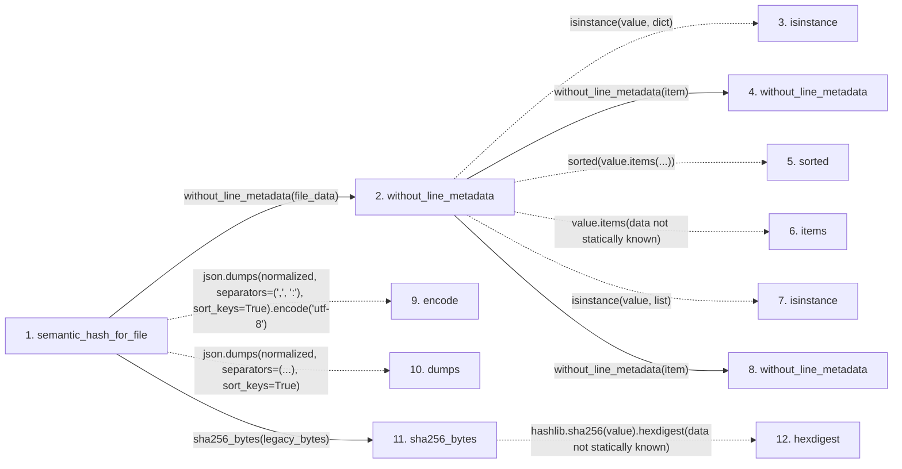

# semantic_hash_for_file

**Entry point:** `semantic_hash_for_file` (`api`)
**Source:** [knowledge_evidence](../modules/knowledge_evidence.md)
**Modules touched:** [knowledge_evidence](../modules/knowledge_evidence.md)

## Call sequence

<!-- Auto-generated from static call edges. Dashed arrows are external or unresolved calls. Reviewed runtime conditions and side effects belong in Behavior. -->

## Data flow

<!-- Auto-generated static analysis. Treat values and boundaries as best-effort hints, not runtime proof. -->

### Step data

| Step | Inputs | Reads | Writes | Returns |
|---|---|---|---|---|
| `semantic_hash_for_file` | `file_data: dict[str, Any]` | - | - | `sha256_bytes(...)` |
| `without_line_metadata` | `value: Any` | - | - | `...`, `...`, `value` |
| `isinstance` | - | - | - | - |
| `without_line_metadata` | `value: Any` | - | - | `...`, `...`, `value` |
| `sorted` | - | - | - | - |
| `items` | - | - | - | - |
| `isinstance` | - | - | - | - |
| `without_line_metadata` | `value: Any` | - | - | `...`, `...`, `value` |
| `encode` | - | - | - | - |
| `dumps` | - | - | - | - |
| `sha256_bytes` | `value: bytes` | - | - | `...` |
| `hexdigest` | - | - | - | - |

### Call data

| From | To | Line | Call |
|---|---|---:|---|
| semantic_hash_for_file | without_line_metadata | 935 | `without_line_metadata(file_data)` |
| without_line_metadata | isinstance | 921 | `isinstance(value, dict)` |
| without_line_metadata | without_line_metadata | 923 | `without_line_metadata(item)` |
| without_line_metadata | sorted | 924 | `sorted(value.items(...))` |
| without_line_metadata | items | 924 | `value.items(data not statically known)` |
| without_line_metadata | isinstance | 927 | `isinstance(value, list)` |
| without_line_metadata | without_line_metadata | 928 | `without_line_metadata(item)` |
| semantic_hash_for_file | encode | 938 | `json.dumps(normalized, separators=(',', ':'), sort_keys=True).encode('utf-8')` |
| semantic_hash_for_file | dumps | 938 | `json.dumps(normalized, separators=(...), sort_keys=True)` |
| semantic_hash_for_file | sha256_bytes | 943 | `sha256_bytes(legacy_bytes)` |
| sha256_bytes | hexdigest | 197 | `hashlib.sha256(value).hexdigest(data not statically known)` |

### Boundary effects

*No boundary effects detected.*

### Static analysis gaps

| Kind | Step | Target | Line |
|---|---|---|---:|
| unresolved_call | `without_line_metadata` | `isinstance` | 921 |
| unresolved_call | `without_line_metadata` | `sorted` | 924 |
| unresolved_call | `without_line_metadata` | `value.items` | 924 |
| unresolved_call | `without_line_metadata` | `isinstance` | 927 |
| external_call | `semantic_hash_for_file` | `json.dumps(normalized, separators=(',', ':'), sort_keys=True).encode` | 938 |
| external_call | `semantic_hash_for_file` | `json.dumps` | 938 |
| external_call | `sha256_bytes` | `hashlib.sha256(value).hexdigest` | 197 |
| step_limit | `semantic_hash_for_file` | `first 12 steps` | 0 |

## Behavior

This flow starts at `semantic_hash_for_file` and is classified as `api`. The generated call and data-flow sections are bounded static projections; runtime conditions and side effects require source-level confirmation.
