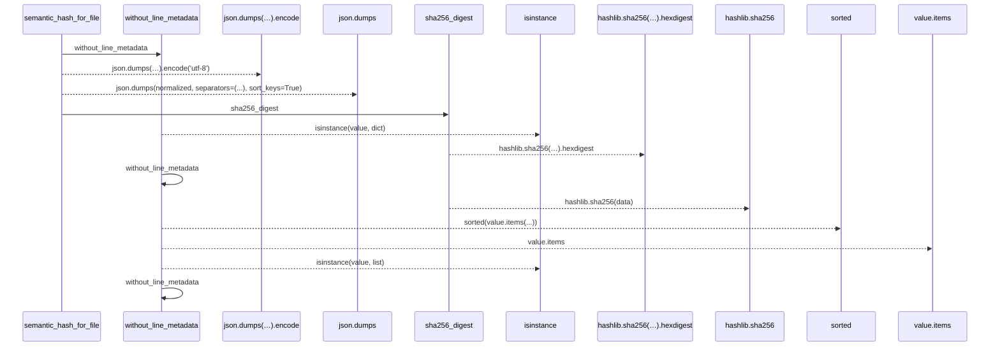
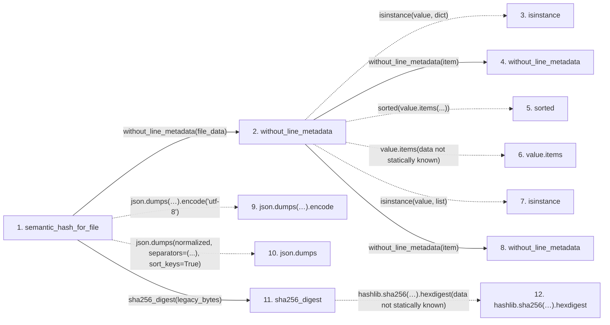

# semantic_hash_for_file

**Entry point:** `semantic_hash_for_file` (`api`)
**Source:** [knowledge_evidence](../modules/knowledge_evidence.md)
**Modules touched:** [canonical_json](../modules/canonical_json.md), [knowledge_evidence](../modules/knowledge_evidence.md)

## Call sequence

> Static overview in presentation order, not runtime execution order. Arrows retain captured callers; representative internal continuations and boundary examples precede repeated helper detail.

<!-- Auto-generated from static call edges. Dashed arrows are external or unresolved calls. Reviewed runtime conditions and side effects belong in Behavior. -->

```mermaid
sequenceDiagram
    participant p0 as semantic_hash_for_file
    participant p1 as without_line_metadata
    participant p2 as json.dumps(…).encode
    participant p3 as json.dumps
    participant p4 as sha256_digest
    participant p5 as isinstance
    participant p6 as hashlib.sha256(…).hexdigest
    participant p7 as hashlib.sha256
    participant p8 as sorted
    participant p9 as value.items
    p0->>p1: without_line_metadata
    p0-->>p2: json.dumps(…).encode('utf-8')
    p0-->>p3: json.dumps(normalized, separators=(...), sort_keys=True)
    p0->>p4: sha256_digest
    p1-->>p5: isinstance(value, dict)
    p4-->>p6: hashlib.sha256(…).hexdigest
    p1->>p1: without_line_metadata
    p4-->>p7: hashlib.sha256(data)
    p1-->>p8: sorted(value.items(...))
    p1-->>p9: value.items
    p1-->>p5: isinstance(value, list)
    p1->>p1: without_line_metadata
```

> Call sequence diagram shows 12 of 12 interactions; 0 omitted to keep the visualization within the 30-interaction and generated-diagram limits, with uncertain identities omitted rather than inferred.

> Captured boundary calls: external 5 of 5 (0 omitted); unresolved 3 of 3 (0 omitted). These counts cover the captured static trace.
> Detailed flow queries retain their own coverage and limits; omitted paths may execute at runtime.

## Data flow

<!-- Auto-generated static analysis. Treat values and boundaries as best-effort hints, not runtime proof. -->

### Analysis coverage

**Effect analysis evaluated.** Flow assembly and source effect analysis are separate; empty observations do not prove an empty handler body.

Source steps: 5; effect analysis evaluated: 5, partial: 0, unavailable: 0. Counts include steps omitted from the displayed trace.

Collector observations for 5 source steps with known totals: observed: 16, emitted: 16, omitted: 0. Unavailable totals are excluded.

```mermaid
flowchart LR
    s1["1. semantic_hash_for_file"]
    s2["2. without_line_metadata"]
    s3["3. isinstance"]
    s4["4. without_line_metadata"]
    s5["5. sorted"]
    s6["6. value.items"]
    s7["7. isinstance"]
    s8["8. without_line_metadata"]
    s9["9. json.dumps(…).encode"]
    s10["10. json.dumps"]
    s11["11. sha256_digest"]
    s12["12. hashlib.sha256(…).hexdigest"]
    s1 -->|"without_line_metadata(file_data)"| s2
    s2 -. "isinstance(value, dict)" .-> s3
    s2 -->|"without_line_metadata(item)"| s4
    s2 -. "sorted(value.items(...))" .-> s5
    s2 -. "value.items(data not statically known)" .-> s6
    s2 -. "isinstance(value, list)" .-> s7
    s2 -->|"without_line_metadata(item)"| s8
    s1 -. "json.dumps(…).encode('utf-8')" .-> s9
    s1 -. "json.dumps(normalized, separators=(...), sort_keys=True)" .-> s10
    s1 -->|"sha256_digest(legacy_bytes)"| s11
    s11 -. "hashlib.sha256(…).hexdigest(data not statically known)" .-> s12
    click s1 "../modules/knowledge_evidence.md"
    click s2 "../modules/knowledge_evidence.md"
    click s4 "../modules/knowledge_evidence.md"
    click s8 "../modules/knowledge_evidence.md"
    click s11 "../modules/canonical_json.md"
```

### Step data

| Step | Inputs | Reads | Writes | Returns |
|---|---|---|---|---|
| `semantic_hash_for_file` | `file_data: dict[str, Any]` | - | - | `sha256_bytes(...)` |
| `without_line_metadata` | `value: Any` | - | - | `...`, `...`, `value` |
| `isinstance` | - | - | - | - |
| `without_line_metadata` | `value: Any` | - | - | `...`, `...`, `value` |
| `sorted` | - | - | - | - |
| `value.items` | - | - | - | - |
| `isinstance` | - | - | - | - |
| `without_line_metadata` | `value: Any` | - | - | `...`, `...`, `value` |
| `json.dumps(…).encode` | - | - | - | - |
| `json.dumps` | - | - | - | - |
| `sha256_digest` | `data: bytes` | - | - | `...` |
| `hashlib.sha256(…).hexdigest` | - | - | - | - |

### Call data

| From | To | Line | Call |
|---|---|---:|---|
| semantic_hash_for_file | without_line_metadata | 902 | `without_line_metadata(file_data)` |
| without_line_metadata | isinstance | 888 | `isinstance(value, dict)` |
| without_line_metadata | without_line_metadata | 890 | `without_line_metadata(item)` |
| without_line_metadata | sorted | 891 | `sorted(value.items(...))` |
| without_line_metadata | value.items | 891 | `value.items(data not statically known)` |
| without_line_metadata | isinstance | 894 | `isinstance(value, list)` |
| without_line_metadata | without_line_metadata | 895 | `without_line_metadata(item)` |
| semantic_hash_for_file | json.dumps(…).encode | 905 | `json.dumps(normalized, separators=(',', ':'), sort_keys=True).encode('utf-8')` |
| semantic_hash_for_file | json.dumps | 905 | `json.dumps(normalized, separators=(...), sort_keys=True)` |
| semantic_hash_for_file | sha256_digest | 910 | `sha256_bytes(legacy_bytes)` |
| sha256_digest | hashlib.sha256(…).hexdigest | 56 | `hashlib.sha256(data).hexdigest(data not statically known)` |

### Boundary effects

*No boundary-effect observations were captured in this static trace.*

### Static analysis gaps

| Kind | Step | Target | Line |
|---|---|---|---:|
| external_call | `without_line_metadata` | `isinstance` | 888 |
| external_call | `without_line_metadata` | `sorted` | 891 |
| unresolved_call | `without_line_metadata` | `value.items` | 891 |
| external_call | `without_line_metadata` | `isinstance` | 894 |
| unresolved_call | `semantic_hash_for_file` | `json.dumps(normalized, separators=(',', ':'), sort_keys=True).encode` | 905 |
| external_call | `semantic_hash_for_file` | `json.dumps` | 905 |
| unresolved_call | `sha256_digest` | `hashlib.sha256(data).hexdigest` | 56 |
| step_limit | `semantic_hash_for_file` | `first 12 steps` | 0 |

## Behavior

This flow starts at `semantic_hash_for_file` and is classified as `api`. The generated call and data-flow sections are bounded static projections; runtime conditions and side effects require source-level confirmation.
