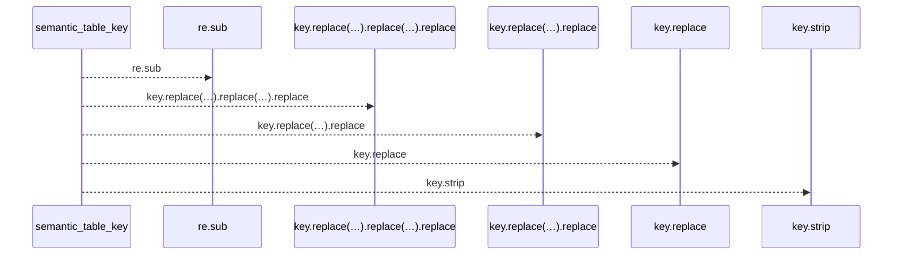
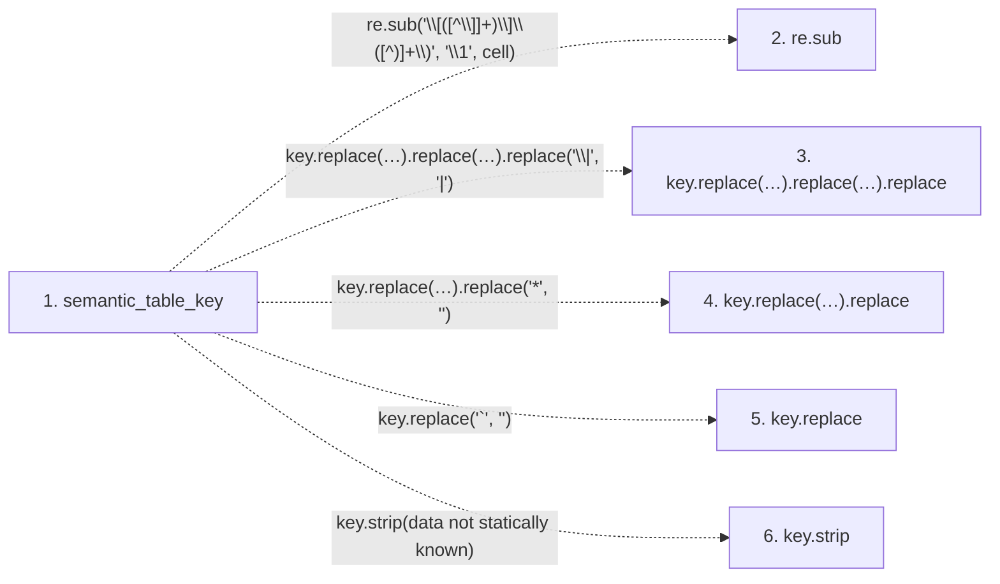

# semantic_table_key

**Entry point:** `semantic_table_key` (`api`)
**Source:** [markdown_sections](../modules/markdown_sections.md)
**Modules touched:** [markdown_sections](../modules/markdown_sections.md)

## Call sequence

<!-- Auto-generated from static call edges. Dashed arrows are external or unresolved calls. Reviewed runtime conditions and side effects belong in Behavior. -->

## Data flow

<!-- Auto-generated static analysis. Treat values and boundaries as best-effort hints, not runtime proof. -->

### Step data

| Step | Inputs | Reads | Writes | Returns |
|---|---|---|---|---|
| `semantic_table_key` | `cell: str` | - | - | `key.strip(...)` |
| `re.sub` | - | - | - | - |
| `key.replace(…).replace(…).replace` | - | - | - | - |
| `key.replace(…).replace` | - | - | - | - |
| `key.replace` | - | - | - | - |
| `key.strip` | - | - | - | - |

### Call data

| From | To | Line | Call |
|---|---|---:|---|
| semantic_table_key | re.sub | 520 | `re.sub('\\[([^\\]]+)\\]\\([^)]+\\)', '\\1', cell)` |
| semantic_table_key | key.replace(…).replace(…).replace | 521 | `key.replace('`', '').replace('*', '').replace('\\\|', '\|')` |
| semantic_table_key | key.replace(…).replace | 521 | `key.replace('`', '').replace('*', '')` |
| semantic_table_key | key.replace | 521 | `key.replace('`', '')` |
| semantic_table_key | key.strip | 522 | `key.strip(data not statically known)` |

### Boundary effects

*No boundary effects detected.*

### Static analysis gaps

| Kind | Step | Target | Line |
|---|---|---|---:|
| external_call | `semantic_table_key` | `re.sub` | 520 |
| unresolved_call | `semantic_table_key` | `key.replace('`', '').replace('*', '').replace` | 521 |
| unresolved_call | `semantic_table_key` | `key.replace('`', '').replace` | 521 |
| unresolved_call | `semantic_table_key` | `key.replace` | 521 |
| unresolved_call | `semantic_table_key` | `key.strip` | 522 |

## Behavior

This flow starts at `semantic_table_key` and is classified as `api`. The generated call and data-flow sections are bounded static projections; runtime conditions and side effects require source-level confirmation.
