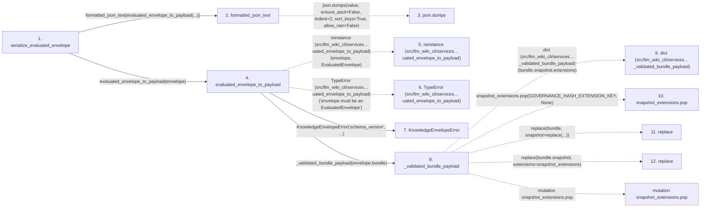

# serialize_evaluated_envelope

**Entry point:** `serialize_evaluated_envelope` (`api`)
**Source:** [knowledge_envelope](../modules/knowledge_envelope.md)
**Modules touched:** [knowledge_envelope](../modules/knowledge_envelope.md), [knowledge_evidence](../modules/knowledge_evidence.md), [knowledge_governance](../modules/knowledge_governance.md), and 6 more

**Complete modules touched:**

- [knowledge_envelope](../modules/knowledge_envelope.md)
- [knowledge_evidence](../modules/knowledge_evidence.md)
- [knowledge_governance](../modules/knowledge_governance.md)
- [knowledge_graph](../modules/knowledge_graph.md)
- [knowledge_model](../modules/knowledge_model.md)
- [knowledge_reuse](../modules/knowledge_reuse.md)
- [section_ownership](../modules/section_ownership.md)
- [validation](../modules/validation.md)
- [wiki_surface](../modules/wiki_surface.md)

## Call sequence

```mermaid
sequenceDiagram
    participant p0 as serialize_evaluated_envelope
    participant p1 as formatted_json_text
    participant p2 as json.dumps
    participant p3 as evaluated_envelope_to_payload
    participant p4 as isinstance (src/llm_wiki_cli/services…uated_envelope_to_payload)
    participant p5 as TypeError (src/llm_wiki_cli/services…uated_envelope_to_payload)
    participant p6 as KnowledgeEnvelopeError
    participant p7 as _validated_bundle_payload
    participant p8 as dict (src/llm_wiki_cli/services…_validated_bundle_payload)
    participant p9 as snapshot_extensions.pop
    participant p10 as replace
    participant p11 as knowledge_index_to_payload
    participant p12 as isinstance (src/llm_wiki_cli/services…nowledge_index_to_payload)
    participant p13 as TypeError (src/llm_wiki_cli/services…nowledge_index_to_payload)
    participant p14 as _emit_extensions
    participant p15 as isinstance (src/llm_wiki_cli/services…model.py:_emit_extensions)
    participant p16 as _parse_extensions
    participant p17 as _object (src/llm_wiki_cli/services/knowledge_model.py)
    participant p18 as sorted (src/llm_wiki_cli/services…odel.py:_parse_extensions)
    participant p19 as _QUALIFIED_NAME_RE.fullmatch
    participant p20 as KnowledgeModelError
    participant p21 as _child
    participant p22 as _normalize_json_value
    participant p23 as _bundle_to_payload
    participant p24 as _wire_enum
    participant p25 as isinstance (src/llm_wiki_cli/services…ledge_model.py:_wire_enum)
    p0->>p1: formatted_json_text
    p1-->>p2: json.dumps
    p0->>p3: evaluated_envelope_to_payload
    p3-->>p4: isinstance (src/llm_wiki_cli/services…uated_envelope_to_payload)
    p3-->>p5: TypeError (src/llm_wiki_cli/services…uated_envelope_to_payload)
    p3->>p6: KnowledgeEnvelopeError
    p3->>p7: _validated_bundle_payload
    p7-->>p8: dict (src/llm_wiki_cli/services…_validated_bundle_payload)
    p7-->>p9: snapshot_extensions.pop
    p7-->>p10: replace
    p7-->>p10: replace
    p7->>p11: knowledge_index_to_payload
    p11-->>p12: isinstance (src/llm_wiki_cli/services…nowledge_index_to_payload)
    p11-->>p13: TypeError (src/llm_wiki_cli/services…nowledge_index_to_payload)
    p11->>p14: _emit_extensions
    p14-->>p15: isinstance (src/llm_wiki_cli/services…model.py:_emit_extensions)
    p14->>p16: _parse_extensions
    p16->>p17: _object (src/llm_wiki_cli/services/knowledge_model.py)
    p16-->>p18: sorted (src/llm_wiki_cli/services…odel.py:_parse_extensions)
    p16-->>p19: _QUALIFIED_NAME_RE.fullmatch
    p16->>p20: KnowledgeModelError
    p16->>p21: _child
    p16->>p22: _normalize_json_value
    p16->>p21: _child
    p16->>p20: KnowledgeModelError
    p16->>p21: _child
    p11->>p23: _bundle_to_payload
    p23->>p14: _emit_extensions
    p23->>p24: _wire_enum
    p24-->>p25: isinstance (src/llm_wiki_cli/services…ledge_model.py:_wire_enum)
```

<!-- Auto-generated from static call edges. Dashed arrows are external or unresolved calls. Reviewed runtime conditions and side effects belong in Behavior. -->

> Call sequence diagram shows 30 of 273 interactions; 243 omitted to keep the visualization within the 30-interaction and generated-diagram limits.

> Trace truncated at the depth limit; deeper calls are omitted.

## Data flow

<!-- Auto-generated static analysis. Treat values and boundaries as best-effort hints, not runtime proof. -->

### Step data

| Step | Inputs | Reads | Writes | Returns |
|---|---|---|---|---|
| `serialize_evaluated_envelope` | `envelope: EvaluatedEnvelope` | `KnowledgeEnvelopeError` | - | `formatted_json_text(...)` |
| `formatted_json_text` | `value: Any` | - | - | `...` |
| `json.dumps` | - | - | - | - |
| `evaluated_envelope_to_payload` | `envelope: EvaluatedEnvelope` | `EvaluatedEnvelope`, `EVALUATED_ENVELOPE_VERSION`, `EVALUATED_ENVELOPE_VERSION`, `INVENTORY_HASH_EXTENSION`, `INVENTORY_HASH_EXTENSION` | - | `{...}` |
| `isinstance (src/llm_wiki_cli/services…uated_envelope_to_payload)` | - | - | - | - |
| `TypeError (src/llm_wiki_cli/services…uated_envelope_to_payload)` | - | - | - | - |
| `KnowledgeEnvelopeError` | - | - | - | - |
| `_validated_bundle_payload` | `bundle: BundleRecord` | `GOVERNANCE_HASH_EXTENSION_KEY`, `KNOWLEDGE_SCHEMA_VERSION`, `KnowledgeModelError` | - | `payload[...]` |
| `dict (src/llm_wiki_cli/services…_validated_bundle_payload)` | - | - | - | - |
| `snapshot_extensions.pop` | - | - | - | - |
| `replace` | - | - | - | - |
| `replace` | - | - | - | - |

### Call data

| From | To | Line | Call |
|---|---|---:|---|
| serialize_evaluated_envelope | formatted_json_text | 1167 | `formatted_json_text(evaluated_envelope_to_payload(...))` |
| formatted_json_text | json.dumps | 178 | `json.dumps(value, ensure_ascii=False, indent=2, sort_keys=True, allow_nan=False)` |
| serialize_evaluated_envelope | evaluated_envelope_to_payload | 1167 | `evaluated_envelope_to_payload(envelope)` |
| evaluated_envelope_to_payload | isinstance (src/llm_wiki_cli/services…uated_envelope_to_payload) | 1141 | `isinstance(envelope, EvaluatedEnvelope)` |
| evaluated_envelope_to_payload | TypeError (src/llm_wiki_cli/services…uated_envelope_to_payload) | 1142 | `TypeError('envelope must be an EvaluatedEnvelope')` |
| evaluated_envelope_to_payload | KnowledgeEnvelopeError | 1144 | `KnowledgeEnvelopeError('schema_version', ...)` |
| evaluated_envelope_to_payload | _validated_bundle_payload | 1148 | `_validated_bundle_payload(envelope.bundle)` |
| _validated_bundle_payload | dict (src/llm_wiki_cli/services…_validated_bundle_payload) | 1942 | `dict(bundle.snapshot.extensions)` |
| _validated_bundle_payload | snapshot_extensions.pop | 1943 | `snapshot_extensions.pop(GOVERNANCE_HASH_EXTENSION_KEY, None)` |
| _validated_bundle_payload | replace | 1944 | `replace(bundle, snapshot=replace(...))` |
| _validated_bundle_payload | replace | 1946 | `replace(bundle.snapshot, extensions=snapshot_extensions)` |

### Boundary effects

| Kind | Target | Step | Line |
|---|---|---|---:|
| mutation | `snapshot_extensions.pop` | `_validated_bundle_payload` | 1943 |

### Static analysis gaps

| Kind | Step | Target | Line |
|---|---|---|---:|
| external_call | `formatted_json_text` | `json.dumps` | 178 |
| external_call | `evaluated_envelope_to_payload` | `isinstance` | 1141 |
| external_call | `evaluated_envelope_to_payload` | `TypeError` | 1142 |
| external_call | `_validated_bundle_payload` | `replace` | 1944 |
| external_call | `_validated_bundle_payload` | `replace` | 1946 |
| step_limit | `serialize_evaluated_envelope` | `first 12 steps` | 0 |
| truncated_flow | `serialize_evaluated_envelope` | `depth limit` | 0 |

## Behavior

This flow starts at `serialize_evaluated_envelope` and is classified as `api`. The generated call and data-flow sections are bounded static projections; runtime conditions and side effects require source-level confirmation.
