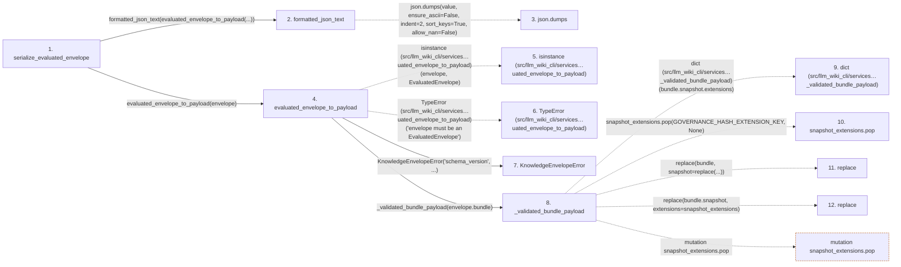

# serialize_evaluated_envelope

**Entry point:** `serialize_evaluated_envelope` (`api`)
**Source:** [knowledge_envelope](../modules/knowledge_envelope.md)
**Modules touched:** [implementation_evidence](../modules/implementation_evidence.md), [knowledge_envelope](../modules/knowledge_envelope.md), [knowledge_evidence](../modules/knowledge_evidence.md), and 10 more

**Complete modules touched:**

- [implementation_evidence](../modules/implementation_evidence.md)
- [knowledge_envelope](../modules/knowledge_envelope.md)
- [knowledge_evidence](../modules/knowledge_evidence.md)
- [knowledge_governance](../modules/knowledge_governance.md)
- [knowledge_graph](../modules/knowledge_graph.md)
- [knowledge_model](../modules/knowledge_model.md)
- [knowledge_reuse](../modules/knowledge_reuse.md)
- [maintenance_projection](../modules/maintenance_projection.md)
- [maintenance_shapes](../modules/maintenance_shapes.md)
- [maintenance_state](../modules/maintenance_state.md)
- [section_ownership](../modules/section_ownership.md)
- [validation](../modules/validation.md)
- [wiki_surface](../modules/wiki_surface.md)

## Call sequence

> Static overview in presentation order, not runtime execution order. Arrows retain captured callers; siblings are shown before deeper helper detail.

<!-- Auto-generated from static call edges. Dashed arrows are external or unresolved calls. Reviewed runtime conditions and side effects belong in Behavior. -->

```mermaid
sequenceDiagram
    participant p0 as serialize_evaluated_envelope
    participant p1 as formatted_json_text
    participant p2 as evaluated_envelope_to_payload
    participant p3 as KnowledgeEnvelopeError
    participant p4 as json.dumps
    participant p5 as isinstance (src/llm_wiki_cli/services…uated_envelope_to_payload)
    participant p6 as TypeError (src/llm_wiki_cli/services…uated_envelope_to_payload)
    participant p7 as _validated_bundle_payload
    participant p8 as bundle_payload[…].get(…).get
    participant p9 as bundle_payload[…].get
    participant p10 as is_valid_sha256
    participant p11 as dict (src/llm_wiki_cli/services…_validated_bundle_payload)
    participant p12 as isinstance (src/llm_wiki_cli/services…idence.py:is_valid_sha256)
    participant p13 as snapshot_extensions.pop
    participant p14 as _SHA256_RE.fullmatch
    participant p15 as replace
    participant p16 as knowledge_index_to_payload
    participant p17 as KnowledgeIndex
    participant p18 as isinstance (src/llm_wiki_cli/services…nowledge_index_to_payload)
    participant p19 as TypeError (src/llm_wiki_cli/services…nowledge_index_to_payload)
    participant p20 as _emit_extensions
    participant p21 as _bundle_to_payload
    participant p22 as _concept_to_payload
    participant p23 as _relationship_to_payload
    participant p24 as KnowledgeModelError
    participant p25 as parse_knowledge_index
    participant p26 as _knowledge_index_to_payload_unchecked
    p0->>p1: formatted_json_text
    p0->>p2: evaluated_envelope_to_payload
    p0->>p3: KnowledgeEnvelopeError
    p1-->>p4: json.dumps(value, ensure_ascii=False, indent=2, sort_keys=True, allow_nan=False)
    p2-->>p5: isinstance (src/llm_wiki_cli/services…uated_envelope_to_payload)(envelope, EvaluatedEnvelope)
    p2-->>p6: TypeError (src/llm_wiki_cli/services…uated_envelope_to_payload)('envelope must be an EvaluatedEnvelope')
    p2->>p3: KnowledgeEnvelopeError
    p2->>p7: _validated_bundle_payload
    p2-->>p8: bundle_payload[…].get(…).get(INVENTORY_HASH_EXTENSION)
    p2-->>p9: bundle_payload[…].get('extensions', {...})
    p2->>p10: is_valid_sha256
    p2->>p3: KnowledgeEnvelopeError
    p7-->>p11: dict (src/llm_wiki_cli/services…_validated_bundle_payload)(bundle.snapshot.extensions)
    p10-->>p12: isinstance (src/llm_wiki_cli/services…idence.py:is_valid_sha256)(value, str)
    p7-->>p13: snapshot_extensions.pop(GOVERNANCE_HASH_EXTENSION_KEY, None)
    p10-->>p14: _SHA256_RE.fullmatch(value)
    p7-->>p15: replace(bundle, snapshot=replace(...))
    p7-->>p15: replace(bundle.snapshot, extensions=snapshot_extensions)
    p7->>p16: knowledge_index_to_payload
    p7->>p17: KnowledgeIndex
    p7->>p3: KnowledgeEnvelopeError
    p16-->>p18: isinstance (src/llm_wiki_cli/services…nowledge_index_to_payload)(model, KnowledgeIndex)
    p16-->>p19: TypeError (src/llm_wiki_cli/services…nowledge_index_to_payload)('model must be a KnowledgeIndex')
    p16->>p20: _emit_extensions
    p16->>p21: _bundle_to_payload
    p16->>p22: _concept_to_payload
    p16->>p23: _relationship_to_payload
    p16->>p24: KnowledgeModelError
    p16->>p25: parse_knowledge_index
    p16->>p26: _knowledge_index_to_payload_unchecked
```

> Call sequence diagram shows 30 of 312 interactions; 282 omitted to keep the visualization within the 30-interaction and generated-diagram limits, with uncertain identities omitted rather than inferred.

> Captured boundary calls: external 9 of 67 (58 omitted); unresolved 4 of 28 (24 omitted). These counts cover the captured static trace.

Omitted captured detail, grouped by actual caller occurrence and target module:

| Caller | Parent step | Target module | Kind | Omitted interactions |
| --- | --- | --- | --- | --- |
| `src/llm_wiki_cli/services/knowledge_model.py:_emit_extensions` | 16 | - | external | 1 |
| `src/llm_wiki_cli/services/knowledge_model.py:_emit_extensions` | 16 | [src/llm_wiki_cli/services/knowledge_model.py](../modules/knowledge_model.md) | internal | 1 |
| `src/llm_wiki_cli/services/knowledge_model.py:_parse_extensions` | 18 | [src/llm_wiki_cli/services/knowledge_model.py](../modules/knowledge_model.md) | internal | 7 |
| `src/llm_wiki_cli/services/knowledge_model.py:_parse_extensions` | 18 | - | external | 1 |
| `src/llm_wiki_cli/services/knowledge_model.py:_parse_extensions` | 18 | - | unresolved | 1 |
| `src/llm_wiki_cli/services/knowledge_model.py:_bundle_to_payload` | 28 | [src/llm_wiki_cli/services/knowledge_model.py](../modules/knowledge_model.md) | internal | 8 |
| `src/llm_wiki_cli/services/knowledge_model.py:_wire_enum` | 30 | - | external | 1 |
| `src/llm_wiki_cli/services/knowledge_model.py:_component_to_payload` | 34 | - | external | 1 |
> Omission summary shows 8 of 57 groups; 49 further groups are not expanded here. Counts above include all omitted interactions.
> Detailed flow queries retain their own coverage and limits; omitted paths may execute at runtime.

> Trace truncated at the depth limit; deeper calls are omitted.

## Data flow

<!-- Auto-generated static analysis. Treat values and boundaries as best-effort hints, not runtime proof. -->

```mermaid
flowchart LR
    s1["1. serialize_evaluated_envelope"]
    s2["2. formatted_json_text"]
    s3["3. json.dumps"]
    s4["4. evaluated_envelope_to_payload"]
    s5["5. isinstance (src/llm_wiki_cli/services…uated_envelope_to_payload)"]
    s6["6. TypeError (src/llm_wiki_cli/services…uated_envelope_to_payload)"]
    s7["7. KnowledgeEnvelopeError"]
    s8["8. _validated_bundle_payload"]
    s9["9. dict (src/llm_wiki_cli/services…_validated_bundle_payload)"]
    s10["10. snapshot_extensions.pop"]
    s11["11. replace"]
    s12["12. replace"]
    s1 -->|"formatted_json_text(evaluated_envelope_to_payload(...))"| s2
    s2 -. "json.dumps(value, ensure_ascii=False, indent=2, sort_keys=True, allow_nan=False)" .-> s3
    s1 -->|"evaluated_envelope_to_payload(envelope)"| s4
    s4 -. "isinstance (src/llm_wiki_cli/services…uated_envelope_to_payload)(envelope, EvaluatedEnvelope)" .-> s5
    s4 -. "TypeError (src/llm_wiki_cli/services…uated_envelope_to_payload)('envelope must be an EvaluatedEnvelope')" .-> s6
    s4 -->|"KnowledgeEnvelopeError('schema_version', ...)"| s7
    s4 -->|"_validated_bundle_payload(envelope.bundle)"| s8
    s8 -. "dict (src/llm_wiki_cli/services…_validated_bundle_payload)(bundle.snapshot.extensions)" .-> s9
    s8 -. "snapshot_extensions.pop(GOVERNANCE_HASH_EXTENSION_KEY, None)" .-> s10
    s8 -. "replace(bundle, snapshot=replace(...))" .-> s11
    s8 -. "replace(bundle.snapshot, extensions=snapshot_extensions)" .-> s12
    b0["mutation snapshot_extensions.pop"]
    s8 -. "mutation snapshot_extensions.pop" .-> b0
    click s1 "../modules/knowledge_envelope.md"
    click s2 "../modules/knowledge_evidence.md"
    click s4 "../modules/knowledge_envelope.md"
    click s7 "../modules/knowledge_envelope.md"
    click s8 "../modules/knowledge_envelope.md"
    classDef boundary stroke:#b45309,stroke-dasharray: 4 2
    class b0 boundary
```

### Step data

| Step | Inputs | Reads | Writes | Returns |
|---|---|---|---|---|
| `serialize_evaluated_envelope` | `envelope: EvaluatedEnvelope` | `KnowledgeEnvelopeError` | - | `formatted_json_text(...)` |
| `formatted_json_text` | `value: Any` | - | - | `...` |
| `json.dumps` | - | - | - | - |
| `evaluated_envelope_to_payload` | `envelope: EvaluatedEnvelope` | `EvaluatedEnvelope`, `EVALUATED_ENVELOPE_VERSION`, `EVALUATED_ENVELOPE_VERSION`, `INVENTORY_HASH_EXTENSION`, `INVENTORY_HASH_EXTENSION` | - | `{...}` |
| `isinstance (src/llm_wiki_cli/services…uated_envelope_to_payload)` | - | - | - | - |
| `TypeError (src/llm_wiki_cli/services…uated_envelope_to_payload)` | - | - | - | - |
| `KnowledgeEnvelopeError` | - | - | - | - |
| `_validated_bundle_payload` | `bundle: BundleRecord` | `GOVERNANCE_HASH_EXTENSION_KEY`, `KNOWLEDGE_SCHEMA_VERSION`, `KnowledgeModelError` | - | `payload[...]` |
| `dict (src/llm_wiki_cli/services…_validated_bundle_payload)` | - | - | - | - |
| `snapshot_extensions.pop` | - | - | - | - |
| `replace` | - | - | - | - |
| `replace` | - | - | - | - |

### Call data

| From | To | Line | Call |
|---|---|---:|---|
| serialize_evaluated_envelope | formatted_json_text | 1167 | `formatted_json_text(evaluated_envelope_to_payload(...))` |
| formatted_json_text | json.dumps | 179 | `json.dumps(value, ensure_ascii=False, indent=2, sort_keys=True, allow_nan=False)` |
| serialize_evaluated_envelope | evaluated_envelope_to_payload | 1167 | `evaluated_envelope_to_payload(envelope)` |
| evaluated_envelope_to_payload | isinstance (src/llm_wiki_cli/services…uated_envelope_to_payload) | 1141 | `isinstance(envelope, EvaluatedEnvelope)` |
| evaluated_envelope_to_payload | TypeError (src/llm_wiki_cli/services…uated_envelope_to_payload) | 1142 | `TypeError('envelope must be an EvaluatedEnvelope')` |
| evaluated_envelope_to_payload | KnowledgeEnvelopeError | 1144 | `KnowledgeEnvelopeError('schema_version', ...)` |
| evaluated_envelope_to_payload | _validated_bundle_payload | 1148 | `_validated_bundle_payload(envelope.bundle)` |
| _validated_bundle_payload | dict (src/llm_wiki_cli/services…_validated_bundle_payload) | 1946 | `dict(bundle.snapshot.extensions)` |
| _validated_bundle_payload | snapshot_extensions.pop | 1947 | `snapshot_extensions.pop(GOVERNANCE_HASH_EXTENSION_KEY, None)` |
| _validated_bundle_payload | replace | 1948 | `replace(bundle, snapshot=replace(...))` |
| _validated_bundle_payload | replace | 1950 | `replace(bundle.snapshot, extensions=snapshot_extensions)` |

### Boundary effects

| Kind | Target | Step | Line |
|---|---|---|---:|
| mutation | `snapshot_extensions.pop` | `_validated_bundle_payload` | 1947 |

### Static analysis gaps

| Kind | Step | Target | Line |
|---|---|---|---:|
| external_call | `formatted_json_text` | `json.dumps` | 179 |
| external_call | `evaluated_envelope_to_payload` | `isinstance` | 1141 |
| external_call | `evaluated_envelope_to_payload` | `TypeError` | 1142 |
| external_call | `_validated_bundle_payload` | `replace` | 1948 |
| external_call | `_validated_bundle_payload` | `replace` | 1950 |
| step_limit | `serialize_evaluated_envelope` | `first 12 steps` | 0 |
| truncated_flow | `serialize_evaluated_envelope` | `depth limit` | 0 |

## Behavior

This flow starts at `serialize_evaluated_envelope` and is classified as `api`. The generated call and data-flow sections are bounded static projections; runtime conditions and side effects require source-level confirmation.
