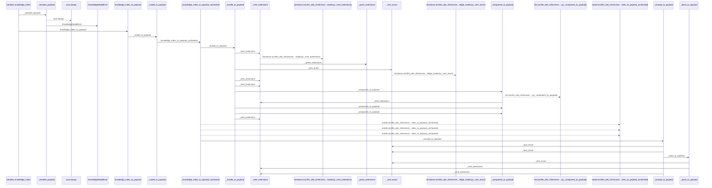

# serialize_knowledge_index

**Entry point:** `serialize_knowledge_index` (`api`)
**Source:** [knowledge_index](../modules/knowledge_index.md)
**Modules touched:** [concept_identity](../modules/concept_identity.md), [knowledge_envelope](../modules/knowledge_envelope.md), [knowledge_evidence](../modules/knowledge_evidence.md), and 11 more

**Complete modules touched:**

- [concept_identity](../modules/concept_identity.md)
- [knowledge_envelope](../modules/knowledge_envelope.md)
- [knowledge_evidence](../modules/knowledge_evidence.md)
- [knowledge_governance](../modules/knowledge_governance.md)
- [knowledge_graph](../modules/knowledge_graph.md)
- [knowledge_index](../modules/knowledge_index.md)
- [knowledge_links](../modules/knowledge_links.md)
- [knowledge_model](../modules/knowledge_model.md)
- [knowledge_reuse](../modules/knowledge_reuse.md)
- [progress](../modules/progress.md)
- [section_ownership](../modules/section_ownership.md)
- [validation](../modules/validation.md)
- [wiki_media](../modules/wiki_media.md)
- [wiki_surface](../modules/wiki_surface.md)

## Call sequence

<!-- Auto-generated from static call edges. Dashed arrows are external or unresolved calls. Reviewed runtime conditions and side effects belong in Behavior. -->

> Call sequence diagram shows 30 of 1039 interactions; 1009 omitted to keep the visualization within the 30-interaction and generated-diagram limits.

> Trace truncated at the depth limit; deeper calls are omitted.

## Data flow

```mermaid
flowchart LR
    s1["1. serialize_knowledge_index"]
    s2["2. _serialize_payload"]
    s3["3. json.dumps"]
    s4["4. KnowledgeModelError"]
    s5["5. knowledge_index_to_payload"]
    s6["6. _model_to_payload"]
    s7["7. _knowledge_index_to_payload_unchecked"]
    s8["8. _bundle_to_payload"]
    s9["9. _emit_extensions"]
    s10["10. isinstance (src/llm_wiki_cli/services…model.py:_emit_extensions)"]
    s11["11. _parse_extensions"]
    s12["12. _wire_enum"]
    s1 -->|"_serialize_payload(knowledge_index_to_payload(...))"| s2
    s2 -. "json.dumps(payload, indent=2, sort_keys=True, ensure_ascii=False, allow_nan=False)" .-> s3
    s2 -->|"KnowledgeModelError('model', 'cannot be serialized as finite JSON')"| s4
    s1 -->|"knowledge_index_to_payload(value)"| s5
    s5 -->|"_model_to_payload(validate_knowledge_index(...))"| s6
    s6 -->|"_knowledge_index_to_payload_unchecked(model)"| s7
    s7 -->|"_bundle_to_payload(model.bundle)"| s8
    s8 -->|"_emit_extensions({...}, bundle.repository.extensions, 'bundle.repository.extensions')"| s9
    s9 -. "isinstance (src/llm_wiki_cli/services…model.py:_emit_extensions)(extensions, FrozenDict)" .-> s10
    s9 -->|"_parse_extensions(extensions, path)"| s11
    s8 -->|"_wire_enum(bundle.repository.working_tree)"| s12
    click s1 "../modules/knowledge_index.md"
    click s2 "../modules/knowledge_index.md"
    click s4 "../modules/knowledge_model.md"
    click s5 "../modules/knowledge_index.md"
    click s6 "../modules/knowledge_index.md"
    click s7 "../modules/knowledge_model.md"
    click s8 "../modules/knowledge_model.md"
    click s9 "../modules/knowledge_model.md"
    click s11 "../modules/knowledge_model.md"
    click s12 "../modules/knowledge_model.md"
```

<!-- Auto-generated static analysis. Treat values and boundaries as best-effort hints, not runtime proof. -->

### Step data

| Step | Inputs | Reads | Writes | Returns |
|---|---|---|---|---|
| `serialize_knowledge_index` | `value: KnowledgeIndex \| object` | - | - | `_serialize_payload(...)` |
| `_serialize_payload` | `payload: dict[str, Any]` | - | - | `...` |
| `json.dumps` | - | - | - | - |
| `KnowledgeModelError` | - | - | - | - |
| `knowledge_index_to_payload` | `value: KnowledgeIndex \| object` | - | - | `_model_to_payload(...)` |
| `_model_to_payload` | `model: KnowledgeIndex` | `KnowledgeModelError` | - | `_knowledge_index_to_payload_unchecked(...)` |
| `_knowledge_index_to_payload_unchecked` | `model: KnowledgeIndex` | `_canonical_relationship_key` | `producer[...]`, `producer[...]` | `_emit_extensions(...)` |
| `_bundle_to_payload` | `bundle: BundleRecord` | - | - | `_emit_extensions(...)` |
| `_emit_extensions` | `payload: dict[str, Any]`, `extensions: Extensions`, `path: str` | - | `payload[...]` | `payload` |
| `isinstance (src/llm_wiki_cli/services…model.py:_emit_extensions)` | - | - | - | - |
| `_parse_extensions` | `value: object`, `path: str` | - | `result[...]` | `result` |
| `_wire_enum` | `value: object` | `Enum` | - | `...` |

### Call data

| From | To | Line | Call |
|---|---|---:|---|
| serialize_knowledge_index | _serialize_payload | 317 | `_serialize_payload(knowledge_index_to_payload(...))` |
| _serialize_payload | json.dumps | 302 | `json.dumps(payload, indent=2, sort_keys=True, ensure_ascii=False, allow_nan=False)` |
| _serialize_payload | KnowledgeModelError | 308 | `KnowledgeModelError('model', 'cannot be serialized as finite JSON')` |
| serialize_knowledge_index | knowledge_index_to_payload | 317 | `knowledge_index_to_payload(value)` |
| knowledge_index_to_payload | _model_to_payload | 277 | `_model_to_payload(validate_knowledge_index(...))` |
| _model_to_payload | _knowledge_index_to_payload_unchecked | 283 | `_knowledge_index_to_payload_unchecked(model)` |
| _knowledge_index_to_payload_unchecked | _bundle_to_payload | 2197 | `_bundle_to_payload(model.bundle)` |
| _bundle_to_payload | _emit_extensions | 2016 | `_emit_extensions({...}, bundle.repository.extensions, 'bundle.repository.extensions')` |
| _emit_extensions | isinstance (src/llm_wiki_cli/services…model.py:_emit_extensions) | 1976 | `isinstance(extensions, FrozenDict)` |
| _emit_extensions | _parse_extensions | 1977 | `_parse_extensions(extensions, path)` |
| _bundle_to_payload | _wire_enum | 2020 | `_wire_enum(bundle.repository.working_tree)` |

### Boundary effects

*No boundary effects detected.*

### Static analysis gaps

| Kind | Step | Target | Line |
|---|---|---|---:|
| external_call | `_serialize_payload` | `json.dumps` | 302 |
| external_call | `_emit_extensions` | `isinstance` | 1976 |
| step_limit | `serialize_knowledge_index` | `first 12 steps` | 0 |
| truncated_flow | `serialize_knowledge_index` | `depth limit` | 0 |

## Behavior

This flow starts at `serialize_knowledge_index` and is classified as `api`. The generated call and data-flow sections are bounded static projections; runtime conditions and side effects require source-level confirmation.
