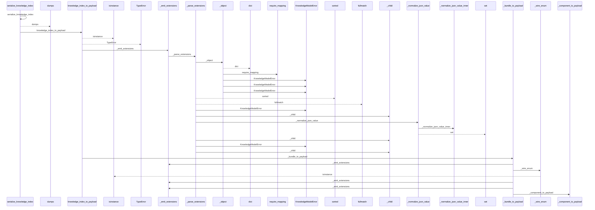

# serialize_knowledge_index

**Entry point:** `serialize_knowledge_index` (`api`)
**Source:** [knowledge_index](../modules/knowledge_index.md)
**Modules touched:** [concept_identity](../modules/concept_identity.md), [knowledge_envelope](../modules/knowledge_envelope.md), [knowledge_evidence](../modules/knowledge_evidence.md), and 9 more

**Complete modules touched:**

- [concept_identity](../modules/concept_identity.md)
- [knowledge_envelope](../modules/knowledge_envelope.md)
- [knowledge_evidence](../modules/knowledge_evidence.md)
- [knowledge_governance](../modules/knowledge_governance.md)
- [knowledge_graph](../modules/knowledge_graph.md)
- [knowledge_index](../modules/knowledge_index.md)
- [knowledge_links](../modules/knowledge_links.md)
- [knowledge_model](../modules/knowledge_model.md)
- [section_ownership](../modules/section_ownership.md)
- [validation](../modules/validation.md)
- [wiki_media](../modules/wiki_media.md)
- [wiki_surface](../modules/wiki_surface.md)

## Call sequence

<!-- Auto-generated from static call edges. Dashed arrows are external or unresolved calls. Reviewed runtime conditions and side effects belong in Behavior. -->

> Call sequence diagram shows 30 of 1135 interactions; 1105 omitted to keep the visualization within the 30-interaction and generated-diagram limits.

> Trace truncated at the depth limit; deeper calls are omitted.

## Data flow

```mermaid
flowchart LR
    s1["1. serialize_knowledge_index"]
    s2["2. serialize_knowledge_index"]
    s3["3. dumps"]
    s4["4. knowledge_index_to_payload"]
    s5["5. isinstance"]
    s6["6. TypeError"]
    s7["7. _emit_extensions"]
    s8["8. _parse_extensions"]
    s9["9. _object"]
    s10["10. dict"]
    s11["11. require_mapping"]
    s12["12. KnowledgeModelError"]
    s1 -->|"_serialize_model(validate_knowledge_index(...))"| s2
    s2 -. "json.dumps(knowledge_index_to_payload(...), indent=2, sort_keys=True, ensure_ascii=False, allow_nan=False)" .-> s3
    s2 -->|"knowledge_index_to_payload(model)"| s4
    s4 -. "isinstance(model, KnowledgeIndex)" .-> s5
    s4 -. "TypeError('model must be a KnowledgeIndex')" .-> s6
    s4 -->|"_emit_extensions({...}, model.extensions, 'extensions')"| s7
    s7 -->|"_parse_extensions(extensions, path)"| s8
    s8 -->|"_object(value, path)"| s9
    s9 -. "dict(require_mapping(...))" .-> s10
    s9 -->|"require_mapping(value, error=KnowledgeModelError(...), require_string_keys=True, key_error=KnowledgeModelError(...), require_utf8_keys=True, utf8_key_error=Kno…"| s11
    s9 -->|"KnowledgeModelError(path, 'must be an object')"| s12
    click s1 "../modules/knowledge_index.md"
    click s2 "../modules/knowledge_model.md"
    click s4 "../modules/knowledge_model.md"
    click s7 "../modules/knowledge_model.md"
    click s8 "../modules/knowledge_model.md"
    click s9 "../modules/knowledge_model.md"
    click s11 "../modules/validation.md"
    click s12 "../modules/knowledge_model.md"
```

<!-- Auto-generated static analysis. Treat values and boundaries as best-effort hints, not runtime proof. -->

### Step data

| Step | Inputs | Reads | Writes | Returns |
|---|---|---|---|---|
| `serialize_knowledge_index` | `value: KnowledgeIndex \| object` | - | - | `_serialize_model(...)` |
| `serialize_knowledge_index` | `model: KnowledgeIndex` | - | - | `...` |
| `dumps` | - | - | - | - |
| `knowledge_index_to_payload` | `model: KnowledgeIndex` | `KnowledgeIndex`, `KnowledgeModelError` | - | `_knowledge_index_to_payload_unchecked(...)` |
| `isinstance` | - | - | - | - |
| `TypeError` | - | - | - | - |
| `_emit_extensions` | `payload: dict[str, Any]`, `extensions: Extensions`, `path: str` | - | `payload[...]` | `payload` |
| `_parse_extensions` | `value: object`, `path: str` | - | `result[...]` | `result` |
| `_object` | `value: object`, `path: str` | - | - | `dict(...)` |
| `dict` | - | - | - | - |
| `require_mapping` | `value: object`, `error: Exception`, `require_string_keys: bool`, `key_error: Exception \| None`, `require_utf8_keys: bool`, `utf8_key_error: Exception \| None` | `Mapping` | - | `value` |
| `KnowledgeModelError` | - | - | - | - |

### Call data

| From | To | Line | Call |
|---|---|---:|---|
| serialize_knowledge_index | serialize_knowledge_index | 282 | `_serialize_model(validate_knowledge_index(...))` |
| serialize_knowledge_index | dumps | 677 | `json.dumps(knowledge_index_to_payload(...), indent=2, sort_keys=True, ensure_ascii=False, allow_nan=False)` |
| serialize_knowledge_index | knowledge_index_to_payload | 678 | `knowledge_index_to_payload(model)` |
| knowledge_index_to_payload | isinstance | 641 | `isinstance(model, KnowledgeIndex)` |
| knowledge_index_to_payload | TypeError | 642 | `TypeError('model must be a KnowledgeIndex')` |
| knowledge_index_to_payload | _emit_extensions | 645 | `_emit_extensions({...}, model.extensions, 'extensions')` |
| _emit_extensions | _parse_extensions | 1960 | `_parse_extensions(extensions, path)` |
| _parse_extensions | _object | 1590 | `_object(value, path)` |
| _object | dict | 1657 | `dict(require_mapping(...))` |
| _object | require_mapping | 1658 | `require_mapping(value, error=KnowledgeModelError(...), require_string_keys=True, key_error=KnowledgeModelError(...), require_utf8_keys=True, utf8_key_error=KnowledgeModelError(...))` |
| _object | KnowledgeModelError | 1660 | `KnowledgeModelError(path, 'must be an object')` |

### Boundary effects

*No boundary effects detected.*

### Static analysis gaps

| Kind | Step | Target | Line |
|---|---|---|---:|
| external_call | `serialize_knowledge_index` | `json.dumps` | 677 |
| unresolved_call | `knowledge_index_to_payload` | `isinstance` | 641 |
| unresolved_call | `knowledge_index_to_payload` | `TypeError` | 642 |
| step_limit | `serialize_knowledge_index` | `first 12 steps` | 0 |
| truncated_flow | `serialize_knowledge_index` | `depth limit` | 0 |

## Behavior

This flow starts at `serialize_knowledge_index` and is classified as `api`. The generated call and data-flow sections are bounded static projections; runtime conditions and side effects require source-level confirmation.
