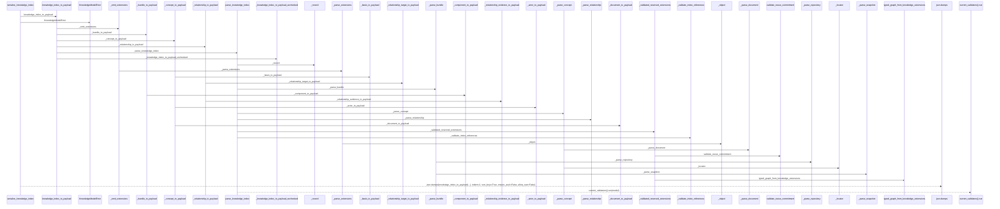
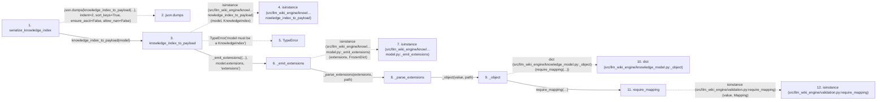

# serialize_knowledge_index

**Entry point:** `serialize_knowledge_index` (`api`)
**Source:** [knowledge_model](../modules/knowledge_model.md)
**Modules touched:** [integrations](../modules/integrations.md), [knowledge_evidence](../modules/knowledge_evidence.md), [knowledge_graph](../modules/knowledge_graph.md), [knowledge_kinds](../modules/knowledge_kinds.md), and 8 more

**Complete modules touched:**

- [integrations](../modules/integrations.md)
- [knowledge_evidence](../modules/knowledge_evidence.md)
- [knowledge_graph](../modules/knowledge_graph.md)
- [knowledge_kinds](../modules/knowledge_kinds.md)
- [knowledge_model](../modules/knowledge_model.md)
- [knowledge_reuse_format](../modules/knowledge_reuse_format.md)
- [knowledge_validators](../modules/knowledge_validators.md)
- [markdown_sections](../modules/markdown_sections.md)
- [section_ownership](../modules/section_ownership.md)
- [validation](../modules/validation.md)
- [wiki_media](../modules/wiki_media.md)
- [wiki_surface](../modules/wiki_surface.md)

## Call sequence

> Static overview in presentation order, not runtime execution order. Arrows retain captured callers; representative internal continuations and boundary examples precede repeated helper detail.

<!-- Auto-generated from static call edges. Dashed arrows are external or unresolved calls. Reviewed runtime conditions and side effects belong in Behavior. -->

```mermaid
sequenceDiagram
    participant p0 as serialize_knowledge_index
    participant p1 as knowledge_index_to_payload
    participant p2 as KnowledgeModelError
    participant p3 as _emit_extensions
    participant p4 as _bundle_to_payload
    participant p5 as _concept_to_payload
    participant p6 as _relationship_to_payload
    participant p7 as parse_knowledge_index
    participant p8 as _knowledge_index_to_payload_unchecked
    participant p9 as _record
    participant p10 as _parse_extensions
    participant p11 as _basis_to_payload
    participant p12 as _relationship_target_to_payload
    participant p13 as _parse_bundle
    participant p14 as _component_to_payload
    participant p15 as _relationship_evidence_to_payload
    participant p16 as _actor_to_payload
    participant p17 as _parse_concept
    participant p18 as _parse_relationship
    participant p19 as _document_to_payload
    participant p20 as _validated_reserved_extensions
    participant p21 as _validate_index_references
    participant p22 as _object
    participant p23 as _parse_document
    participant p24 as validate_reuse_commitment
    participant p25 as _parse_repository
    participant p26 as _locator
    participant p27 as _parse_snapshot
    participant p28 as typed_graph_from_knowledge_extensions
    participant p29 as json.dumps
    participant p30 as current_validators().run
    p0->>p1: knowledge_index_to_payload
    p0->>p2: KnowledgeModelError
    p1->>p3: _emit_extensions
    p1->>p4: _bundle_to_payload
    p1->>p5: _concept_to_payload
    p1->>p6: _relationship_to_payload
    p1->>p7: parse_knowledge_index
    p1->>p8: _knowledge_index_to_payload_unchecked
    p7->>p9: _record
    p3->>p10: _parse_extensions
    p5->>p11: _basis_to_payload
    p6->>p12: _relationship_target_to_payload
    p7->>p13: _parse_bundle
    p4->>p14: _component_to_payload
    p6->>p15: _relationship_evidence_to_payload
    p5->>p16: _actor_to_payload
    p7->>p17: _parse_concept
    p7->>p18: _parse_relationship
    p5->>p19: _document_to_payload
    p7->>p20: _validated_reserved_extensions
    p7->>p21: _validate_index_references
    p10->>p22: _object
    p17->>p23: _parse_document
    p20->>p24: validate_reuse_commitment
    p13->>p25: _parse_repository
    p17->>p26: _locator
    p13->>p27: _parse_snapshot
    p20->>p28: typed_graph_from_knowledge_extensions
    p0-->>p29: json.dumps(knowledge_index_to_payload(...), indent=2, sort_keys=True, ensure_ascii=False, allow_nan=False)
    p7-->>p30: current_validators().run(model)
```

> Call sequence diagram shows 30 of 655 interactions; 625 omitted to keep the visualization within the 30-interaction and generated-diagram limits, with uncertain identities omitted rather than inferred.

> Captured boundary calls: external 1 of 128 (127 omitted); unresolved 1 of 76 (75 omitted). These counts cover the captured static trace.

Omitted captured detail, grouped by actual caller occurrence and target module:

| Caller | Parent step | Target module | Kind | Omitted interactions |
| --- | --- | --- | --- | --- |
| `src/llm_wiki_engine/knowledge_model.py:knowledge_index_to_payload` | 3 | - | external | 2 |
| `src/llm_wiki_engine/knowledge_model.py:_emit_extensions` | 6 | - | external | 1 |
| `src/llm_wiki_engine/knowledge_model.py:_object` | 9 | - | external | 1 |
| `src/llm_wiki_engine/knowledge_model.py:_object` | 9 | [src/llm_wiki_engine/validation.py](../modules/validation.md) | internal | 1 |
| `src/llm_wiki_engine/validation.py:require_mapping` | 11 | - | external | 2 |
| `src/llm_wiki_engine/validation.py:require_mapping` | 11 | [src/llm_wiki_engine/validation.py](../modules/validation.md) | internal | 3 |
| `src/llm_wiki_engine/validation.py:require_mapping` | 11 | - | unresolved | 1 |
| `src/llm_wiki_engine/knowledge_model.py:_parse_extensions` | 8 | - | external | 1 |
> Omission summary shows 8 of 151 groups; 143 further groups are not expanded here. Counts above include all omitted interactions.
> Detailed flow queries retain their own coverage and limits; omitted paths may execute at runtime.

> Trace truncated at the depth limit; deeper calls are omitted.

## Data flow

<!-- Auto-generated static analysis. Treat values and boundaries as best-effort hints, not runtime proof. -->

### Analysis coverage

**Effect analysis partially available.** Flow assembly and source effect analysis are separate; empty observations do not prove an empty handler body.

Source steps: 452; effect analysis evaluated: 303, partial: 6, unavailable: 143. Counts include steps omitted from the displayed trace.

Collector observations for 309 source steps with known totals: observed: 1424, emitted: 1308, omitted: 116. Unavailable totals are excluded.

- Callable record unavailable for one or more source steps; those steps have no represented callable body.
- Effect collector omitted observations before flow assembly; displayed effects are partial.
- Effect collector totals unavailable; observed counts cover captured records only.

| Step | Callable record | Effect analysis | Collector totals | Observed | Emitted | Omitted |
|---|---|---|---|---:|---:|---:|
| `serialize_knowledge_index` | `available` | `evaluated` | `available` | `2` | `2` | `0` |
| `json.dumps` | `not_applicable` | `not_applicable` | `not_applicable` | — | — | — |
| `knowledge_index_to_payload` | `available` | `evaluated` | `available` | `4` | `4` | `0` |
| `isinstance (src/llm_wiki_engine/knowl…nowledge_index_to_payload)` | `not_applicable` | `not_applicable` | `not_applicable` | — | — | — |
| `TypeError` | `not_applicable` | `not_applicable` | `not_applicable` | — | — | — |
| `_emit_extensions` | `available` | `evaluated` | `available` | `5` | `5` | `0` |
| `isinstance (src/llm_wiki_engine/knowl…model.py:_emit_extensions)` | `not_applicable` | `not_applicable` | `not_applicable` | — | — | — |
| `_parse_extensions` | `available` | `evaluated` | `available` | `4` | `4` | `0` |
| `_object` | `available` | `evaluated` | `available` | `6` | `6` | `0` |
| `dict (src/llm_wiki_engine/knowledge_model.py:_object)` | `not_applicable` | `not_applicable` | `not_applicable` | — | — | — |
| `require_mapping` | `available` | `evaluated` | `available` | `9` | `9` | `0` |
| `isinstance (src/llm_wiki_engine/validation.py:require_mapping)` | `not_applicable` | `not_applicable` | `not_applicable` | — | — | — |

```mermaid
flowchart LR
    s1["1. serialize_knowledge_index"]
    s2["2. json.dumps"]
    s3["3. knowledge_index_to_payload"]
    s4["4. isinstance (src/llm_wiki_engine/knowl…nowledge_index_to_payload)"]
    s5["5. TypeError"]
    s6["6. _emit_extensions"]
    s7["7. isinstance (src/llm_wiki_engine/knowl…model.py:_emit_extensions)"]
    s8["8. _parse_extensions"]
    s9["9. _object"]
    s10["10. dict (src/llm_wiki_engine/knowledge_model.py:_object)"]
    s11["11. require_mapping"]
    s12["12. isinstance (src/llm_wiki_engine/validation.py:require_mapping)"]
    s1 -. "json.dumps(knowledge_index_to_payload(...), indent=2, sort_keys=True, ensure_ascii=False, allow_nan=False)" .-> s2
    s1 -->|"knowledge_index_to_payload(model)"| s3
    s3 -. "isinstance (src/llm_wiki_engine/knowl…nowledge_index_to_payload)(model, KnowledgeIndex)" .-> s4
    s3 -. "TypeError('model must be a KnowledgeIndex')" .-> s5
    s3 -->|"_emit_extensions({...}, model.extensions, 'extensions')"| s6
    s6 -. "isinstance (src/llm_wiki_engine/knowl…model.py:_emit_extensions)(extensions, FrozenDict)" .-> s7
    s6 -->|"_parse_extensions(extensions, path)"| s8
    s8 -->|"_object(value, path)"| s9
    s9 -. "dict (src/llm_wiki_engine/knowledge_model.py:_object)(require_mapping(...))" .-> s10
    s9 -->|"require_mapping(…)"| s11
    s11 -. "isinstance (src/llm_wiki_engine/validation.py:require_mapping)(value, Mapping)" .-> s12
    click s1 "../modules/knowledge_model.md"
    click s3 "../modules/knowledge_model.md"
    click s6 "../modules/knowledge_model.md"
    click s8 "../modules/knowledge_model.md"
    click s9 "../modules/knowledge_model.md"
    click s11 "../modules/validation.md"
```

### Step data

| Step | Inputs | Reads | Writes | Returns |
|---|---|---|---|---|
| `serialize_knowledge_index` | `model: KnowledgeIndex` | - | - | `...` |
| `json.dumps` | - | - | - | - |
| `knowledge_index_to_payload` | `model: KnowledgeIndex` | `KnowledgeIndex`, `KnowledgeModelError` | - | `_knowledge_index_to_payload_unchecked(...)` |
| `isinstance (src/llm_wiki_engine/knowl…nowledge_index_to_payload)` | - | - | - | - |
| `TypeError` | - | - | - | - |
| `_emit_extensions` | `payload: dict[str, Any]`, `extensions: Extensions`, `path: str` | - | `payload[...]` | `payload` |
| `isinstance (src/llm_wiki_engine/knowl…model.py:_emit_extensions)` | - | - | - | - |
| `_parse_extensions` | `value: object`, `path: str` | - | `result[...]` | `result` |
| `_object` | `value: object`, `path: str` | `_OBJECT_ERROR`, `_OBJECT_KEYS_ERROR`, `_UTF8_ERROR` | - | `dict(...)` |
| `dict (src/llm_wiki_engine/knowledge_model.py:_object)` | - | - | - | - |
| `require_mapping` | `value: object`, `error: _ValidationError`, `error_context: str`, `require_string_keys: bool`, `key_error: _ValidationError \| None`, `require_utf8_keys: bool`, `utf8_key_error: _ValidationError \| None` | `Mapping` | - | `value` |
| `isinstance (src/llm_wiki_engine/validation.py:require_mapping)` | - | - | - | - |

### Call data

| From | To | Line | Call |
|---|---|---:|---|
| serialize_knowledge_index | json.dumps | 703 | `json.dumps(knowledge_index_to_payload(...), indent=2, sort_keys=True, ensure_ascii=False, allow_nan=False)` |
| serialize_knowledge_index | knowledge_index_to_payload | 704 | `knowledge_index_to_payload(model)` |
| knowledge_index_to_payload | isinstance (src/llm_wiki_engine/knowl…nowledge_index_to_payload) | 667 | `isinstance(model, KnowledgeIndex)` |
| knowledge_index_to_payload | TypeError | 668 | `TypeError('model must be a KnowledgeIndex')` |
| knowledge_index_to_payload | _emit_extensions | 671 | `_emit_extensions({...}, model.extensions, 'extensions')` |
| _emit_extensions | isinstance (src/llm_wiki_engine/knowl…model.py:_emit_extensions) | 1990 | `isinstance(extensions, FrozenDict)` |
| _emit_extensions | _parse_extensions | 1991 | `_parse_extensions(extensions, path)` |
| _parse_extensions | _object | 1631 | `_object(value, path)` |
| _object | dict (src/llm_wiki_engine/knowledge_model.py:_object) | 1698 | `dict(require_mapping(...))` |
| _object | require_mapping | 1699 | `require_mapping(value, error=_OBJECT_ERROR, error_context=path, require_string_keys=True, key_error=_OBJECT_KEYS_ERROR, require_utf8_keys=True, utf8_key_error=_UTF8_ERROR)` |
| require_mapping | isinstance (src/llm_wiki_engine/validation.py:require_mapping) | 783 | `isinstance(value, Mapping)` |

### Boundary effects

*No boundary-effect observations were captured in this static trace.*

### Static analysis gaps

| Kind | Step | Target | Line |
|---|---|---|---:|
| external_call | `serialize_knowledge_index` | `json.dumps` | 703 |
| external_call | `knowledge_index_to_payload` | `isinstance` | 667 |
| external_call | `knowledge_index_to_payload` | `TypeError` | 668 |
| external_call | `_emit_extensions` | `isinstance` | 1990 |
| external_call | `require_mapping` | `isinstance` | 783 |
| step_limit | `serialize_knowledge_index` | `first 12 steps` | 0 |
| truncated_flow | `serialize_knowledge_index` | `depth limit` | 0 |

## Behavior

This flow starts at `serialize_knowledge_index` and is classified as `api`. The generated call and data-flow sections are bounded static projections; runtime conditions and side effects require source-level confirmation.
