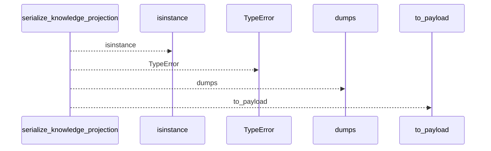
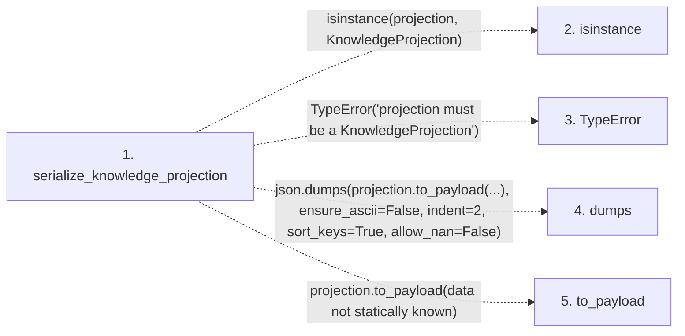

# serialize_knowledge_projection

**Entry point:** `serialize_knowledge_projection` (`api`)
**Source:** [knowledge_projection](../modules/knowledge_projection.md)
**Modules touched:** [knowledge_projection](../modules/knowledge_projection.md)

## Call sequence

<!-- Auto-generated from static call edges. Dashed arrows are external or unresolved calls. Reviewed runtime conditions and side effects belong in Behavior. -->

## Data flow

<!-- Auto-generated static analysis. Treat values and boundaries as best-effort hints, not runtime proof. -->

### Step data

| Step | Inputs | Reads | Writes | Returns |
|---|---|---|---|---|
| `serialize_knowledge_projection` | `projection: KnowledgeProjection` | `KnowledgeProjection` | - | `...` |
| `isinstance` | - | - | - | - |
| `TypeError` | - | - | - | - |
| `dumps` | - | - | - | - |
| `to_payload` | - | - | - | - |

### Call data

| From | To | Line | Call |
|---|---|---:|---|
| serialize_knowledge_projection | isinstance | 388 | `isinstance(projection, KnowledgeProjection)` |
| serialize_knowledge_projection | TypeError | 389 | `TypeError('projection must be a KnowledgeProjection')` |
| serialize_knowledge_projection | dumps | 391 | `json.dumps(projection.to_payload(...), ensure_ascii=False, indent=2, sort_keys=True, allow_nan=False)` |
| serialize_knowledge_projection | to_payload | 392 | `projection.to_payload(data not statically known)` |

### Boundary effects

*No boundary effects detected.*

### Static analysis gaps

| Kind | Step | Target | Line |
|---|---|---|---:|
| unresolved_call | `serialize_knowledge_projection` | `isinstance` | 388 |
| unresolved_call | `serialize_knowledge_projection` | `TypeError` | 389 |
| external_call | `serialize_knowledge_projection` | `json.dumps` | 391 |
| unresolved_call | `serialize_knowledge_projection` | `projection.to_payload` | 392 |

## Behavior

This flow starts at `serialize_knowledge_projection` and is classified as `api`. The generated call and data-flow sections are bounded static projections; runtime conditions and side effects require source-level confirmation.
