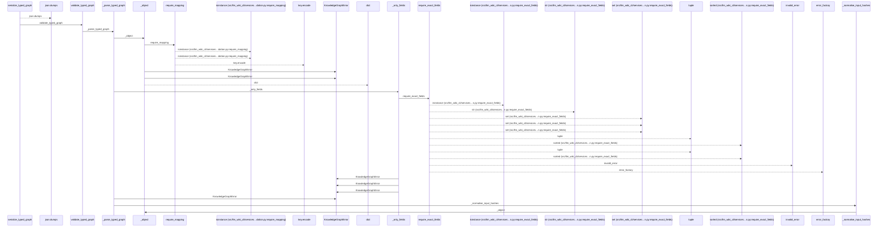
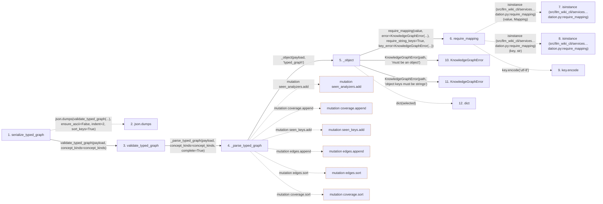

# serialize_typed_graph

**Entry point:** `serialize_typed_graph` (`api`)
**Source:** [knowledge_graph](../modules/knowledge_graph.md)
**Modules touched:** [knowledge_evidence](../modules/knowledge_evidence.md), [knowledge_graph](../modules/knowledge_graph.md), [validation](../modules/validation.md), [wiki_media](../modules/wiki_media.md), and 1 more

**Complete modules touched:**

- [knowledge_evidence](../modules/knowledge_evidence.md)
- [knowledge_graph](../modules/knowledge_graph.md)
- [validation](../modules/validation.md)
- [wiki_media](../modules/wiki_media.md)
- [wiki_surface](../modules/wiki_surface.md)

## Call sequence

<!-- Auto-generated from static call edges. Dashed arrows are external or unresolved calls. Reviewed runtime conditions and side effects belong in Behavior. -->

> Call sequence diagram shows 30 of 335 interactions; 305 omitted to keep the visualization within the 30-interaction and generated-diagram limits.

> Trace truncated at the depth limit; deeper calls are omitted.

## Data flow

<!-- Auto-generated static analysis. Treat values and boundaries as best-effort hints, not runtime proof. -->

### Step data

| Step | Inputs | Reads | Writes | Returns |
|---|---|---|---|---|
| `serialize_typed_graph` | `payload: object`, `concept_kinds: Mapping[str, str] \| None` | - | - | `...` |
| `json.dumps` | - | - | - | - |
| `validate_typed_graph` | `payload: object`, `concept_kinds: Mapping[str, str] \| None` | - | - | `_parse_typed_graph(...)` |
| `_parse_typed_graph` | `payload: object`, `concept_kinds: Mapping[str, str] \| None`, `complete: bool` | `TYPED_GRAPH_SCHEMA_VERSION`, `TYPED_GRAPH_SCHEMA_VERSION`, `TYPED_GRAPH_SCHEMA_VERSION` | - | `{...}` |
| `_object` | `value: object`, `path: str` | - | - | `dict(...)` |
| `require_mapping` | `value: object`, `error: Exception`, `require_string_keys: bool`, `key_error: Exception \| None`, `require_utf8_keys: bool`, `utf8_key_error: Exception \| None` | `Mapping` | - | `value` |
| `isinstance (src/llm_wiki_cli/services…dation.py:require_mapping)` | - | - | - | - |
| `isinstance (src/llm_wiki_cli/services…dation.py:require_mapping)` | - | - | - | - |
| `key.encode` | - | - | - | - |
| `KnowledgeGraphError` | - | - | - | - |
| `KnowledgeGraphError` | - | - | - | - |
| `dict` | - | - | - | - |

### Call data

| From | To | Line | Call |
|---|---|---:|---|
| serialize_typed_graph | json.dumps | 513 | `json.dumps(validate_typed_graph(...), ensure_ascii=False, indent=2, sort_keys=True)` |
| serialize_typed_graph | validate_typed_graph | 514 | `validate_typed_graph(payload, concept_kinds=concept_kinds)` |
| validate_typed_graph | _parse_typed_graph | 407 | `_parse_typed_graph(payload, concept_kinds=concept_kinds, complete=True)` |
| _parse_typed_graph | _object | 421 | `_object(payload, 'typed_graph')` |
| _object | require_mapping | 2302 | `require_mapping(value, error=KnowledgeGraphError(...), require_string_keys=True, key_error=KnowledgeGraphError(...))` |
| require_mapping | isinstance (src/llm_wiki_cli/services…dation.py:require_mapping) | 765 | `isinstance(value, Mapping)` |
| require_mapping | isinstance (src/llm_wiki_cli/services…dation.py:require_mapping) | 769 | `isinstance(key, str)` |
| require_mapping | key.encode | 774 | `key.encode('utf-8')` |
| _object | KnowledgeGraphError | 2304 | `KnowledgeGraphError(path, 'must be an object')` |
| _object | KnowledgeGraphError | 2306 | `KnowledgeGraphError(path, 'object keys must be strings')` |
| _object | dict | 2308 | `dict(selected)` |

### Boundary effects

| Kind | Target | Step | Line |
|---|---|---|---:|
| mutation | `seen_analyzers.add` | `_parse_typed_graph` | 467 |
| mutation | `coverage.append` | `_parse_typed_graph` | 468 |
| mutation | `seen_keys.add` | `_parse_typed_graph` | 492 |
| mutation | `edges.append` | `_parse_typed_graph` | 493 |
| mutation | `edges.sort` | `_parse_typed_graph` | 494 |
| mutation | `coverage.sort` | `_parse_typed_graph` | 495 |

### Static analysis gaps

| Kind | Step | Target | Line |
|---|---|---|---:|
| external_call | `serialize_typed_graph` | `json.dumps` | 513 |
| external_call | `require_mapping` | `isinstance` | 765 |
| external_call | `require_mapping` | `isinstance` | 769 |
| unresolved_call | `require_mapping` | `key.encode` | 774 |
| step_limit | `serialize_typed_graph` | `first 12 steps` | 0 |
| truncated_flow | `serialize_typed_graph` | `depth limit` | 0 |

## Behavior

This flow starts at `serialize_typed_graph` and is classified as `api`. The generated call and data-flow sections are bounded static projections; runtime conditions and side effects require source-level confirmation.
