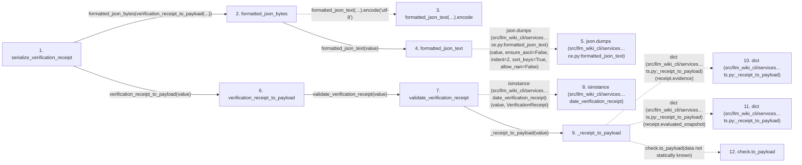

# serialize_verification_receipt

**Entry point:** `serialize_verification_receipt` (`api`)
**Source:** [verification_contracts](../modules/verification_contracts.md)
**Modules touched:** [knowledge_evidence](../modules/knowledge_evidence.md), [validation](../modules/validation.md), [verification_contracts](../modules/verification_contracts.md)

## Call sequence

```mermaid
sequenceDiagram
    participant p0 as serialize_verification_receipt
    participant p1 as formatted_json_bytes
    participant p2 as formatted_json_text(…).encode
    participant p3 as formatted_json_text
    participant p4 as json.dumps (src/llm_wiki_cli/services…ce.py:formatted_json_text)
    participant p5 as verification_receipt_to_payload
    participant p6 as validate_verification_receipt
    participant p7 as isinstance (src/llm_wiki_cli/services…date_verification_receipt)
    participant p8 as _receipt_to_payload
    participant p9 as dict (src/llm_wiki_cli/services…ts.py:_receipt_to_payload)
    participant p10 as check.to_payload
    participant p11 as _object
    participant p12 as require_mapping
    participant p13 as isinstance (src/llm_wiki_cli/services…dation.py:require_mapping)
    participant p14 as key.encode
    participant p15 as VerificationReceiptError
    participant p16 as _exact_fields
    participant p17 as set (src/llm_wiki_cli/services…ontracts.py:_exact_fields)
    participant p18 as require_exact_fields
    participant p19 as isinstance (src/llm_wiki_cli/services…n.py:require_exact_fields)
    participant p20 as str (src/llm_wiki_cli/services…n.py:require_exact_fields)
    participant p21 as set (src/llm_wiki_cli/services…n.py:require_exact_fields)
    participant p22 as tuple (src/llm_wiki_cli/services…n.py:require_exact_fields)
    participant p23 as sorted (src/llm_wiki_cli/services…n.py:require_exact_fields)
    p0->>p1: formatted_json_bytes
    p1-->>p2: formatted_json_text(…).encode
    p1->>p3: formatted_json_text
    p3-->>p4: json.dumps (src/llm_wiki_cli/services…ce.py:formatted_json_text)
    p0->>p5: verification_receipt_to_payload
    p5->>p6: validate_verification_receipt
    p6-->>p7: isinstance (src/llm_wiki_cli/services…date_verification_receipt)
    p6->>p8: _receipt_to_payload
    p8-->>p9: dict (src/llm_wiki_cli/services…ts.py:_receipt_to_payload)
    p8-->>p9: dict (src/llm_wiki_cli/services…ts.py:_receipt_to_payload)
    p8-->>p10: check.to_payload
    p6->>p11: _object
    p11->>p12: require_mapping
    p12-->>p13: isinstance (src/llm_wiki_cli/services…dation.py:require_mapping)
    p12-->>p13: isinstance (src/llm_wiki_cli/services…dation.py:require_mapping)
    p12-->>p14: key.encode
    p11->>p15: VerificationReceiptError
    p11->>p15: VerificationReceiptError
    p6->>p16: _exact_fields
    p16-->>p17: set (src/llm_wiki_cli/services…ontracts.py:_exact_fields)
    p16->>p18: require_exact_fields
    p18-->>p19: isinstance (src/llm_wiki_cli/services…n.py:require_exact_fields)
    p18-->>p20: str (src/llm_wiki_cli/services…n.py:require_exact_fields)
    p18-->>p21: set (src/llm_wiki_cli/services…n.py:require_exact_fields)
    p18-->>p21: set (src/llm_wiki_cli/services…n.py:require_exact_fields)
    p18-->>p21: set (src/llm_wiki_cli/services…n.py:require_exact_fields)
    p18-->>p22: tuple (src/llm_wiki_cli/services…n.py:require_exact_fields)
    p18-->>p23: sorted (src/llm_wiki_cli/services…n.py:require_exact_fields)
    p18-->>p22: tuple (src/llm_wiki_cli/services…n.py:require_exact_fields)
    p18-->>p23: sorted (src/llm_wiki_cli/services…n.py:require_exact_fields)
```

<!-- Auto-generated from static call edges. Dashed arrows are external or unresolved calls. Reviewed runtime conditions and side effects belong in Behavior. -->

> Call sequence diagram shows 30 of 169 interactions; 139 omitted to keep the visualization within the 30-interaction and generated-diagram limits.

> Trace truncated at the depth limit; deeper calls are omitted.

## Data flow

<!-- Auto-generated static analysis. Treat values and boundaries as best-effort hints, not runtime proof. -->

### Step data

| Step | Inputs | Reads | Writes | Returns |
|---|---|---|---|---|
| `serialize_verification_receipt` | `value: VerificationReceipt \| object` | `MAX_RECEIPT_BYTES` | - | `content` |
| `formatted_json_bytes` | `value: Any` | - | - | `...` |
| `formatted_json_text(…).encode` | - | - | - | - |
| `formatted_json_text` | `value: Any` | - | - | `...` |
| `json.dumps (src/llm_wiki_cli/services…ce.py:formatted_json_text)` | - | - | - | - |
| `verification_receipt_to_payload` | `value: VerificationReceipt \| object` | - | - | `_receipt_to_payload(...)` |
| `validate_verification_receipt` | `value: VerificationReceipt \| object` | `VerificationReceipt`, `VERIFICATION_RECEIPT_SCHEMA_VERSION`, `VERIFICATION_RECEIPT_SCHEMA_VERSION`, `VerificationContractError`, `MAX_CHECKS_PER_RECEIPT` | - | `VerificationReceipt(...)` |
| `isinstance (src/llm_wiki_cli/services…date_verification_receipt)` | - | - | - | - |
| `_receipt_to_payload` | `receipt: VerificationReceipt` | - | - | `{...}` |
| `dict (src/llm_wiki_cli/services…ts.py:_receipt_to_payload)` | - | - | - | - |
| `dict (src/llm_wiki_cli/services…ts.py:_receipt_to_payload)` | - | - | - | - |
| `check.to_payload` | - | - | - | - |

### Call data

| From | To | Line | Call |
|---|---|---:|---|
| serialize_verification_receipt | formatted_json_bytes | 790 | `formatted_json_bytes(verification_receipt_to_payload(...))` |
| formatted_json_bytes | formatted_json_text(…).encode | 192 | `formatted_json_text(value).encode('utf-8')` |
| formatted_json_bytes | formatted_json_text | 192 | `formatted_json_text(value)` |
| formatted_json_text | json.dumps (src/llm_wiki_cli/services…ce.py:formatted_json_text) | 178 | `json.dumps(value, ensure_ascii=False, indent=2, sort_keys=True, allow_nan=False)` |
| serialize_verification_receipt | verification_receipt_to_payload | 790 | `verification_receipt_to_payload(value)` |
| verification_receipt_to_payload | validate_verification_receipt | 781 | `validate_verification_receipt(value)` |
| validate_verification_receipt | isinstance (src/llm_wiki_cli/services…date_verification_receipt) | 806 | `isinstance(value, VerificationReceipt)` |
| validate_verification_receipt | _receipt_to_payload | 805 | `_receipt_to_payload(value)` |
| _receipt_to_payload | dict (src/llm_wiki_cli/services…ts.py:_receipt_to_payload) | 1101 | `dict(receipt.evidence)` |
| _receipt_to_payload | dict (src/llm_wiki_cli/services…ts.py:_receipt_to_payload) | 1103 | `dict(receipt.evaluated_snapshot)` |
| _receipt_to_payload | check.to_payload | 1107 | `check.to_payload(data not statically known)` |

### Boundary effects

*No boundary effects detected.*

### Static analysis gaps

| Kind | Step | Target | Line |
|---|---|---|---:|
| unresolved_call | `formatted_json_bytes` | `formatted_json_text(value).encode` | 192 |
| external_call | `formatted_json_text` | `json.dumps` | 178 |
| external_call | `validate_verification_receipt` | `isinstance` | 806 |
| unresolved_call | `_receipt_to_payload` | `check.to_payload` | 1107 |
| step_limit | `serialize_verification_receipt` | `first 12 steps` | 0 |
| truncated_flow | `serialize_verification_receipt` | `depth limit` | 0 |

## Behavior

This flow starts at `serialize_verification_receipt` and is classified as `api`. The generated call and data-flow sections are bounded static projections; runtime conditions and side effects require source-level confirmation.
