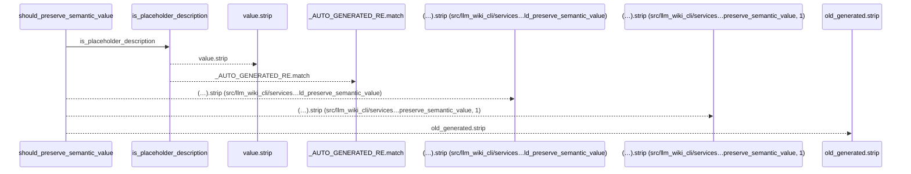
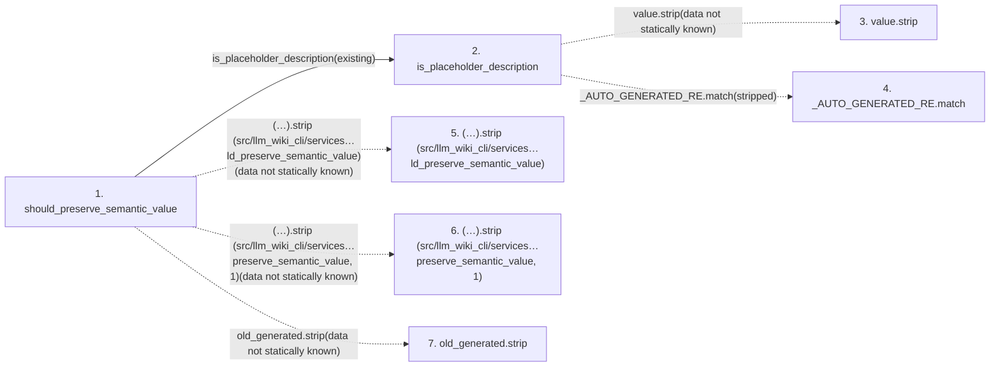

# should_preserve_semantic_value

**Entry point:** `should_preserve_semantic_value` (`api`)
**Source:** [markdown_sections](../modules/markdown_sections.md)
**Modules touched:** [markdown_sections](../modules/markdown_sections.md)

## Call sequence

<!-- Auto-generated from static call edges. Dashed arrows are external or unresolved calls. Reviewed runtime conditions and side effects belong in Behavior. -->

## Data flow

<!-- Auto-generated static analysis. Treat values and boundaries as best-effort hints, not runtime proof. -->

### Step data

| Step | Inputs | Reads | Writes | Returns |
|---|---|---|---|---|
| `should_preserve_semantic_value` | `existing: str \| None`, `generated: str \| None`, `old_generated: str \| None` | - | - | `False`, `...`, `False`, `...` |
| `is_placeholder_description` | `value: str \| None` | - | - | `True`, `True`, `...` |
| `value.strip` | - | - | - | - |
| `_AUTO_GENERATED_RE.match` | - | - | - | - |
| `(…).strip (src/llm_wiki_cli/services…ld_preserve_semantic_value)` | - | - | - | - |
| `(…).strip (src/llm_wiki_cli/services…preserve_semantic_value, 1)` | - | - | - | - |
| `old_generated.strip` | - | - | - | - |

### Call data

| From | To | Line | Call |
|---|---|---:|---|
| should_preserve_semantic_value | is_placeholder_description | 543 | `is_placeholder_description(existing)` |
| is_placeholder_description | value.strip | 530 | `value.strip(data not statically known)` |
| is_placeholder_description | _AUTO_GENERATED_RE.match | 533 | `_AUTO_GENERATED_RE.match(stripped)` |
| should_preserve_semantic_value | (…).strip (src/llm_wiki_cli/services…ld_preserve_semantic_value) | 545 | `(existing or '').strip(data not statically known)` |
| should_preserve_semantic_value | (…).strip (src/llm_wiki_cli/services…preserve_semantic_value, 1) | 546 | `(generated or '').strip(data not statically known)` |
| should_preserve_semantic_value | old_generated.strip | 549 | `old_generated.strip(data not statically known)` |

### Boundary effects

*No boundary effects detected.*

### Static analysis gaps

| Kind | Step | Target | Line |
|---|---|---|---:|
| unresolved_call | `is_placeholder_description` | `value.strip` | 530 |
| unresolved_call | `is_placeholder_description` | `_AUTO_GENERATED_RE.match` | 533 |
| unresolved_call | `should_preserve_semantic_value` | `(existing or '').strip` | 545 |
| unresolved_call | `should_preserve_semantic_value` | `(generated or '').strip` | 546 |
| unresolved_call | `should_preserve_semantic_value` | `old_generated.strip` | 549 |

## Behavior

This flow starts at `should_preserve_semantic_value` and is classified as `api`. The generated call and data-flow sections are bounded static projections; runtime conditions and side effects require source-level confirmation.
