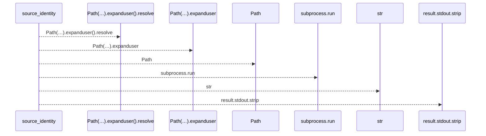
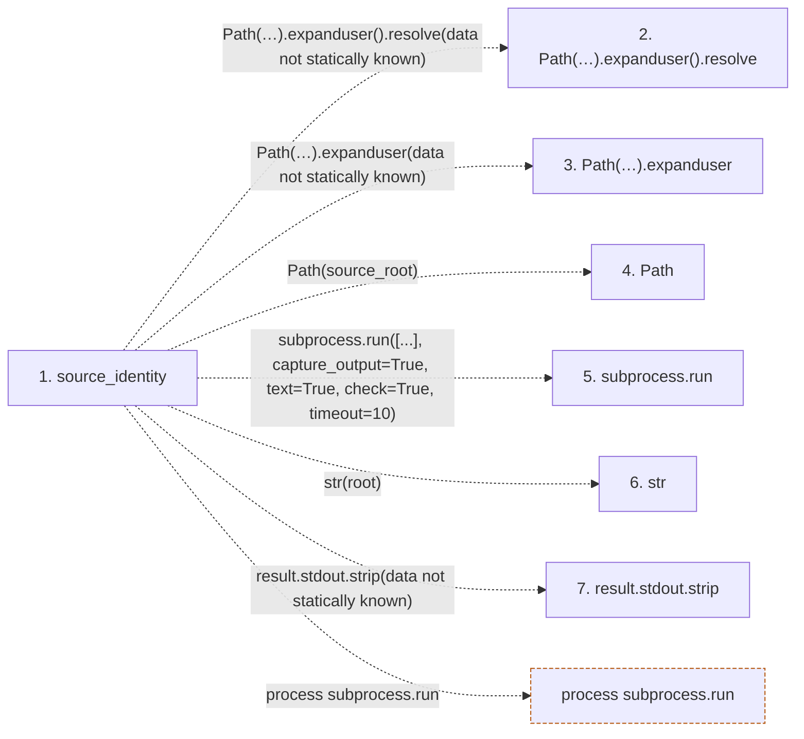

# source_identity

**Entry point:** `source_identity` (`api`)
**Source:** [refresh](../modules/refresh.md)
**Modules touched:** [refresh](../modules/refresh.md)

## Call sequence

<!-- Auto-generated from static call edges. Dashed arrows are external or unresolved calls. Reviewed runtime conditions and side effects belong in Behavior. -->

## Data flow

<!-- Auto-generated static analysis. Treat values and boundaries as best-effort hints, not runtime proof. -->

### Step data

| Step | Inputs | Reads | Writes | Returns |
|---|---|---|---|---|
| `source_identity` | `source_root: str \| Path`, `baseline: TreeBaseline` | - | - | `{...}` |
| `Path(…).expanduser().resolve` | - | - | - | - |
| `Path(…).expanduser` | - | - | - | - |
| `Path` | - | - | - | - |
| `subprocess.run` | - | - | - | - |
| `str` | - | - | - | - |
| `result.stdout.strip` | - | - | - | - |

### Call data

| From | To | Line | Call |
|---|---|---:|---|
| source_identity | Path(…).expanduser().resolve | 632 | `Path(source_root).expanduser().resolve(data not statically known)` |
| source_identity | Path(…).expanduser | 632 | `Path(source_root).expanduser(data not statically known)` |
| source_identity | Path | 632 | `Path(source_root)` |
| source_identity | subprocess.run | 635 | `subprocess.run([...], capture_output=True, text=True, check=True, timeout=10)` |
| source_identity | str | 636 | `str(root)` |
| source_identity | result.stdout.strip | 642 | `result.stdout.strip(data not statically known)` |

### Boundary effects

| Kind | Target | Step | Line |
|---|---|---|---:|
| process | `subprocess.run` | `source_identity` | 635 |

### Static analysis gaps

| Kind | Step | Target | Line |
|---|---|---|---:|
| unresolved_call | `source_identity` | `Path(source_root).expanduser().resolve` | 632 |
| unresolved_call | `source_identity` | `Path(source_root).expanduser` | 632 |
| unresolved_call | `source_identity` | `result.stdout.strip` | 642 |

## Behavior

This flow starts at `source_identity` and is classified as `api`. The generated call and data-flow sections are bounded static projections; runtime conditions and side effects require source-level confirmation.
