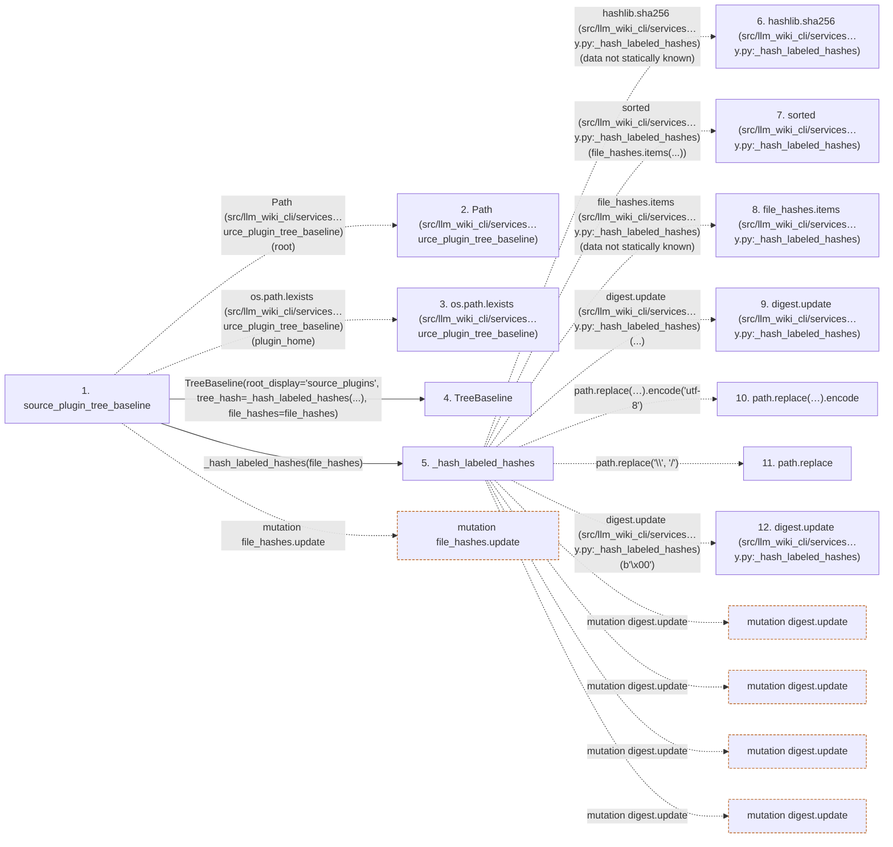

# source_plugin_tree_baseline

**Entry point:** `source_plugin_tree_baseline` (`api`)
**Source:** [documentation_policy](../modules/documentation_policy.md)
**Modules touched:** [documentation_policy](../modules/documentation_policy.md), [filesystem_guard](../modules/filesystem_guard.md)

## Call sequence

```mermaid
sequenceDiagram
    participant p0 as source_plugin_tree_baseline
    participant p1 as Path (src/llm_wiki_cli/services…urce_plugin_tree_baseline)
    participant p2 as os.path.lexists (src/llm_wiki_cli/services…urce_plugin_tree_baseline)
    participant p3 as TreeBaseline
    participant p4 as _hash_labeled_hashes
    participant p5 as hashlib.sha256 (src/llm_wiki_cli/services…y.py:_hash_labeled_hashes)
    participant p6 as sorted (src/llm_wiki_cli/services…y.py:_hash_labeled_hashes)
    participant p7 as file_hashes.items (src/llm_wiki_cli/services…y.py:_hash_labeled_hashes)
    participant p8 as digest.update (src/llm_wiki_cli/services…y.py:_hash_labeled_hashes)
    participant p9 as path.replace(…).encode
    participant p10 as path.replace
    participant p11 as file_hash.encode
    participant p12 as digest.hexdigest (src/llm_wiki_cli/services…y.py:_hash_labeled_hashes)
    participant p13 as _lstat
    participant p14 as os.lstat (src/llm_wiki_cli/services…entation_policy.py:_lstat)
    participant p15 as DocumentationPolicyError
    participant p16 as _assert_safe_directory
    participant p17 as stat.S_ISLNK (src/llm_wiki_cli/services…py:_assert_safe_directory)
    participant p18 as _is_windows_reparse_point
    participant p19 as int (src/llm_wiki_cli/services…_is_windows_reparse_point)
    participant p20 as getattr (src/llm_wiki_cli/services…_is_windows_reparse_point)
    participant p21 as bool
    participant p22 as stat.S_ISDIR (src/llm_wiki_cli/services…py:_assert_safe_directory)
    p0-->>p1: Path (src/llm_wiki_cli/services…urce_plugin_tree_baseline)
    p0-->>p2: os.path.lexists (src/llm_wiki_cli/services…urce_plugin_tree_baseline)
    p0->>p3: TreeBaseline
    p0->>p4: _hash_labeled_hashes
    p4-->>p5: hashlib.sha256 (src/llm_wiki_cli/services…y.py:_hash_labeled_hashes)
    p4-->>p6: sorted (src/llm_wiki_cli/services…y.py:_hash_labeled_hashes)
    p4-->>p7: file_hashes.items (src/llm_wiki_cli/services…y.py:_hash_labeled_hashes)
    p4-->>p8: digest.update (src/llm_wiki_cli/services…y.py:_hash_labeled_hashes)
    p4-->>p9: path.replace(…).encode
    p4-->>p10: path.replace
    p4-->>p8: digest.update (src/llm_wiki_cli/services…y.py:_hash_labeled_hashes)
    p4-->>p8: digest.update (src/llm_wiki_cli/services…y.py:_hash_labeled_hashes)
    p4-->>p11: file_hash.encode
    p4-->>p8: digest.update (src/llm_wiki_cli/services…y.py:_hash_labeled_hashes)
    p4-->>p12: digest.hexdigest (src/llm_wiki_cli/services…y.py:_hash_labeled_hashes)
    p0->>p13: _lstat
    p13-->>p14: os.lstat (src/llm_wiki_cli/services…entation_policy.py:_lstat)
    p13->>p15: DocumentationPolicyError
    p0->>p16: _assert_safe_directory
    p16-->>p17: stat.S_ISLNK (src/llm_wiki_cli/services…py:_assert_safe_directory)
    p16->>p15: DocumentationPolicyError
    p16->>p18: _is_windows_reparse_point
    p18-->>p19: int (src/llm_wiki_cli/services…_is_windows_reparse_point)
    p18-->>p20: getattr (src/llm_wiki_cli/services…_is_windows_reparse_point)
    p18-->>p19: int (src/llm_wiki_cli/services…_is_windows_reparse_point)
    p18-->>p20: getattr (src/llm_wiki_cli/services…_is_windows_reparse_point)
    p18-->>p21: bool
    p16->>p15: DocumentationPolicyError
    p16-->>p22: stat.S_ISDIR (src/llm_wiki_cli/services…py:_assert_safe_directory)
    p16->>p15: DocumentationPolicyError
```

<!-- Auto-generated from static call edges. Dashed arrows are external or unresolved calls. Reviewed runtime conditions and side effects belong in Behavior. -->

> Call sequence diagram shows 30 of 338 interactions; 308 omitted to keep the visualization within the 30-interaction and generated-diagram limits.

> Trace truncated at the depth limit; deeper calls are omitted.

## Data flow

<!-- Auto-generated static analysis. Treat values and boundaries as best-effort hints, not runtime proof. -->

### Step data

| Step | Inputs | Reads | Writes | Returns |
|---|---|---|---|---|
| `source_plugin_tree_baseline` | `root: str \| Path` | `DEFAULT_MAX_BASELINE_FILE_BYTES`, `DEFAULT_MAX_BASELINE_FILE_BYTES`, `DEFAULT_MAX_BASELINE_FILES` | `file_hashes[...]` | `TreeBaseline(...)`, `TreeBaseline(...)` |
| `Path (src/llm_wiki_cli/services…urce_plugin_tree_baseline)` | - | - | - | - |
| `os.path.lexists (src/llm_wiki_cli/services…urce_plugin_tree_baseline)` | - | - | - | - |
| `TreeBaseline` | - | - | - | - |
| `_hash_labeled_hashes` | `file_hashes: dict[str, str]` | - | - | `...` |
| `hashlib.sha256 (src/llm_wiki_cli/services…y.py:_hash_labeled_hashes)` | - | - | - | - |
| `sorted (src/llm_wiki_cli/services…y.py:_hash_labeled_hashes)` | - | - | - | - |
| `file_hashes.items (src/llm_wiki_cli/services…y.py:_hash_labeled_hashes)` | - | - | - | - |
| `digest.update (src/llm_wiki_cli/services…y.py:_hash_labeled_hashes)` | - | - | - | - |
| `path.replace(…).encode` | - | - | - | - |
| `path.replace` | - | - | - | - |
| `digest.update (src/llm_wiki_cli/services…y.py:_hash_labeled_hashes)` | - | - | - | - |

### Call data

| From | To | Line | Call |
|---|---|---:|---|
| source_plugin_tree_baseline | Path (src/llm_wiki_cli/services…urce_plugin_tree_baseline) | 427 | `Path(root)` |
| source_plugin_tree_baseline | os.path.lexists (src/llm_wiki_cli/services…urce_plugin_tree_baseline) | 432 | `os.path.lexists(plugin_home)` |
| source_plugin_tree_baseline | TreeBaseline | 433 | `TreeBaseline(root_display='source_plugins', tree_hash=_hash_labeled_hashes(...), file_hashes=file_hashes)` |
| source_plugin_tree_baseline | _hash_labeled_hashes | 435 | `_hash_labeled_hashes(file_hashes)` |
| _hash_labeled_hashes | hashlib.sha256 (src/llm_wiki_cli/services…y.py:_hash_labeled_hashes) | 905 | `hashlib.sha256(data not statically known)` |
| _hash_labeled_hashes | sorted (src/llm_wiki_cli/services…y.py:_hash_labeled_hashes) | 906 | `sorted(file_hashes.items(...))` |
| _hash_labeled_hashes | file_hashes.items (src/llm_wiki_cli/services…y.py:_hash_labeled_hashes) | 906 | `file_hashes.items(data not statically known)` |
| _hash_labeled_hashes | digest.update (src/llm_wiki_cli/services…y.py:_hash_labeled_hashes) | 907 | `digest.update(...)` |
| _hash_labeled_hashes | path.replace(…).encode | 907 | `path.replace('\\', '/').encode('utf-8')` |
| _hash_labeled_hashes | path.replace | 907 | `path.replace('\\', '/')` |
| _hash_labeled_hashes | digest.update (src/llm_wiki_cli/services…y.py:_hash_labeled_hashes) | 908 | `digest.update(b'\x00')` |

### Boundary effects

| Kind | Target | Step | Line |
|---|---|---|---:|
| mutation | `file_hashes.update` | `source_plugin_tree_baseline` | 467 |
| mutation | `digest.update` | `_hash_labeled_hashes` | 907 |
| mutation | `digest.update` | `_hash_labeled_hashes` | 908 |
| mutation | `digest.update` | `_hash_labeled_hashes` | 909 |
| mutation | `digest.update` | `_hash_labeled_hashes` | 910 |

### Static analysis gaps

| Kind | Step | Target | Line |
|---|---|---|---:|
| external_call | `source_plugin_tree_baseline` | `os.path.lexists` | 432 |
| external_call | `_hash_labeled_hashes` | `hashlib.sha256` | 905 |
| external_call | `_hash_labeled_hashes` | `sorted` | 906 |
| unresolved_call | `_hash_labeled_hashes` | `file_hashes.items` | 906 |
| step_limit | `source_plugin_tree_baseline` | `first 12 steps` | 0 |
| truncated_flow | `source_plugin_tree_baseline` | `depth limit` | 0 |

## Behavior

This flow starts at `source_plugin_tree_baseline` and is classified as `api`. The generated call and data-flow sections are bounded static projections; runtime conditions and side effects require source-level confirmation.
