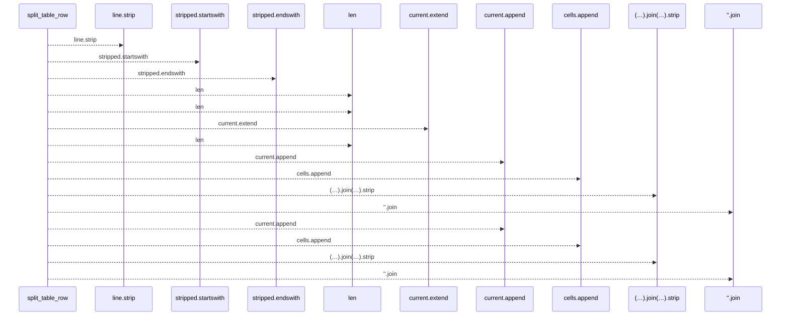
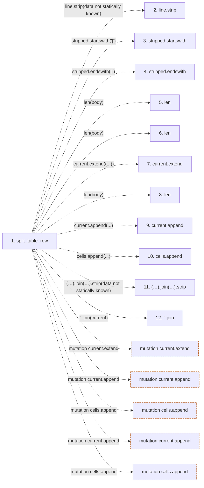

# split_table_row

**Entry point:** `split_table_row` (`api`)
**Source:** [markdown_sections](../modules/markdown_sections.md)
**Modules touched:** [markdown_sections](../modules/markdown_sections.md)

## Call sequence

<!-- Auto-generated from static call edges. Dashed arrows are external or unresolved calls. Reviewed runtime conditions and side effects belong in Behavior. -->

## Data flow

<!-- Auto-generated static analysis. Treat values and boundaries as best-effort hints, not runtime proof. -->

### Step data

| Step | Inputs | Reads | Writes | Returns |
|---|---|---|---|---|
| `split_table_row` | `line: str` | - | - | `[...]`, `cells` |
| `line.strip` | - | - | - | - |
| `stripped.startswith` | - | - | - | - |
| `stripped.endswith` | - | - | - | - |
| `len` | - | - | - | - |
| `len` | - | - | - | - |
| `current.extend` | - | - | - | - |
| `len` | - | - | - | - |
| `current.append` | - | - | - | - |
| `cells.append` | - | - | - | - |
| `(…).join(…).strip` | - | - | - | - |
| `''.join` | - | - | - | - |

### Call data

| From | To | Line | Call |
|---|---|---:|---|
| split_table_row | line.strip | 467 | `line.strip(data not statically known)` |
| split_table_row | stripped.startswith | 468 | `stripped.startswith('\|')` |
| split_table_row | stripped.endswith | 468 | `stripped.endswith('\|')` |
| split_table_row | len | 475 | `len(body)` |
| split_table_row | len | 477 | `len(body)` |
| split_table_row | current.extend | 478 | `current.extend((...))` |
| split_table_row | len | 483 | `len(body)` |
| split_table_row | current.append | 486 | `current.append(...)` |
| split_table_row | cells.append | 494 | `cells.append(...)` |
| split_table_row | (…).join(…).strip | 494 | `''.join(current).strip(data not statically known)` |
| split_table_row | ''.join | 494 | `''.join(current)` |

### Boundary effects

| Kind | Target | Step | Line |
|---|---|---|---:|
| mutation | `current.extend` | `split_table_row` | 478 |
| mutation | `current.append` | `split_table_row` | 486 |
| mutation | `cells.append` | `split_table_row` | 494 |
| mutation | `current.append` | `split_table_row` | 497 |
| mutation | `cells.append` | `split_table_row` | 499 |

### Static analysis gaps

| Kind | Step | Target | Line |
|---|---|---|---:|
| unresolved_call | `split_table_row` | `line.strip` | 467 |
| unresolved_call | `split_table_row` | `stripped.startswith` | 468 |
| unresolved_call | `split_table_row` | `stripped.endswith` | 468 |
| step_limit | `split_table_row` | `first 12 steps` | 0 |

## Behavior

This flow starts at `split_table_row` and is classified as `api`. The generated call and data-flow sections are bounded static projections; runtime conditions and side effects require source-level confirmation.
