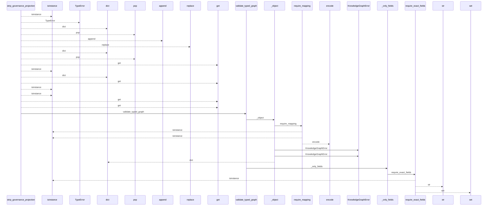
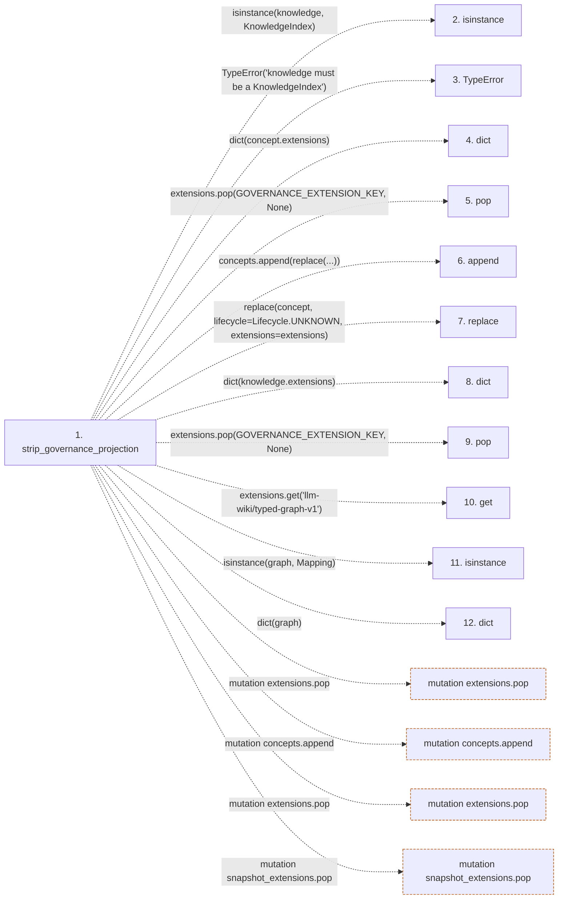

# strip_governance_projection

**Entry point:** `strip_governance_projection` (`api`)
**Source:** [knowledge_governance](../modules/knowledge_governance.md)
**Modules touched:** [knowledge_evidence](../modules/knowledge_evidence.md), [knowledge_governance](../modules/knowledge_governance.md), [knowledge_graph](../modules/knowledge_graph.md), [validation](../modules/validation.md), and 2 more

**Complete modules touched:**

- [knowledge_evidence](../modules/knowledge_evidence.md)
- [knowledge_governance](../modules/knowledge_governance.md)
- [knowledge_graph](../modules/knowledge_graph.md)
- [validation](../modules/validation.md)
- [wiki_media](../modules/wiki_media.md)
- [wiki_surface](../modules/wiki_surface.md)

## Call sequence

<!-- Auto-generated from static call edges. Dashed arrows are external or unresolved calls. Reviewed runtime conditions and side effects belong in Behavior. -->

> Call sequence diagram shows 30 of 435 interactions; 405 omitted to keep the visualization within the 30-interaction and generated-diagram limits.

> Trace truncated at the depth limit; deeper calls are omitted.

## Data flow

<!-- Auto-generated static analysis. Treat values and boundaries as best-effort hints, not runtime proof. -->

### Step data

| Step | Inputs | Reads | Writes | Returns |
|---|---|---|---|---|
| `strip_governance_projection` | `knowledge: KnowledgeIndex` | `KnowledgeIndex`, `GOVERNANCE_EXTENSION_KEY`, `Lifecycle`, `GOVERNANCE_EXTENSION_KEY`, `Mapping`, `Mapping`, `ConceptKind`, `GOVERNANCE_HASH_EXTENSION_KEY` | `graph_payload[...]`, `extensions[...]` | `replace(...)` |
| `isinstance` | - | - | - | - |
| `TypeError` | - | - | - | - |
| `dict` | - | - | - | - |
| `pop` | - | - | - | - |
| `append` | - | - | - | - |
| `replace` | - | - | - | - |
| `dict` | - | - | - | - |
| `pop` | - | - | - | - |
| `get` | - | - | - | - |
| `isinstance` | - | - | - | - |
| `dict` | - | - | - | - |

### Call data

| From | To | Line | Call |
|---|---|---:|---|
| strip_governance_projection | isinstance | 1613 | `isinstance(knowledge, KnowledgeIndex)` |
| strip_governance_projection | TypeError | 1614 | `TypeError('knowledge must be a KnowledgeIndex')` |
| strip_governance_projection | dict | 1617 | `dict(concept.extensions)` |
| strip_governance_projection | pop | 1618 | `extensions.pop(GOVERNANCE_EXTENSION_KEY, None)` |
| strip_governance_projection | append | 1619 | `concepts.append(replace(...))` |
| strip_governance_projection | replace | 1620 | `replace(concept, lifecycle=Lifecycle.UNKNOWN, extensions=extensions)` |
| strip_governance_projection | dict | 1626 | `dict(knowledge.extensions)` |
| strip_governance_projection | pop | 1627 | `extensions.pop(GOVERNANCE_EXTENSION_KEY, None)` |
| strip_governance_projection | get | 1628 | `extensions.get('llm-wiki/typed-graph-v1')` |
| strip_governance_projection | isinstance | 1629 | `isinstance(graph, Mapping)` |
| strip_governance_projection | dict | 1632 | `dict(graph)` |

### Boundary effects

| Kind | Target | Step | Line |
|---|---|---|---:|
| mutation | `extensions.pop` | `strip_governance_projection` | 1618 |
| mutation | `concepts.append` | `strip_governance_projection` | 1619 |
| mutation | `extensions.pop` | `strip_governance_projection` | 1627 |
| mutation | `snapshot_extensions.pop` | `strip_governance_projection` | 1656 |

### Static analysis gaps

| Kind | Step | Target | Line |
|---|---|---|---:|
| unresolved_call | `strip_governance_projection` | `isinstance` | 1613 |
| unresolved_call | `strip_governance_projection` | `TypeError` | 1614 |
| external_call | `strip_governance_projection` | `replace` | 1620 |
| unresolved_call | `strip_governance_projection` | `extensions.get` | 1628 |
| unresolved_call | `strip_governance_projection` | `isinstance` | 1629 |
| step_limit | `strip_governance_projection` | `first 12 steps` | 0 |
| truncated_flow | `strip_governance_projection` | `depth limit` | 0 |

## Behavior

This flow starts at `strip_governance_projection` and is classified as `api`. The generated call and data-flow sections are bounded static projections; runtime conditions and side effects require source-level confirmation.
