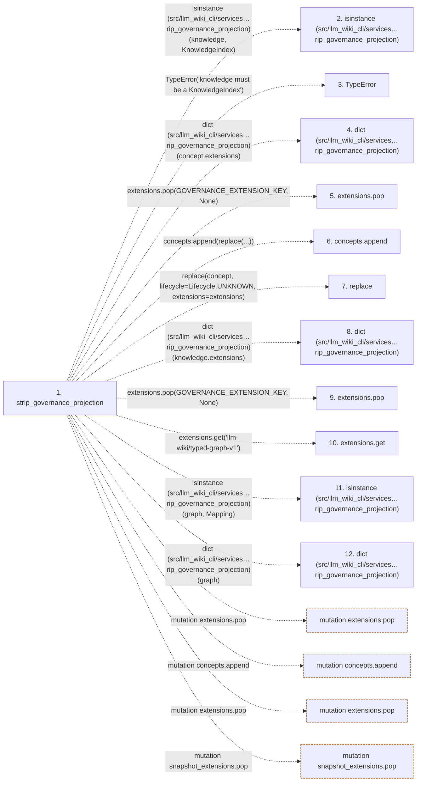

# strip_governance_projection

**Entry point:** `strip_governance_projection` (`api`)
**Source:** [knowledge_governance](../modules/knowledge_governance.md)
**Modules touched:** [knowledge_evidence](../modules/knowledge_evidence.md), [knowledge_governance](../modules/knowledge_governance.md), [knowledge_graph](../modules/knowledge_graph.md), [validation](../modules/validation.md), and 2 more

**Complete modules touched:**

- [knowledge_evidence](../modules/knowledge_evidence.md)
- [knowledge_governance](../modules/knowledge_governance.md)
- [knowledge_graph](../modules/knowledge_graph.md)
- [validation](../modules/validation.md)
- [wiki_media](../modules/wiki_media.md)
- [wiki_surface](../modules/wiki_surface.md)

## Call sequence

```mermaid
sequenceDiagram
    participant p0 as strip_governance_projection
    participant p1 as isinstance (src/llm_wiki_cli/services…rip_governance_projection)
    participant p2 as TypeError
    participant p3 as dict (src/llm_wiki_cli/services…rip_governance_projection)
    participant p4 as extensions.pop
    participant p5 as concepts.append
    participant p6 as replace
    participant p7 as extensions.get
    participant p8 as graph_payload.get
    participant p9 as edge.get
    participant p10 as validate_typed_graph
    participant p11 as _parse_typed_graph
    participant p12 as _object
    participant p13 as require_mapping
    participant p14 as isinstance (src/llm_wiki_cli/services…dation.py:require_mapping)
    participant p15 as key.encode
    participant p16 as KnowledgeGraphError
    participant p17 as dict (src/llm_wiki_cli/services…nowledge_graph.py:_object)
    participant p18 as _only_fields
    participant p19 as require_exact_fields
    participant p20 as isinstance (src/llm_wiki_cli/services…n.py:require_exact_fields)
    participant p21 as str (src/llm_wiki_cli/services…n.py:require_exact_fields)
    p0-->>p1: isinstance (src/llm_wiki_cli/services…rip_governance_projection)
    p0-->>p2: TypeError
    p0-->>p3: dict (src/llm_wiki_cli/services…rip_governance_projection)
    p0-->>p4: extensions.pop
    p0-->>p5: concepts.append
    p0-->>p6: replace
    p0-->>p3: dict (src/llm_wiki_cli/services…rip_governance_projection)
    p0-->>p4: extensions.pop
    p0-->>p7: extensions.get
    p0-->>p1: isinstance (src/llm_wiki_cli/services…rip_governance_projection)
    p0-->>p3: dict (src/llm_wiki_cli/services…rip_governance_projection)
    p0-->>p8: graph_payload.get
    p0-->>p1: isinstance (src/llm_wiki_cli/services…rip_governance_projection)
    p0-->>p1: isinstance (src/llm_wiki_cli/services…rip_governance_projection)
    p0-->>p9: edge.get
    p0-->>p9: edge.get
    p0->>p10: validate_typed_graph
    p10->>p11: _parse_typed_graph
    p11->>p12: _object
    p12->>p13: require_mapping
    p13-->>p14: isinstance (src/llm_wiki_cli/services…dation.py:require_mapping)
    p13-->>p14: isinstance (src/llm_wiki_cli/services…dation.py:require_mapping)
    p13-->>p15: key.encode
    p12->>p16: KnowledgeGraphError
    p12->>p16: KnowledgeGraphError
    p12-->>p17: dict (src/llm_wiki_cli/services…nowledge_graph.py:_object)
    p11->>p18: _only_fields
    p18->>p19: require_exact_fields
    p19-->>p20: isinstance (src/llm_wiki_cli/services…n.py:require_exact_fields)
    p19-->>p21: str (src/llm_wiki_cli/services…n.py:require_exact_fields)
```

<!-- Auto-generated from static call edges. Dashed arrows are external or unresolved calls. Reviewed runtime conditions and side effects belong in Behavior. -->

> Call sequence diagram shows 30 of 358 interactions; 328 omitted to keep the visualization within the 30-interaction and generated-diagram limits.

> Trace truncated at the depth limit; deeper calls are omitted.

## Data flow

<!-- Auto-generated static analysis. Treat values and boundaries as best-effort hints, not runtime proof. -->

### Step data

| Step | Inputs | Reads | Writes | Returns |
|---|---|---|---|---|
| `strip_governance_projection` | `knowledge: KnowledgeIndex` | `KnowledgeIndex`, `GOVERNANCE_EXTENSION_KEY`, `Lifecycle`, `GOVERNANCE_EXTENSION_KEY`, `Mapping`, `Mapping`, `ConceptKind`, `GOVERNANCE_HASH_EXTENSION_KEY` | `graph_payload[...]`, `extensions[...]` | `replace(...)` |
| `isinstance (src/llm_wiki_cli/services…rip_governance_projection)` | - | - | - | - |
| `TypeError` | - | - | - | - |
| `dict (src/llm_wiki_cli/services…rip_governance_projection)` | - | - | - | - |
| `extensions.pop` | - | - | - | - |
| `concepts.append` | - | - | - | - |
| `replace` | - | - | - | - |
| `dict (src/llm_wiki_cli/services…rip_governance_projection)` | - | - | - | - |
| `extensions.pop` | - | - | - | - |
| `extensions.get` | - | - | - | - |
| `isinstance (src/llm_wiki_cli/services…rip_governance_projection)` | - | - | - | - |
| `dict (src/llm_wiki_cli/services…rip_governance_projection)` | - | - | - | - |

### Call data

| From | To | Line | Call |
|---|---|---:|---|
| strip_governance_projection | isinstance (src/llm_wiki_cli/services…rip_governance_projection) | 1617 | `isinstance(knowledge, KnowledgeIndex)` |
| strip_governance_projection | TypeError | 1618 | `TypeError('knowledge must be a KnowledgeIndex')` |
| strip_governance_projection | dict (src/llm_wiki_cli/services…rip_governance_projection) | 1621 | `dict(concept.extensions)` |
| strip_governance_projection | extensions.pop | 1622 | `extensions.pop(GOVERNANCE_EXTENSION_KEY, None)` |
| strip_governance_projection | concepts.append | 1623 | `concepts.append(replace(...))` |
| strip_governance_projection | replace | 1624 | `replace(concept, lifecycle=Lifecycle.UNKNOWN, extensions=extensions)` |
| strip_governance_projection | dict (src/llm_wiki_cli/services…rip_governance_projection) | 1630 | `dict(knowledge.extensions)` |
| strip_governance_projection | extensions.pop | 1631 | `extensions.pop(GOVERNANCE_EXTENSION_KEY, None)` |
| strip_governance_projection | extensions.get | 1632 | `extensions.get('llm-wiki/typed-graph-v1')` |
| strip_governance_projection | isinstance (src/llm_wiki_cli/services…rip_governance_projection) | 1633 | `isinstance(graph, Mapping)` |
| strip_governance_projection | dict (src/llm_wiki_cli/services…rip_governance_projection) | 1636 | `dict(graph)` |

### Boundary effects

| Kind | Target | Step | Line |
|---|---|---|---:|
| mutation | `extensions.pop` | `strip_governance_projection` | 1622 |
| mutation | `concepts.append` | `strip_governance_projection` | 1623 |
| mutation | `extensions.pop` | `strip_governance_projection` | 1631 |
| mutation | `snapshot_extensions.pop` | `strip_governance_projection` | 1660 |

### Static analysis gaps

| Kind | Step | Target | Line |
|---|---|---|---:|
| external_call | `strip_governance_projection` | `isinstance` | 1617 |
| external_call | `strip_governance_projection` | `TypeError` | 1618 |
| external_call | `strip_governance_projection` | `replace` | 1624 |
| unresolved_call | `strip_governance_projection` | `extensions.get` | 1632 |
| external_call | `strip_governance_projection` | `isinstance` | 1633 |
| step_limit | `strip_governance_projection` | `first 12 steps` | 0 |
| truncated_flow | `strip_governance_projection` | `depth limit` | 0 |

## Behavior

This flow starts at `strip_governance_projection` and is classified as `api`. The generated call and data-flow sections are bounded static projections; runtime conditions and side effects require source-level confirmation.
