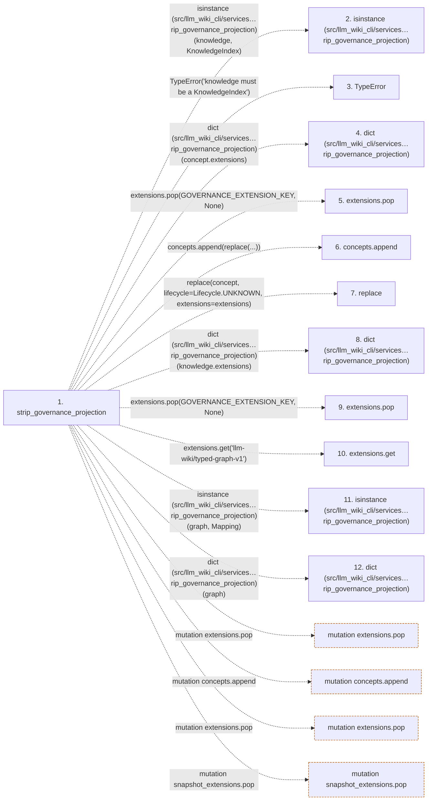

# strip_governance_projection

**Entry point:** `strip_governance_projection` (`api`)
**Source:** [knowledge_governance](../modules/knowledge_governance.md)
**Modules touched:** [knowledge_evidence](../modules/knowledge_evidence.md), [knowledge_governance](../modules/knowledge_governance.md), [knowledge_graph](../modules/knowledge_graph.md), [validation](../modules/validation.md), and 2 more

**Complete modules touched:**

- [knowledge_evidence](../modules/knowledge_evidence.md)
- [knowledge_governance](../modules/knowledge_governance.md)
- [knowledge_graph](../modules/knowledge_graph.md)
- [validation](../modules/validation.md)
- [wiki_media](../modules/wiki_media.md)
- [wiki_surface](../modules/wiki_surface.md)

## Call sequence

> Static overview in presentation order, not runtime execution order. Arrows retain captured callers; representative internal continuations and boundary examples precede repeated helper detail.

<!-- Auto-generated from static call edges. Dashed arrows are external or unresolved calls. Reviewed runtime conditions and side effects belong in Behavior. -->

```mermaid
sequenceDiagram
    participant p0 as strip_governance_projection
    participant p1 as validate_typed_graph
    participant p2 as _parse_typed_graph
    participant p3 as _object
    participant p4 as _only_fields
    participant p5 as _normalise_input_hashes
    participant p6 as _array
    participant p7 as _name
    participant p8 as _normalise_coverage
    participant p9 as _locator
    participant p10 as _normalise_edge
    participant p11 as _validate_graph_bindings
    participant p12 as require_nonempty_text
    participant p13 as validate_exact_page_coordinate
    participant p14 as _nonnegative_int
    participant p15 as _hash
    participant p16 as _relationship_kind
    participant p17 as _normalise_endpoint
    participant p18 as _aggregate_input_hash
    participant p19 as _positive_int
    participant p20 as _limitation
    participant p21 as _validate_resolution_target
    participant p22 as _normalise_evidence
    participant p23 as _validate_endpoint_concept_references
    participant p24 as relationship_edge_key
    participant p25 as _validate_core_direction
    participant p26 as require_sha256
    participant p27 as require_nonnegative_int
    participant p28 as _open_name
    participant p29 as isinstance (src/llm_wiki_cli/services…rip_governance_projection)
    participant p30 as extensions.pop
    p0->>p1: validate_typed_graph
    p1->>p2: _parse_typed_graph
    p2->>p3: _object
    p2->>p4: _only_fields
    p2->>p5: _normalise_input_hashes
    p2->>p6: _array
    p2->>p7: _name
    p2->>p8: _normalise_coverage
    p2->>p9: _locator
    p2->>p10: _normalise_edge
    p2->>p11: _validate_graph_bindings
    p7->>p12: require_nonempty_text
    p9->>p13: validate_exact_page_coordinate
    p8->>p14: _nonnegative_int
    p5->>p15: _hash
    p10->>p16: _relationship_kind
    p10->>p17: _normalise_endpoint
    p5->>p18: _aggregate_input_hash
    p8->>p19: _positive_int
    p8->>p20: _limitation
    p10->>p21: _validate_resolution_target
    p10->>p22: _normalise_evidence
    p10->>p23: _validate_endpoint_concept_references
    p10->>p24: relationship_edge_key
    p10->>p25: _validate_core_direction
    p15->>p26: require_sha256
    p14->>p27: require_nonnegative_int
    p16->>p28: _open_name
    p0-->>p29: isinstance (src/llm_wiki_cli/services…rip_governance_projection)(knowledge, KnowledgeIndex)
    p0-->>p30: extensions.pop(GOVERNANCE_EXTENSION_KEY, None)
```

> Call sequence diagram shows 30 of 357 interactions; 327 omitted to keep the visualization within the 30-interaction and generated-diagram limits, with uncertain identities omitted rather than inferred.

> Captured boundary calls: external 1 of 87 (86 omitted); unresolved 1 of 58 (57 omitted). These counts cover the captured static trace.

Omitted captured detail, grouped by actual caller occurrence and target module:

| Caller | Parent step | Target module | Kind | Omitted interactions |
| --- | --- | --- | --- | --- |
| `src/llm_wiki_cli/services/knowledge_governance.py:strip_governance_projection` | 1 | - | external | 14 |
| `src/llm_wiki_cli/services/knowledge_governance.py:strip_governance_projection` | 1 | - | unresolved | 7 |
| `src/llm_wiki_cli/services/knowledge_graph.py:_object` | 20 | [src/llm_wiki_cli/services/validation.py](../modules/validation.md) | internal | 1 |
| `src/llm_wiki_cli/services/validation.py:require_mapping` | 21 | - | external | 2 |
| `src/llm_wiki_cli/services/validation.py:require_mapping` | 21 | - | unresolved | 1 |
| `src/llm_wiki_cli/services/knowledge_graph.py:_object` | 20 | [src/llm_wiki_cli/services/knowledge_graph.py](../modules/knowledge_graph.md) | internal | 2 |
| `src/llm_wiki_cli/services/knowledge_graph.py:_object` | 20 | - | external | 1 |
| `src/llm_wiki_cli/services/knowledge_graph.py:_only_fields` | 28 | [src/llm_wiki_cli/services/validation.py](../modules/validation.md) | internal | 1 |
> Omission summary shows 8 of 103 groups; 95 further groups are not expanded here. Counts above include all omitted interactions.
> Detailed flow queries retain their own coverage and limits; omitted paths may execute at runtime.

> Trace truncated at the depth limit; deeper calls are omitted.

## Data flow

<!-- Auto-generated static analysis. Treat values and boundaries as best-effort hints, not runtime proof. -->

### Analysis coverage

**Effect analysis partially available.** Flow assembly and source effect analysis are separate; empty observations do not prove an empty handler body.

Source steps: 213; effect analysis evaluated: 149, partial: 0, unavailable: 64. Counts include steps omitted from the displayed trace.

- Callable record unavailable; the selected entry symbol has no represented callable body.
- Effect collector totals unavailable; observed counts cover captured records only.

| Step | Callable record | Effect analysis | Collector totals |
|---|---|---|---|
| `strip_governance_projection` | `available` | `evaluated` | `available` |
| `isinstance (src/llm_wiki_cli/services…rip_governance_projection)` | `not_applicable` | `not_applicable` | `not_applicable` |
| `TypeError` | `not_applicable` | `not_applicable` | `not_applicable` |
| `dict (src/llm_wiki_cli/services…rip_governance_projection)` | `not_applicable` | `not_applicable` | `not_applicable` |
| `extensions.pop` | `not_applicable` | `not_applicable` | `not_applicable` |
| `concepts.append` | `not_applicable` | `not_applicable` | `not_applicable` |
| `replace` | `not_applicable` | `not_applicable` | `not_applicable` |
| `dict (src/llm_wiki_cli/services…rip_governance_projection)` | `not_applicable` | `not_applicable` | `not_applicable` |
| `extensions.pop` | `not_applicable` | `not_applicable` | `not_applicable` |
| `extensions.get` | `not_applicable` | `not_applicable` | `not_applicable` |
| `isinstance (src/llm_wiki_cli/services…rip_governance_projection)` | `not_applicable` | `not_applicable` | `not_applicable` |
| `dict (src/llm_wiki_cli/services…rip_governance_projection)` | `not_applicable` | `not_applicable` | `not_applicable` |

```mermaid
flowchart LR
    s1["1. strip_governance_projection"]
    s2["2. isinstance (src/llm_wiki_cli/services…rip_governance_projection)"]
    s3["3. TypeError"]
    s4["4. dict (src/llm_wiki_cli/services…rip_governance_projection)"]
    s5["5. extensions.pop"]
    s6["6. concepts.append"]
    s7["7. replace"]
    s8["8. dict (src/llm_wiki_cli/services…rip_governance_projection)"]
    s9["9. extensions.pop"]
    s10["10. extensions.get"]
    s11["11. isinstance (src/llm_wiki_cli/services…rip_governance_projection)"]
    s12["12. dict (src/llm_wiki_cli/services…rip_governance_projection)"]
    s1 -. "isinstance (src/llm_wiki_cli/services…rip_governance_projection)(knowledge, KnowledgeIndex)" .-> s2
    s1 -. "TypeError('knowledge must be a KnowledgeIndex')" .-> s3
    s1 -. "dict (src/llm_wiki_cli/services…rip_governance_projection)(concept.extensions)" .-> s4
    s1 -. "extensions.pop(GOVERNANCE_EXTENSION_KEY, None)" .-> s5
    s1 -. "concepts.append(replace(...))" .-> s6
    s1 -. "replace(concept, lifecycle=Lifecycle.UNKNOWN, extensions=extensions)" .-> s7
    s1 -. "dict (src/llm_wiki_cli/services…rip_governance_projection)(knowledge.extensions)" .-> s8
    s1 -. "extensions.pop(GOVERNANCE_EXTENSION_KEY, None)" .-> s9
    s1 -. "extensions.get('llm-wiki/typed-graph-v1')" .-> s10
    s1 -. "isinstance (src/llm_wiki_cli/services…rip_governance_projection)(graph, Mapping)" .-> s11
    s1 -. "dict (src/llm_wiki_cli/services…rip_governance_projection)(graph)" .-> s12
    b0["mutation extensions.pop"]
    s1 -. "mutation extensions.pop" .-> b0
    b1["mutation concepts.append"]
    s1 -. "mutation concepts.append" .-> b1
    b2["mutation extensions.pop"]
    s1 -. "mutation extensions.pop" .-> b2
    b3["mutation snapshot_extensions.pop"]
    s1 -. "mutation snapshot_extensions.pop" .-> b3
    click s1 "../modules/knowledge_governance.md"
    classDef boundary stroke:#b45309,stroke-dasharray: 4 2
    class b0 boundary
    class b1 boundary
    class b2 boundary
    class b3 boundary
```

### Step data

| Step | Inputs | Reads | Writes | Returns |
|---|---|---|---|---|
| `strip_governance_projection` | `knowledge: KnowledgeIndex` | `KnowledgeIndex`, `GOVERNANCE_EXTENSION_KEY`, `Lifecycle`, `GOVERNANCE_EXTENSION_KEY`, `Mapping`, `Mapping`, `ConceptKind`, `GOVERNANCE_HASH_EXTENSION_KEY` | `graph_payload[...]`, `extensions[...]` | `replace(...)` |
| `isinstance (src/llm_wiki_cli/services…rip_governance_projection)` | - | - | - | - |
| `TypeError` | - | - | - | - |
| `dict (src/llm_wiki_cli/services…rip_governance_projection)` | - | - | - | - |
| `extensions.pop` | - | - | - | - |
| `concepts.append` | - | - | - | - |
| `replace` | - | - | - | - |
| `dict (src/llm_wiki_cli/services…rip_governance_projection)` | - | - | - | - |
| `extensions.pop` | - | - | - | - |
| `extensions.get` | - | - | - | - |
| `isinstance (src/llm_wiki_cli/services…rip_governance_projection)` | - | - | - | - |
| `dict (src/llm_wiki_cli/services…rip_governance_projection)` | - | - | - | - |

### Call data

| From | To | Line | Call |
|---|---|---:|---|
| strip_governance_projection | isinstance (src/llm_wiki_cli/services…rip_governance_projection) | 1646 | `isinstance(knowledge, KnowledgeIndex)` |
| strip_governance_projection | TypeError | 1647 | `TypeError('knowledge must be a KnowledgeIndex')` |
| strip_governance_projection | dict (src/llm_wiki_cli/services…rip_governance_projection) | 1650 | `dict(concept.extensions)` |
| strip_governance_projection | extensions.pop | 1651 | `extensions.pop(GOVERNANCE_EXTENSION_KEY, None)` |
| strip_governance_projection | concepts.append | 1652 | `concepts.append(replace(...))` |
| strip_governance_projection | replace | 1653 | `replace(concept, lifecycle=Lifecycle.UNKNOWN, extensions=extensions)` |
| strip_governance_projection | dict (src/llm_wiki_cli/services…rip_governance_projection) | 1659 | `dict(knowledge.extensions)` |
| strip_governance_projection | extensions.pop | 1660 | `extensions.pop(GOVERNANCE_EXTENSION_KEY, None)` |
| strip_governance_projection | extensions.get | 1661 | `extensions.get('llm-wiki/typed-graph-v1')` |
| strip_governance_projection | isinstance (src/llm_wiki_cli/services…rip_governance_projection) | 1662 | `isinstance(graph, Mapping)` |
| strip_governance_projection | dict (src/llm_wiki_cli/services…rip_governance_projection) | 1665 | `dict(graph)` |

### Boundary effects

| Kind | Target | Step | Line |
|---|---|---|---:|
| mutation | `extensions.pop` | `strip_governance_projection` | 1651 |
| mutation | `concepts.append` | `strip_governance_projection` | 1652 |
| mutation | `extensions.pop` | `strip_governance_projection` | 1660 |
| mutation | `snapshot_extensions.pop` | `strip_governance_projection` | 1689 |

### Static analysis gaps

| Kind | Step | Target | Line |
|---|---|---|---:|
| external_call | `strip_governance_projection` | `isinstance` | 1646 |
| external_call | `strip_governance_projection` | `TypeError` | 1647 |
| external_call | `strip_governance_projection` | `replace` | 1653 |
| unresolved_call | `strip_governance_projection` | `extensions.get` | 1661 |
| external_call | `strip_governance_projection` | `isinstance` | 1662 |
| step_limit | `strip_governance_projection` | `first 12 steps` | 0 |
| truncated_flow | `strip_governance_projection` | `depth limit` | 0 |

## Behavior

This flow starts at `strip_governance_projection` and is classified as `api`. The generated call and data-flow sections are bounded static projections; runtime conditions and side effects require source-level confirmation.
