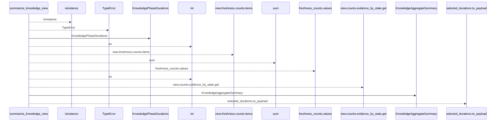
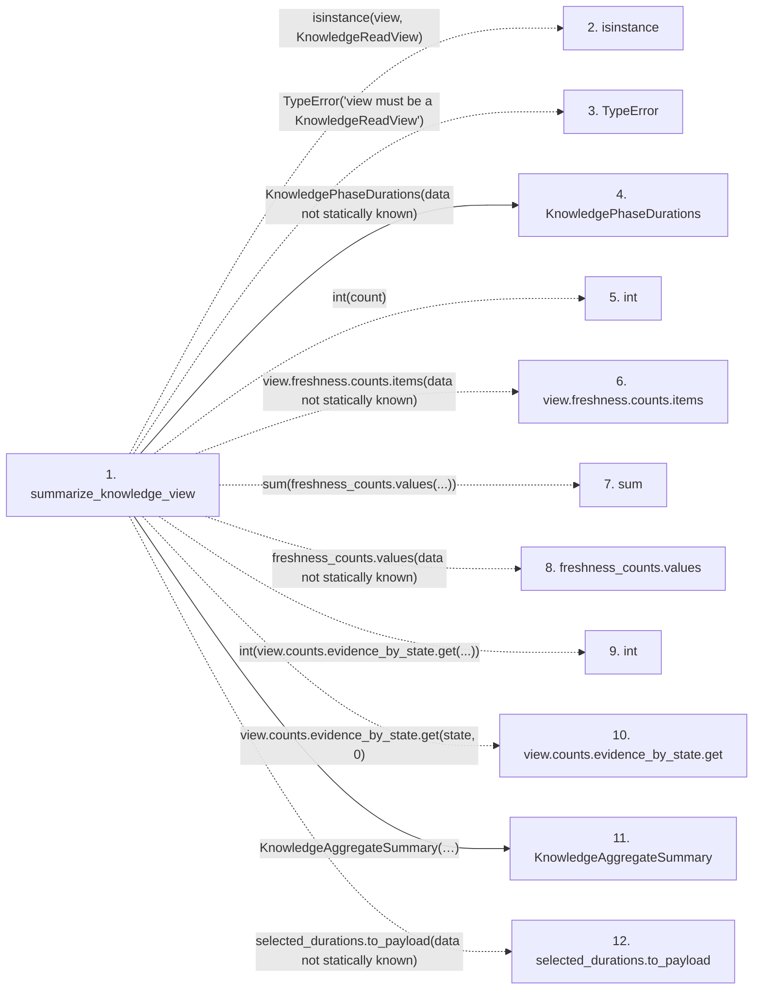

# summarize_knowledge_view

**Entry point:** `summarize_knowledge_view` (`api`)
**Source:** [knowledge_observability](../modules/knowledge_observability.md)
**Modules touched:** [knowledge_observability](../modules/knowledge_observability.md)

## Call sequence

<!-- Auto-generated from static call edges. Dashed arrows are external or unresolved calls. Reviewed runtime conditions and side effects belong in Behavior. -->

## Data flow

<!-- Auto-generated static analysis. Treat values and boundaries as best-effort hints, not runtime proof. -->

### Step data

| Step | Inputs | Reads | Writes | Returns |
|---|---|---|---|---|
| `summarize_knowledge_view` | `view: KnowledgeReadView`, `durations: KnowledgePhaseDurations \| None` | `KnowledgeReadView`, `_EVIDENCE_ISSUE_STATES`, `KnowledgeAvailability` | - | `KnowledgeAggregateSummary(...)` |
| `isinstance` | - | - | - | - |
| `TypeError` | - | - | - | - |
| `KnowledgePhaseDurations` | - | - | - | - |
| `int` | - | - | - | - |
| `view.freshness.counts.items` | - | - | - | - |
| `sum` | - | - | - | - |
| `freshness_counts.values` | - | - | - | - |
| `int` | - | - | - | - |
| `view.counts.evidence_by_state.get` | - | - | - | - |
| `KnowledgeAggregateSummary` | - | - | - | - |
| `selected_durations.to_payload` | - | - | - | - |

### Call data

| From | To | Line | Call |
|---|---|---:|---|
| summarize_knowledge_view | isinstance | 403 | `isinstance(view, KnowledgeReadView)` |
| summarize_knowledge_view | TypeError | 404 | `TypeError('view must be a KnowledgeReadView')` |
| summarize_knowledge_view | KnowledgePhaseDurations | 405 | `KnowledgePhaseDurations(data not statically known)` |
| summarize_knowledge_view | int | 409 | `int(count)` |
| summarize_knowledge_view | view.freshness.counts.items | 409 | `view.freshness.counts.items(data not statically known)` |
| summarize_knowledge_view | sum | 412 | `sum(freshness_counts.values(...))` |
| summarize_knowledge_view | freshness_counts.values | 412 | `freshness_counts.values(data not statically known)` |
| summarize_knowledge_view | int | 418 | `int(view.counts.evidence_by_state.get(...))` |
| summarize_knowledge_view | view.counts.evidence_by_state.get | 418 | `view.counts.evidence_by_state.get(state, 0)` |
| summarize_knowledge_view | KnowledgeAggregateSummary | 428 | `KnowledgeAggregateSummary(availability=view.availability.value, reason=view.reason_code, concepts_evaluated=concepts_evaluated, freshness_counts=freshness_counts, evidence_issue_counts=evidence_issue_counts, degraded_reason=degraded_reason, phase_durations_ms=selected_durations.to_payload(...), freshness_evaluated=view.freshness_evaluated)` |
| summarize_knowledge_view | selected_durations.to_payload | 435 | `selected_durations.to_payload(data not statically known)` |

### Boundary effects

*No boundary effects detected.*

### Static analysis gaps

| Kind | Step | Target | Line |
|---|---|---|---:|
| external_call | `summarize_knowledge_view` | `isinstance` | 403 |
| external_call | `summarize_knowledge_view` | `TypeError` | 404 |
| unresolved_call | `summarize_knowledge_view` | `view.freshness.counts.items` | 409 |
| external_call | `summarize_knowledge_view` | `sum` | 412 |
| unresolved_call | `summarize_knowledge_view` | `freshness_counts.values` | 412 |
| unresolved_call | `summarize_knowledge_view` | `view.counts.evidence_by_state.get` | 418 |
| unresolved_call | `summarize_knowledge_view` | `selected_durations.to_payload` | 435 |

## Behavior

This flow starts at `summarize_knowledge_view` and is classified as `api`. The generated call and data-flow sections are bounded static projections; runtime conditions and side effects require source-level confirmation.
