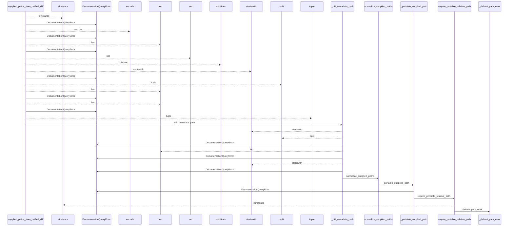
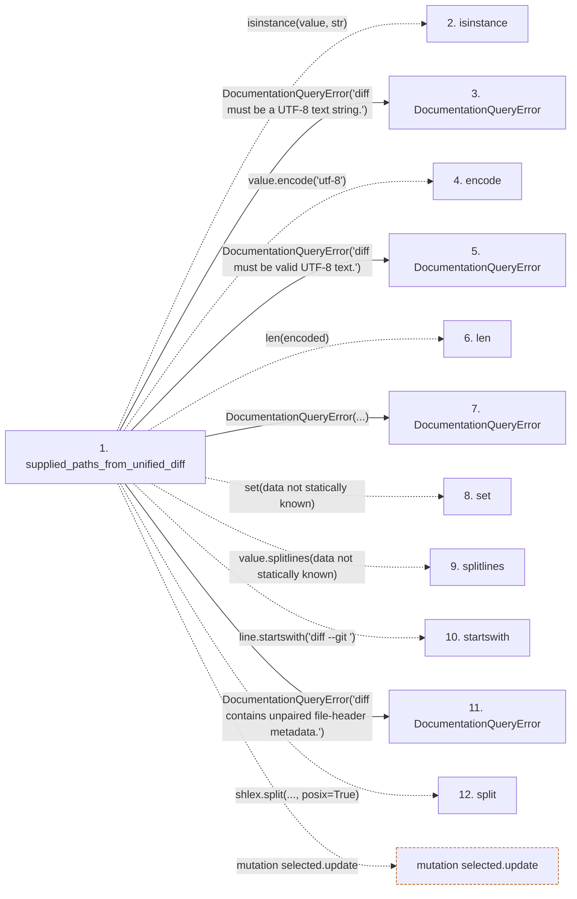

# supplied_paths_from_unified_diff

**Entry point:** `supplied_paths_from_unified_diff` (`api`)
**Source:** [documentation_query_builder](../modules/documentation_query_builder.md)
**Modules touched:** [documentation_queries](../modules/documentation_queries.md), [documentation_query_builder](../modules/documentation_query_builder.md), [validation](../modules/validation.md)

## Call sequence

<!-- Auto-generated from static call edges. Dashed arrows are external or unresolved calls. Reviewed runtime conditions and side effects belong in Behavior. -->

> Call sequence diagram shows 30 of 103 interactions; 73 omitted to keep the visualization within the 30-interaction and generated-diagram limits.

## Data flow

<!-- Auto-generated static analysis. Treat values and boundaries as best-effort hints, not runtime proof. -->

### Step data

| Step | Inputs | Reads | Writes | Returns |
|---|---|---|---|---|
| `supplied_paths_from_unified_diff` | `value: object` | `MAX_SUPPLIED_DIFF_BYTES`, `MAX_SUPPLIED_DIFF_BYTES`, `_UNSET_DIFF_HEADER`, `_UNSET_DIFF_HEADER`, `_UNSET_DIFF_HEADER`, `_UNSET_DIFF_HEADER`, `_UNSET_DIFF_HEADER`, `_UNSET_DIFF_HEADER` | - | `normalize_supplied_paths(...)` |
| `isinstance` | - | - | - | - |
| `DocumentationQueryError` | - | - | - | - |
| `encode` | - | - | - | - |
| `DocumentationQueryError` | - | - | - | - |
| `len` | - | - | - | - |
| `DocumentationQueryError` | - | - | - | - |
| `set` | - | - | - | - |
| `splitlines` | - | - | - | - |
| `startswith` | - | - | - | - |
| `DocumentationQueryError` | - | - | - | - |
| `split` | - | - | - | - |

### Call data

| From | To | Line | Call |
|---|---|---:|---|
| supplied_paths_from_unified_diff | isinstance | 170 | `isinstance(value, str)` |
| supplied_paths_from_unified_diff | DocumentationQueryError | 171 | `DocumentationQueryError('diff must be a UTF-8 text string.')` |
| supplied_paths_from_unified_diff | encode | 173 | `value.encode('utf-8')` |
| supplied_paths_from_unified_diff | DocumentationQueryError | 175 | `DocumentationQueryError('diff must be valid UTF-8 text.')` |
| supplied_paths_from_unified_diff | len | 176 | `len(encoded)` |
| supplied_paths_from_unified_diff | DocumentationQueryError | 177 | `DocumentationQueryError(...)` |
| supplied_paths_from_unified_diff | set | 181 | `set(data not statically known)` |
| supplied_paths_from_unified_diff | splitlines | 187 | `value.splitlines(data not statically known)` |
| supplied_paths_from_unified_diff | startswith | 188 | `line.startswith('diff --git ')` |
| supplied_paths_from_unified_diff | DocumentationQueryError | 190 | `DocumentationQueryError('diff contains unpaired file-header metadata.')` |
| supplied_paths_from_unified_diff | split | 194 | `shlex.split(..., posix=True)` |

### Boundary effects

| Kind | Target | Step | Line |
|---|---|---|---:|
| mutation | `selected.update` | `supplied_paths_from_unified_diff` | 211 |

### Static analysis gaps

| Kind | Step | Target | Line |
|---|---|---|---:|
| unresolved_call | `supplied_paths_from_unified_diff` | `isinstance` | 170 |
| unresolved_call | `supplied_paths_from_unified_diff` | `value.encode` | 173 |
| unresolved_call | `supplied_paths_from_unified_diff` | `value.splitlines` | 187 |
| unresolved_call | `supplied_paths_from_unified_diff` | `line.startswith` | 188 |
| external_call | `supplied_paths_from_unified_diff` | `shlex.split` | 194 |
| step_limit | `supplied_paths_from_unified_diff` | `first 12 steps` | 0 |

## Behavior

This flow starts at `supplied_paths_from_unified_diff` and is classified as `api`. The generated call and data-flow sections are bounded static projections; runtime conditions and side effects require source-level confirmation.
