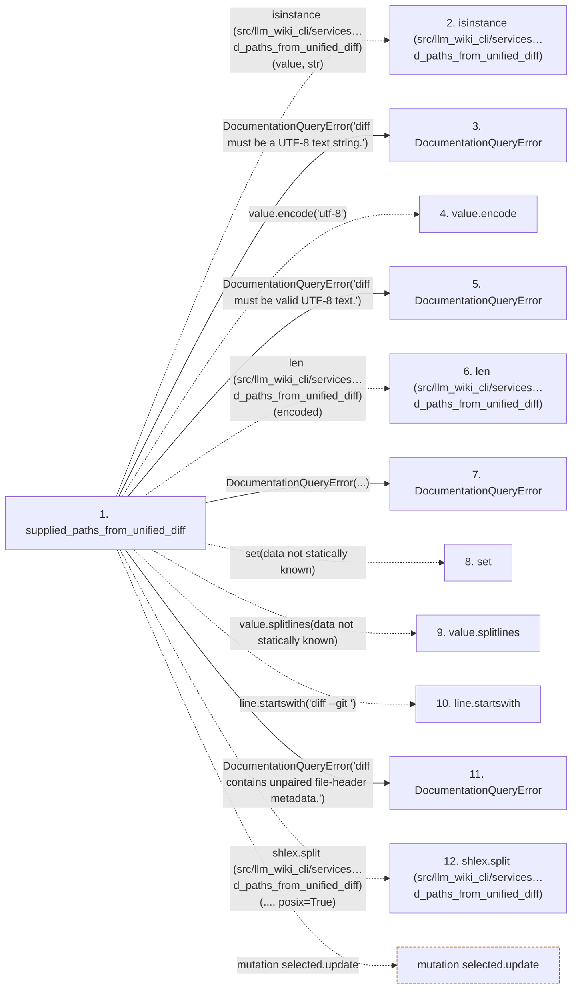

# supplied_paths_from_unified_diff

**Entry point:** `supplied_paths_from_unified_diff` (`api`)
**Source:** [documentation_query_builder](../modules/documentation_query_builder.md)
**Modules touched:** [documentation_queries](../modules/documentation_queries.md), [documentation_query_builder](../modules/documentation_query_builder.md), [validation](../modules/validation.md)

## Call sequence

> Static overview in presentation order, not runtime execution order. Arrows retain captured callers; representative internal continuations and boundary examples precede repeated helper detail.

<!-- Auto-generated from static call edges. Dashed arrows are external or unresolved calls. Reviewed runtime conditions and side effects belong in Behavior. -->

```mermaid
sequenceDiagram
    participant p0 as supplied_paths_from_unified_diff
    participant p1 as _diff_metadata_path
    participant p2 as DocumentationQueryError
    participant p3 as normalize_supplied_paths
    participant p4 as _portable_supplied_path
    participant p5 as _supplied_path_values
    participant p6 as require_portable_relative_path
    participant p7 as _default_path_error
    participant p8 as _check_path_collision
    participant p9 as require_portable_path_component
    participant p10 as _syntax_key
    participant p11 as _known_syntax
    participant p12 as _remember_syntax
    participant p13 as SharedValidationError
    participant p14 as portable_path_key
    participant p15 as isinstance (src/llm_wiki_cli/services…d_paths_from_unified_diff)
    participant p16 as value.encode
    participant p17 as len (src/llm_wiki_cli/services…d_paths_from_unified_diff)
    participant p18 as set
    participant p19 as value.splitlines
    participant p20 as line.startswith
    participant p21 as shlex.split (src/llm_wiki_cli/services…d_paths_from_unified_diff)
    participant p22 as tuple (src/llm_wiki_cli/services…d_paths_from_unified_diff)
    participant p23 as any (src/llm_wiki_cli/services…d_paths_from_unified_diff)
    participant p24 as str
    participant p25 as selected.update
    p0->>p1: _diff_metadata_path
    p0->>p2: DocumentationQueryError
    p0->>p3: normalize_supplied_paths
    p3->>p4: _portable_supplied_path
    p3->>p5: _supplied_path_values
    p4->>p6: require_portable_relative_path
    p6->>p7: _default_path_error
    p6->>p8: _check_path_collision
    p6->>p9: require_portable_path_component
    p6->>p10: _syntax_key
    p6->>p11: _known_syntax
    p6->>p12: _remember_syntax
    p7->>p13: SharedValidationError
    p8->>p14: portable_path_key
    p0-->>p15: isinstance (src/llm_wiki_cli/services…d_paths_from_unified_diff)(value, str)
    p0-->>p16: value.encode('utf-8')
    p0-->>p17: len (src/llm_wiki_cli/services…d_paths_from_unified_diff)(encoded)
    p0-->>p18: set
    p0-->>p19: value.splitlines
    p0-->>p20: line.startswith('diff --git ')
    p0-->>p21: shlex.split (src/llm_wiki_cli/services…d_paths_from_unified_diff)(..., posix=True)
    p0-->>p17: len (src/llm_wiki_cli/services…d_paths_from_unified_diff)('diff --git ')
    p0-->>p17: len (src/llm_wiki_cli/services…d_paths_from_unified_diff)(parts)
    p0-->>p22: tuple (src/llm_wiki_cli/services…d_paths_from_unified_diff)(...)
    p0-->>p23: any (src/llm_wiki_cli/services…d_paths_from_unified_diff)(...)
    p0-->>p24: str(parsed_paths[...])
    p0-->>p24: str(parsed_paths[...])
    p0-->>p25: selected.update(block_paths)
    p0-->>p20: line.startswith('@@')
    p0-->>p20: line.startswith('--- ')
```

> Call sequence diagram shows 30 of 117 interactions; 87 omitted to keep the visualization within the 30-interaction and generated-diagram limits, with uncertain identities omitted rather than inferred.

> Captured boundary calls: external 10 of 36 (26 omitted); unresolved 6 of 31 (25 omitted). These counts cover the captured static trace.

Omitted captured detail, grouped by actual caller occurrence and target module:

| Caller | Parent step | Target module | Kind | Omitted interactions |
| --- | --- | --- | --- | --- |
| `src/llm_wiki_cli/services/documentation_query_builder.py:supplied_paths_from_unified_diff` | 1 | [src/llm_wiki_cli/services/documentation_queries.py](../modules/documentation_queries.md) | internal | 13 |
| `src/llm_wiki_cli/services/documentation_query_builder.py:_diff_metadata_path` | 18 | - | unresolved | 2 |
| `src/llm_wiki_cli/services/documentation_query_builder.py:_diff_metadata_path` | 18 | - | external | 2 |
| `src/llm_wiki_cli/services/documentation_query_builder.py:_diff_metadata_path` | 18 | [src/llm_wiki_cli/services/documentation_queries.py](../modules/documentation_queries.md) | internal | 3 |
| `src/llm_wiki_cli/services/documentation_query_builder.py:_diff_metadata_path` | 18 | [src/llm_wiki_cli/services/documentation_query_builder.py](../modules/documentation_query_builder.md) | internal | 1 |
| `src/llm_wiki_cli/services/documentation_query_builder.py:_portable_supplied_path` | 27 | [src/llm_wiki_cli/services/documentation_queries.py](../modules/documentation_queries.md) | internal | 1 |
| `src/llm_wiki_cli/services/validation.py:require_portable_relative_path` | 29 | - | external | 4 |
| `src/llm_wiki_cli/services/validation.py:require_portable_relative_path` | 29 | [src/llm_wiki_cli/services/validation.py](../modules/validation.md) | internal | 7 |
> Omission summary shows 8 of 24 groups; 16 further groups are not expanded here. Counts above include all omitted interactions.
> Detailed flow queries retain their own coverage and limits; omitted paths may execute at runtime.

> Trace truncated at the depth limit; deeper calls are omitted.

## Data flow

<!-- Auto-generated static analysis. Treat values and boundaries as best-effort hints, not runtime proof. -->

### Analysis coverage

**Effect analysis partially available.** Flow assembly and source effect analysis are separate; empty observations do not prove an empty handler body.

Source steps: 51; effect analysis evaluated: 23, partial: 0, unavailable: 28. Counts include steps omitted from the displayed trace.

- Callable record unavailable; the selected entry symbol has no represented callable body.
- Effect collector totals unavailable; observed counts cover captured records only.

| Step | Callable record | Effect analysis | Collector totals |
|---|---|---|---|
| `supplied_paths_from_unified_diff` | `available` | `evaluated` | `available` |
| `isinstance (src/llm_wiki_cli/services…d_paths_from_unified_diff)` | `not_applicable` | `not_applicable` | `not_applicable` |
| `DocumentationQueryError` | `unavailable` | `unavailable` | `unavailable` |
| `value.encode` | `not_applicable` | `not_applicable` | `not_applicable` |
| `DocumentationQueryError` | `unavailable` | `unavailable` | `unavailable` |
| `len (src/llm_wiki_cli/services…d_paths_from_unified_diff)` | `not_applicable` | `not_applicable` | `not_applicable` |
| `DocumentationQueryError` | `unavailable` | `unavailable` | `unavailable` |
| `set` | `not_applicable` | `not_applicable` | `not_applicable` |
| `value.splitlines` | `not_applicable` | `not_applicable` | `not_applicable` |
| `line.startswith` | `not_applicable` | `not_applicable` | `not_applicable` |
| `DocumentationQueryError` | `unavailable` | `unavailable` | `unavailable` |
| `shlex.split (src/llm_wiki_cli/services…d_paths_from_unified_diff)` | `not_applicable` | `not_applicable` | `not_applicable` |

```mermaid
flowchart LR
    s1["1. supplied_paths_from_unified_diff"]
    s2["2. isinstance (src/llm_wiki_cli/services…d_paths_from_unified_diff)"]
    s3["3. DocumentationQueryError"]
    s4["4. value.encode"]
    s5["5. DocumentationQueryError"]
    s6["6. len (src/llm_wiki_cli/services…d_paths_from_unified_diff)"]
    s7["7. DocumentationQueryError"]
    s8["8. set"]
    s9["9. value.splitlines"]
    s10["10. line.startswith"]
    s11["11. DocumentationQueryError"]
    s12["12. shlex.split (src/llm_wiki_cli/services…d_paths_from_unified_diff)"]
    s1 -. "isinstance (src/llm_wiki_cli/services…d_paths_from_unified_diff)(value, str)" .-> s2
    s1 -->|"DocumentationQueryError('diff must be a UTF-8 text string.')"| s3
    s1 -. "value.encode('utf-8')" .-> s4
    s1 -->|"DocumentationQueryError('diff must be valid UTF-8 text.')"| s5
    s1 -. "len (src/llm_wiki_cli/services…d_paths_from_unified_diff)(encoded)" .-> s6
    s1 -->|"DocumentationQueryError(...)"| s7
    s1 -. "set(data not statically known)" .-> s8
    s1 -. "value.splitlines(data not statically known)" .-> s9
    s1 -. "line.startswith('diff --git ')" .-> s10
    s1 -->|"DocumentationQueryError('diff contains unpaired file-header metadata.')"| s11
    s1 -. "shlex.split (src/llm_wiki_cli/services…d_paths_from_unified_diff)(..., posix=True)" .-> s12
    b0["mutation selected.update"]
    s1 -. "mutation selected.update" .-> b0
    click s1 "../modules/documentation_query_builder.md"
    click s3 "../modules/documentation_queries.md"
    click s5 "../modules/documentation_queries.md"
    click s7 "../modules/documentation_queries.md"
    click s11 "../modules/documentation_queries.md"
    classDef boundary stroke:#b45309,stroke-dasharray: 4 2
    class b0 boundary
```

### Step data

| Step | Inputs | Reads | Writes | Returns |
|---|---|---|---|---|
| `supplied_paths_from_unified_diff` | `value: object` | `MAX_SUPPLIED_DIFF_BYTES`, `MAX_SUPPLIED_DIFF_BYTES`, `_UNSET_DIFF_HEADER`, `_UNSET_DIFF_HEADER`, `_UNSET_DIFF_HEADER`, `_UNSET_DIFF_HEADER`, `_UNSET_DIFF_HEADER`, `_UNSET_DIFF_HEADER` | - | `normalize_supplied_paths(...)` |
| `isinstance (src/llm_wiki_cli/services…d_paths_from_unified_diff)` | - | - | - | - |
| `DocumentationQueryError` | - | - | - | - |
| `value.encode` | - | - | - | - |
| `DocumentationQueryError` | - | - | - | - |
| `len (src/llm_wiki_cli/services…d_paths_from_unified_diff)` | - | - | - | - |
| `DocumentationQueryError` | - | - | - | - |
| `set` | - | - | - | - |
| `value.splitlines` | - | - | - | - |
| `line.startswith` | - | - | - | - |
| `DocumentationQueryError` | - | - | - | - |
| `shlex.split (src/llm_wiki_cli/services…d_paths_from_unified_diff)` | - | - | - | - |

### Call data

| From | To | Line | Call |
|---|---|---:|---|
| supplied_paths_from_unified_diff | isinstance (src/llm_wiki_cli/services…d_paths_from_unified_diff) | 175 | `isinstance(value, str)` |
| supplied_paths_from_unified_diff | DocumentationQueryError | 176 | `DocumentationQueryError('diff must be a UTF-8 text string.')` |
| supplied_paths_from_unified_diff | value.encode | 178 | `value.encode('utf-8')` |
| supplied_paths_from_unified_diff | DocumentationQueryError | 180 | `DocumentationQueryError('diff must be valid UTF-8 text.')` |
| supplied_paths_from_unified_diff | len (src/llm_wiki_cli/services…d_paths_from_unified_diff) | 181 | `len(encoded)` |
| supplied_paths_from_unified_diff | DocumentationQueryError | 182 | `DocumentationQueryError(...)` |
| supplied_paths_from_unified_diff | set | 186 | `set(data not statically known)` |
| supplied_paths_from_unified_diff | value.splitlines | 192 | `value.splitlines(data not statically known)` |
| supplied_paths_from_unified_diff | line.startswith | 193 | `line.startswith('diff --git ')` |
| supplied_paths_from_unified_diff | DocumentationQueryError | 195 | `DocumentationQueryError('diff contains unpaired file-header metadata.')` |
| supplied_paths_from_unified_diff | shlex.split (src/llm_wiki_cli/services…d_paths_from_unified_diff) | 199 | `shlex.split(..., posix=True)` |

### Boundary effects

| Kind | Target | Step | Line |
|---|---|---|---:|
| mutation | `selected.update` | `supplied_paths_from_unified_diff` | 216 |

### Static analysis gaps

| Kind | Step | Target | Line |
|---|---|---|---:|
| external_call | `supplied_paths_from_unified_diff` | `isinstance` | 175 |
| unresolved_call | `supplied_paths_from_unified_diff` | `value.encode` | 178 |
| unresolved_call | `supplied_paths_from_unified_diff` | `value.splitlines` | 192 |
| unresolved_call | `supplied_paths_from_unified_diff` | `line.startswith` | 193 |
| external_call | `supplied_paths_from_unified_diff` | `shlex.split` | 199 |
| step_limit | `supplied_paths_from_unified_diff` | `first 12 steps` | 0 |
| truncated_flow | `supplied_paths_from_unified_diff` | `depth limit` | 0 |

## Behavior

This flow starts at `supplied_paths_from_unified_diff` and is classified as `api`. The generated call and data-flow sections are bounded static projections; runtime conditions and side effects require source-level confirmation.
