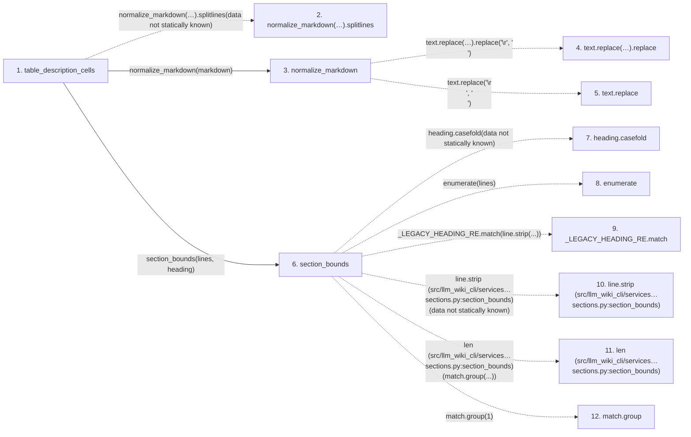

# table_description_cells

**Entry point:** `table_description_cells` (`api`)
**Source:** [markdown_sections](../modules/markdown_sections.md)
**Modules touched:** [markdown_sections](../modules/markdown_sections.md)

## Call sequence

```mermaid
sequenceDiagram
    participant p0 as table_description_cells
    participant p1 as normalize_markdown(…).splitlines
    participant p2 as normalize_markdown
    participant p3 as text.replace(…).replace
    participant p4 as text.replace
    participant p5 as section_bounds
    participant p6 as heading.casefold
    participant p7 as enumerate
    participant p8 as _LEGACY_HEADING_RE.match
    participant p9 as line.strip (src/llm_wiki_cli/services…sections.py:section_bounds)
    participant p10 as len (src/llm_wiki_cli/services…sections.py:section_bounds)
    participant p11 as match.group
    participant p12 as match.group(…).strip().casefold
    participant p13 as match.group(…).strip
    participant p14 as range (src/llm_wiki_cli/services…sections.py:section_bounds)
    participant p15 as lines[…].strip
    participant p16 as next_match.group
    participant p17 as range (src/llm_wiki_cli/services…py:table_description_cells)
    participant p18 as split_table_row
    participant p19 as line.strip (src/llm_wiki_cli/services…ections.py:split_table_row)
    participant p20 as stripped.startswith
    participant p21 as stripped.endswith
    participant p22 as len (src/llm_wiki_cli/services…ections.py:split_table_row)
    participant p23 as current.extend
    p0-->>p1: normalize_markdown(…).splitlines
    p0->>p2: normalize_markdown
    p2-->>p3: text.replace(…).replace
    p2-->>p4: text.replace
    p0->>p5: section_bounds
    p5-->>p6: heading.casefold
    p5-->>p7: enumerate
    p5-->>p8: _LEGACY_HEADING_RE.match
    p5-->>p9: line.strip (src/llm_wiki_cli/services…sections.py:section_bounds)
    p5-->>p10: len (src/llm_wiki_cli/services…sections.py:section_bounds)
    p5-->>p11: match.group
    p5-->>p12: match.group(…).strip().casefold
    p5-->>p13: match.group(…).strip
    p5-->>p11: match.group
    p5-->>p10: len (src/llm_wiki_cli/services…sections.py:section_bounds)
    p5-->>p14: range (src/llm_wiki_cli/services…sections.py:section_bounds)
    p5-->>p10: len (src/llm_wiki_cli/services…sections.py:section_bounds)
    p5-->>p8: _LEGACY_HEADING_RE.match
    p5-->>p15: lines[…].strip
    p5-->>p10: len (src/llm_wiki_cli/services…sections.py:section_bounds)
    p5-->>p16: next_match.group
    p0-->>p17: range (src/llm_wiki_cli/services…py:table_description_cells)
    p0->>p18: split_table_row
    p18-->>p19: line.strip (src/llm_wiki_cli/services…ections.py:split_table_row)
    p18-->>p20: stripped.startswith
    p18-->>p21: stripped.endswith
    p18-->>p22: len (src/llm_wiki_cli/services…ections.py:split_table_row)
    p18-->>p22: len (src/llm_wiki_cli/services…ections.py:split_table_row)
    p18-->>p23: current.extend
    p18-->>p22: len (src/llm_wiki_cli/services…ections.py:split_table_row)
```

<!-- Auto-generated from static call edges. Dashed arrows are external or unresolved calls. Reviewed runtime conditions and side effects belong in Behavior. -->

> Call sequence diagram shows 30 of 57 interactions; 27 omitted to keep the visualization within the 30-interaction and generated-diagram limits.

## Data flow

<!-- Auto-generated static analysis. Treat values and boundaries as best-effort hints, not runtime proof. -->

### Step data

| Step | Inputs | Reads | Writes | Returns |
|---|---|---|---|---|
| `table_description_cells` | `markdown: str`, `heading: str` | - | `descriptions[...]` | `{...}`, `descriptions`, `{...}` |
| `normalize_markdown(…).splitlines` | - | - | - | - |
| `normalize_markdown` | `text: str` | - | - | `...` |
| `text.replace(…).replace` | - | - | - | - |
| `text.replace` | - | - | - | - |
| `section_bounds` | `lines: list[str]`, `heading: str` | - | - | `(...)`, `None` |
| `heading.casefold` | - | - | - | - |
| `enumerate` | - | - | - | - |
| `_LEGACY_HEADING_RE.match` | - | - | - | - |
| `line.strip (src/llm_wiki_cli/services…sections.py:section_bounds)` | - | - | - | - |
| `len (src/llm_wiki_cli/services…sections.py:section_bounds)` | - | - | - | - |
| `match.group` | - | - | - | - |

### Call data

| From | To | Line | Call |
|---|---|---:|---|
| table_description_cells | normalize_markdown(…).splitlines | 832 | `normalize_markdown(markdown).splitlines(data not statically known)` |
| table_description_cells | normalize_markdown | 832 | `normalize_markdown(markdown)` |
| normalize_markdown | text.replace(…).replace | 81 | `text.replace('\r\n', '\n').replace('\r', '\n')` |
| normalize_markdown | text.replace | 81 | `text.replace('\r\n', '\n')` |
| table_description_cells | section_bounds | 833 | `section_bounds(lines, heading)` |
| section_bounds | heading.casefold | 661 | `heading.casefold(data not statically known)` |
| section_bounds | enumerate | 662 | `enumerate(lines)` |
| section_bounds | _LEGACY_HEADING_RE.match | 663 | `_LEGACY_HEADING_RE.match(line.strip(...))` |
| section_bounds | line.strip (src/llm_wiki_cli/services…sections.py:section_bounds) | 663 | `line.strip(data not statically known)` |
| section_bounds | len (src/llm_wiki_cli/services…sections.py:section_bounds) | 666 | `len(match.group(...))` |
| section_bounds | match.group | 666 | `match.group(1)` |

### Boundary effects

*No boundary effects detected.*

### Static analysis gaps

| Kind | Step | Target | Line |
|---|---|---|---:|
| unresolved_call | `table_description_cells` | `normalize_markdown(markdown).splitlines` | 832 |
| unresolved_call | `normalize_markdown` | `text.replace('\r\n', '\n').replace` | 81 |
| unresolved_call | `normalize_markdown` | `text.replace` | 81 |
| unresolved_call | `section_bounds` | `heading.casefold` | 661 |
| external_call | `section_bounds` | `enumerate` | 662 |
| unresolved_call | `section_bounds` | `_LEGACY_HEADING_RE.match` | 663 |
| unresolved_call | `section_bounds` | `line.strip` | 663 |
| unresolved_call | `section_bounds` | `match.group` | 666 |
| step_limit | `table_description_cells` | `first 12 steps` | 0 |

## Behavior

This flow starts at `table_description_cells` and is classified as `api`. The generated call and data-flow sections are bounded static projections; runtime conditions and side effects require source-level confirmation.
