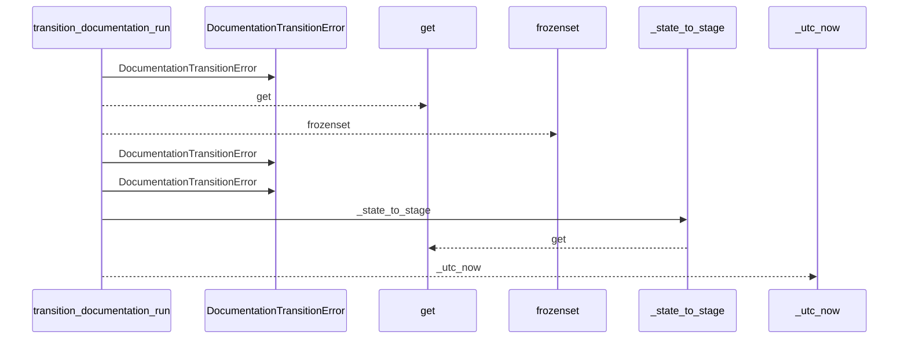
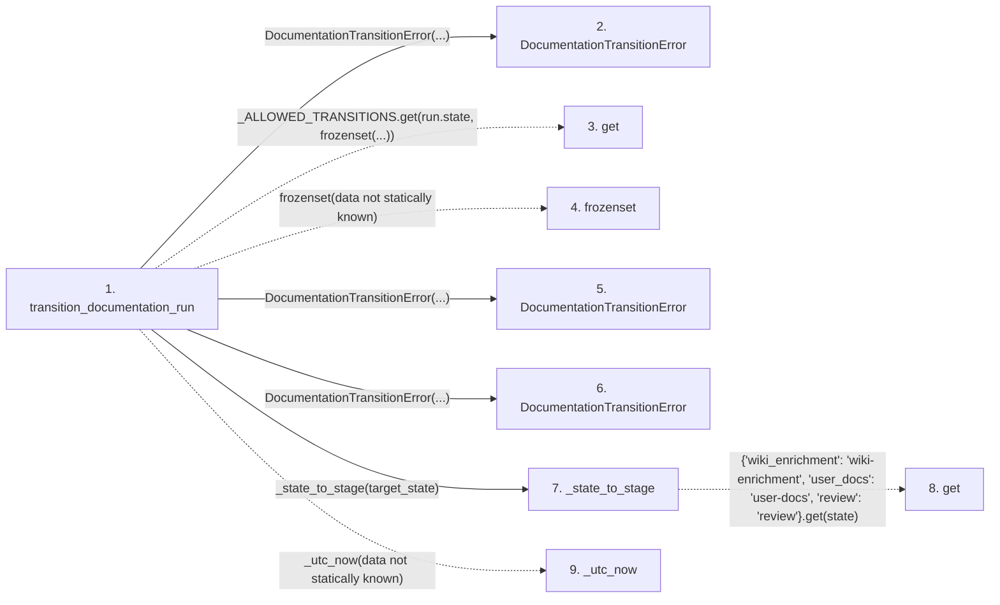

# transition_documentation_run

**Entry point:** `transition_documentation_run` (`api`)
**Source:** [workspace](../modules/workspace.md)
**Modules touched:** [documentation_run_contracts](../modules/documentation_run_contracts.md), [workspace](../modules/workspace.md)

## Call sequence

<!-- Auto-generated from static call edges. Dashed arrows are external or unresolved calls. Reviewed runtime conditions and side effects belong in Behavior. -->

## Data flow

<!-- Auto-generated static analysis. Treat values and boundaries as best-effort hints, not runtime proof. -->

### Step data

| Step | Inputs | Reads | Writes | Returns |
|---|---|---|---|---|
| `transition_documentation_run` | `run: DocumentationRun`, `target_state: str`, `resume_state: str \| None` | - | `run.resume_state`, `run.resume_state`, `run.state`, `run.current_stage`, `run.updated_at` | `run`, `run` |
| `DocumentationTransitionError` | - | - | - | - |
| `get` | - | - | - | - |
| `frozenset` | - | - | - | - |
| `DocumentationTransitionError` | - | - | - | - |
| `DocumentationTransitionError` | - | - | - | - |
| `_state_to_stage` | `state: str` | - | - | `...` |
| `get` | - | - | - | - |
| `_utc_now` | - | - | - | - |

### Call data

| From | To | Line | Call |
|---|---|---:|---|
| transition_documentation_run | DocumentationTransitionError | 49 | `DocumentationTransitionError(...)` |
| transition_documentation_run | get | 52 | `_ALLOWED_TRANSITIONS.get(run.state, frozenset(...))` |
| transition_documentation_run | frozenset | 52 | `frozenset(data not statically known)` |
| transition_documentation_run | DocumentationTransitionError | 54 | `DocumentationTransitionError(...)` |
| transition_documentation_run | DocumentationTransitionError | 58 | `DocumentationTransitionError(...)` |
| transition_documentation_run | _state_to_stage | 66 | `_state_to_stage(target_state)` |
| _state_to_stage | get | 1009 | `{'wiki_enrichment': 'wiki-enrichment', 'user_docs': 'user-docs', 'review': 'review'}.get(state)` |
| transition_documentation_run | _utc_now | 67 | `_utc_now(data not statically known)` |

### Boundary effects

*No boundary effects detected.*

### Static analysis gaps

| Kind | Step | Target | Line |
|---|---|---|---:|
| unresolved_call | `transition_documentation_run` | `_ALLOWED_TRANSITIONS.get` | 52 |
| unresolved_call | `transition_documentation_run` | `frozenset` | 52 |
| unresolved_call | `_state_to_stage` | `{'wiki_enrichment': 'wiki-enrichment', 'user_docs': 'user-docs', 'review': 'review'}.get` | 1009 |
| unresolved_call | `transition_documentation_run` | `_utc_now` | 67 |

## Behavior

This flow starts at `transition_documentation_run` and is classified as `api`. The generated call and data-flow sections are bounded static projections; runtime conditions and side effects require source-level confirmation.
