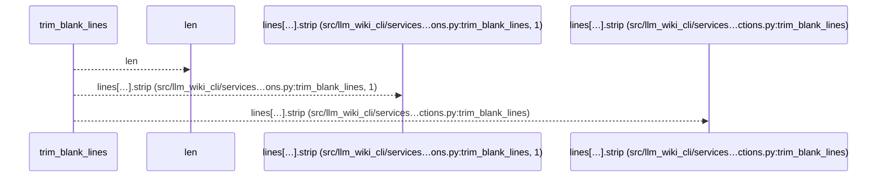
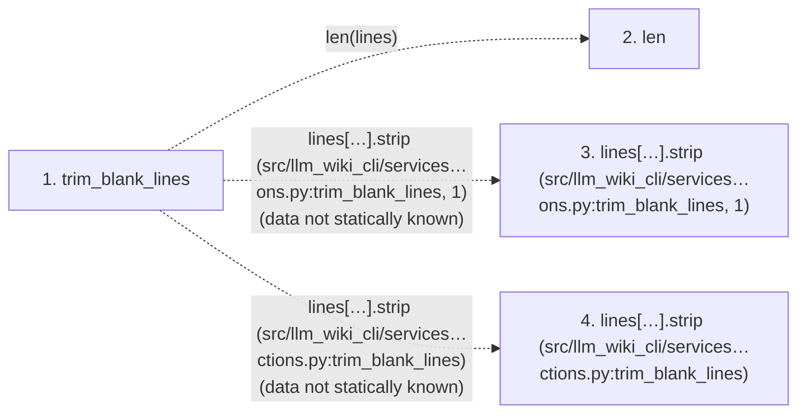

# trim_blank_lines

**Entry point:** `trim_blank_lines` (`api`)
**Source:** [markdown_sections](../modules/markdown_sections.md)
**Modules touched:** [markdown_sections](../modules/markdown_sections.md)

## Call sequence

<!-- Auto-generated from static call edges. Dashed arrows are external or unresolved calls. Reviewed runtime conditions and side effects belong in Behavior. -->

## Data flow

<!-- Auto-generated static analysis. Treat values and boundaries as best-effort hints, not runtime proof. -->

### Step data

| Step | Inputs | Reads | Writes | Returns |
|---|---|---|---|---|
| `trim_blank_lines` | `lines: list[str]` | - | - | `...` |
| `len` | - | - | - | - |
| `lines[…].strip (src/llm_wiki_cli/services…ons.py:trim_blank_lines, 1)` | - | - | - | - |
| `lines[…].strip (src/llm_wiki_cli/services…ctions.py:trim_blank_lines)` | - | - | - | - |

### Call data

| From | To | Line | Call |
|---|---|---:|---|
| trim_blank_lines | len | 684 | `len(lines)` |
| trim_blank_lines | lines[…].strip (src/llm_wiki_cli/services…ons.py:trim_blank_lines, 1) | 685 | `lines[start].strip(data not statically known)` |
| trim_blank_lines | lines[…].strip (src/llm_wiki_cli/services…ctions.py:trim_blank_lines) | 687 | `lines[end - 1].strip(data not statically known)` |

### Boundary effects

*No boundary effects detected.*

### Static analysis gaps

| Kind | Step | Target | Line |
|---|---|---|---:|
| unresolved_call | `trim_blank_lines` | `lines[start].strip` | 685 |
| unresolved_call | `trim_blank_lines` | `lines[end - 1].strip` | 687 |

## Behavior

This flow starts at `trim_blank_lines` and is classified as `api`. The generated call and data-flow sections are bounded static projections; runtime conditions and side effects require source-level confirmation.
