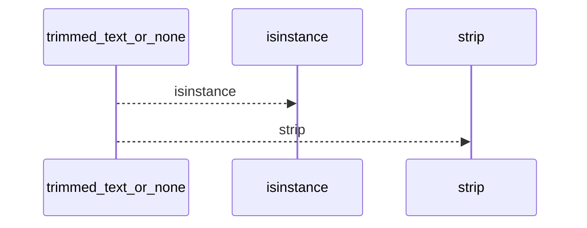
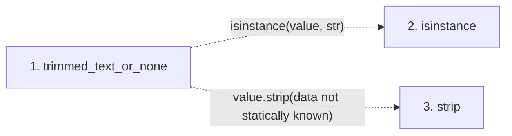

# trimmed_text_or_none

**Entry point:** `trimmed_text_or_none` (`api`)
**Source:** [validation](../modules/validation.md)
**Modules touched:** [validation](../modules/validation.md)

## Call sequence

<!-- Auto-generated from static call edges. Dashed arrows are external or unresolved calls. Reviewed runtime conditions and side effects belong in Behavior. -->

## Data flow

<!-- Auto-generated static analysis. Treat values and boundaries as best-effort hints, not runtime proof. -->

### Step data

| Step | Inputs | Reads | Writes | Returns |
|---|---|---|---|---|
| `trimmed_text_or_none` | `value: object`, `error: Exception \| None` | - | - | `None`, `...` |
| `isinstance` | - | - | - | - |
| `strip` | - | - | - | - |

### Call data

| From | To | Line | Call |
|---|---|---:|---|
| trimmed_text_or_none | isinstance | 917 | `isinstance(value, str)` |
| trimmed_text_or_none | strip | 921 | `value.strip(data not statically known)` |

### Boundary effects

*No boundary effects detected.*

### Static analysis gaps

| Kind | Step | Target | Line |
|---|---|---|---:|
| unresolved_call | `trimmed_text_or_none` | `isinstance` | 917 |
| unresolved_call | `trimmed_text_or_none` | `value.strip` | 921 |

## Behavior

This flow starts at `trimmed_text_or_none` and is classified as `api`. The generated call and data-flow sections are bounded static projections; runtime conditions and side effects require source-level confirmation.
