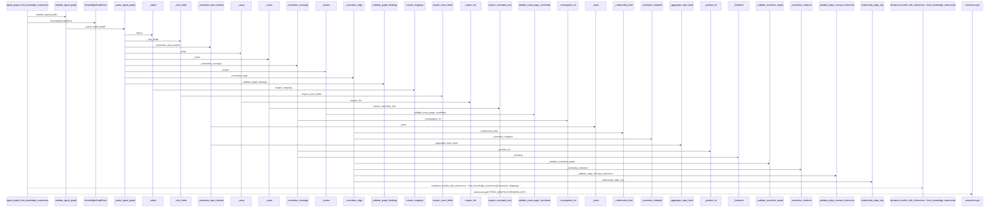
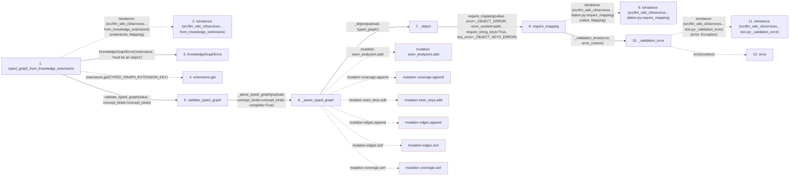

# typed_graph_from_knowledge_extensions

**Entry point:** `typed_graph_from_knowledge_extensions` (`api`)
**Source:** [knowledge_graph](../modules/knowledge_graph.md)
**Modules touched:** [knowledge_evidence](../modules/knowledge_evidence.md), [knowledge_graph](../modules/knowledge_graph.md), [validation](../modules/validation.md), [wiki_media](../modules/wiki_media.md), and 1 more

**Complete modules touched:**

- [knowledge_evidence](../modules/knowledge_evidence.md)
- [knowledge_graph](../modules/knowledge_graph.md)
- [validation](../modules/validation.md)
- [wiki_media](../modules/wiki_media.md)
- [wiki_surface](../modules/wiki_surface.md)

## Call sequence

> Static overview in presentation order, not runtime execution order. Arrows retain captured callers; representative internal continuations and boundary examples precede repeated helper detail.

<!-- Auto-generated from static call edges. Dashed arrows are external or unresolved calls. Reviewed runtime conditions and side effects belong in Behavior. -->

```mermaid
sequenceDiagram
    participant p0 as typed_graph_from_knowledge_extensions
    participant p1 as validate_typed_graph
    participant p2 as KnowledgeGraphError
    participant p3 as _parse_typed_graph
    participant p4 as _object
    participant p5 as _only_fields
    participant p6 as _normalise_input_hashes
    participant p7 as _array
    participant p8 as _name
    participant p9 as _normalise_coverage
    participant p10 as _locator
    participant p11 as _normalise_edge
    participant p12 as _validate_graph_bindings
    participant p13 as require_mapping
    participant p14 as require_exact_fields
    participant p15 as require_list
    participant p16 as require_nonempty_text
    participant p17 as validate_exact_page_coordinate
    participant p18 as _nonnegative_int
    participant p19 as _hash
    participant p20 as _relationship_kind
    participant p21 as _normalise_endpoint
    participant p22 as _aggregate_input_hash
    participant p23 as _positive_int
    participant p24 as _limitation
    participant p25 as _validate_resolution_target
    participant p26 as _normalise_evidence
    participant p27 as _validate_edge_concept_references
    participant p28 as relationship_edge_key
    participant p29 as isinstance (src/llm_wiki_cli/services…from_knowledge_extensions)
    participant p30 as extensions.get
    p0->>p1: validate_typed_graph
    p0->>p2: KnowledgeGraphError
    p1->>p3: _parse_typed_graph
    p3->>p4: _object
    p3->>p5: _only_fields
    p3->>p6: _normalise_input_hashes
    p3->>p7: _array
    p3->>p8: _name
    p3->>p9: _normalise_coverage
    p3->>p10: _locator
    p3->>p11: _normalise_edge
    p3->>p12: _validate_graph_bindings
    p4->>p13: require_mapping
    p5->>p14: require_exact_fields
    p7->>p15: require_list
    p8->>p16: require_nonempty_text
    p10->>p17: validate_exact_page_coordinate
    p9->>p18: _nonnegative_int
    p6->>p19: _hash
    p11->>p20: _relationship_kind
    p11->>p21: _normalise_endpoint
    p6->>p22: _aggregate_input_hash
    p9->>p23: _positive_int
    p9->>p24: _limitation
    p11->>p25: _validate_resolution_target
    p11->>p26: _normalise_evidence
    p11->>p27: _validate_edge_concept_references
    p11->>p28: relationship_edge_key
    p0-->>p29: isinstance (src/llm_wiki_cli/services…from_knowledge_extensions)(extensions, Mapping)
    p0-->>p30: extensions.get(TYPED_GRAPH_EXTENSION_KEY)
```

> Call sequence diagram shows 30 of 349 interactions; 319 omitted to keep the visualization within the 30-interaction and generated-diagram limits, with uncertain identities omitted rather than inferred.

> Captured boundary calls: external 1 of 76 (75 omitted); unresolved 1 of 54 (53 omitted). These counts cover the captured static trace.

Omitted captured detail, grouped by actual caller occurrence and target module:

| Caller | Parent step | Target module | Kind | Omitted interactions |
| --- | --- | --- | --- | --- |
| `src/llm_wiki_cli/services/validation.py:require_mapping` | 8 | - | external | 2 |
| `src/llm_wiki_cli/services/validation.py:require_mapping` | 8 | [src/llm_wiki_cli/services/validation.py](../modules/validation.md) | internal | 3 |
| `src/llm_wiki_cli/services/validation.py:_validation_error` | 10 | - | external | 1 |
| `src/llm_wiki_cli/services/validation.py:_validation_error` | 10 | - | unresolved | 1 |
| `src/llm_wiki_cli/services/validation.py:require_mapping` | 8 | - | unresolved | 1 |
| `src/llm_wiki_cli/services/knowledge_graph.py:_object` | 7 | - | external | 1 |
| `src/llm_wiki_cli/services/validation.py:require_exact_fields` | 19 | - | external | 9 |
| `src/llm_wiki_cli/services/validation.py:require_exact_fields` | 19 | [src/llm_wiki_cli/services/validation.py](../modules/validation.md) | internal | 1 |
> Omission summary shows 8 of 100 groups; 92 further groups are not expanded here. Counts above include all omitted interactions.
> Detailed flow queries retain their own coverage and limits; omitted paths may execute at runtime.

> Trace truncated at the depth limit; deeper calls are omitted.

## Data flow

<!-- Auto-generated static analysis. Treat values and boundaries as best-effort hints, not runtime proof. -->

### Analysis coverage

**Effect analysis partially available.** Flow assembly and source effect analysis are separate; empty observations do not prove an empty handler body.

Source steps: 220; effect analysis evaluated: 160, partial: 2, unavailable: 58. Counts include steps omitted from the displayed trace.

Collector observations for 162 source steps with known totals: observed: 766, emitted: 760, omitted: 6. Unavailable totals are excluded.

- Callable record unavailable for one or more source steps; those steps have no represented callable body.
- Effect collector omitted observations before flow assembly; displayed effects are partial.
- Effect collector totals unavailable; observed counts cover captured records only.

| Step | Callable record | Effect analysis | Collector totals | Observed | Emitted | Omitted |
|---|---|---|---|---:|---:|---:|
| `typed_graph_from_knowledge_extensions` | `available` | `evaluated` | `available` | `6` | `6` | `0` |
| `isinstance (src/llm_wiki_cli/services…from_knowledge_extensions)` | `not_applicable` | `not_applicable` | `not_applicable` | — | — | — |
| `KnowledgeGraphError` | `unavailable` | `unavailable` | `unavailable` | — | — | — |
| `extensions.get` | `not_applicable` | `not_applicable` | `not_applicable` | — | — | — |
| `validate_typed_graph` | `available` | `evaluated` | `available` | `3` | `3` | `0` |
| `_parse_typed_graph` | `available` | `evaluated` | `available` | `13` | `13` | `0` |
| `_object` | `available` | `evaluated` | `available` | `5` | `5` | `0` |
| `require_mapping` | `available` | `evaluated` | `available` | `9` | `9` | `0` |
| `isinstance (src/llm_wiki_cli/services…dation.py:require_mapping)` | `not_applicable` | `not_applicable` | `not_applicable` | — | — | — |
| `_validation_error` | `available` | `evaluated` | `available` | `3` | `3` | `0` |
| `isinstance (src/llm_wiki_cli/services…tion.py:_validation_error)` | `not_applicable` | `not_applicable` | `not_applicable` | — | — | — |
| `error` | `not_applicable` | `not_applicable` | `not_applicable` | — | — | — |

```mermaid
flowchart LR
    s1["1. typed_graph_from_knowledge_extensions"]
    s2["2. isinstance (src/llm_wiki_cli/services…from_knowledge_extensions)"]
    s3["3. KnowledgeGraphError"]
    s4["4. extensions.get"]
    s5["5. validate_typed_graph"]
    s6["6. _parse_typed_graph"]
    s7["7. _object"]
    s8["8. require_mapping"]
    s9["9. isinstance (src/llm_wiki_cli/services…dation.py:require_mapping)"]
    s10["10. _validation_error"]
    s11["11. isinstance (src/llm_wiki_cli/services…tion.py:_validation_error)"]
    s12["12. error"]
    s1 -. "isinstance (src/llm_wiki_cli/services…from_knowledge_extensions)(extensions, Mapping)" .-> s2
    s1 -->|"KnowledgeGraphError('extensions', 'must be an object')"| s3
    s1 -. "extensions.get(TYPED_GRAPH_EXTENSION_KEY)" .-> s4
    s1 -->|"validate_typed_graph(value, concept_kinds=concept_kinds)"| s5
    s5 -->|"_parse_typed_graph(payload, concept_kinds=concept_kinds, complete=True)"| s6
    s6 -->|"_object(payload, 'typed_graph')"| s7
    s7 -->|"require_mapping(value, error=_OBJECT_ERROR, error_context=path, require_string_keys=True, key_error=_OBJECT_KEYS_ERROR)"| s8
    s8 -. "isinstance (src/llm_wiki_cli/services…dation.py:require_mapping)(value, Mapping)" .-> s9
    s8 -->|"_validation_error(error, error_context)"| s10
    s10 -. "isinstance (src/llm_wiki_cli/services…tion.py:_validation_error)(error, Exception)" .-> s11
    s10 -. "error(context)" .-> s12
    b0["mutation seen_analyzers.add"]
    s6 -. "mutation seen_analyzers.add" .-> b0
    b1["mutation coverage.append"]
    s6 -. "mutation coverage.append" .-> b1
    b2["mutation seen_keys.add"]
    s6 -. "mutation seen_keys.add" .-> b2
    b3["mutation edges.append"]
    s6 -. "mutation edges.append" .-> b3
    b4["mutation edges.sort"]
    s6 -. "mutation edges.sort" .-> b4
    b5["mutation coverage.sort"]
    s6 -. "mutation coverage.sort" .-> b5
    click s1 "../modules/knowledge_graph.md"
    click s3 "../modules/knowledge_graph.md"
    click s5 "../modules/knowledge_graph.md"
    click s6 "../modules/knowledge_graph.md"
    click s7 "../modules/knowledge_graph.md"
    click s8 "../modules/validation.md"
    click s10 "../modules/validation.md"
    classDef boundary stroke:#b45309,stroke-dasharray: 4 2
    class b0 boundary
    class b1 boundary
    class b2 boundary
    class b3 boundary
    class b4 boundary
    class b5 boundary
```

### Step data

| Step | Inputs | Reads | Writes | Returns |
|---|---|---|---|---|
| `typed_graph_from_knowledge_extensions` | `extensions: Mapping[str, Any]`, `concept_kinds: Mapping[str, str] \| None` | `Mapping`, `TYPED_GRAPH_EXTENSION_KEY` | - | `None`, `validate_typed_graph(...)` |
| `isinstance (src/llm_wiki_cli/services…from_knowledge_extensions)` | - | - | - | - |
| `KnowledgeGraphError` | - | - | - | - |
| `extensions.get` | - | - | - | - |
| `validate_typed_graph` | `payload: object`, `concept_kinds: Mapping[str, str] \| None` | - | - | `_parse_typed_graph(...)` |
| `_parse_typed_graph` | `payload: object`, `concept_kinds: Mapping[str, str] \| None`, `complete: bool` | `TYPED_GRAPH_SCHEMA_VERSION`, `TYPED_GRAPH_SCHEMA_VERSION`, `TYPED_GRAPH_SCHEMA_VERSION` | - | `{...}` |
| `_object` | `value: object`, `path: str` | `_OBJECT_ERROR`, `_OBJECT_KEYS_ERROR` | - | `dict(...)` |
| `require_mapping` | `value: object`, `error: _ValidationError`, `error_context: str`, `require_string_keys: bool`, `key_error: _ValidationError \| None`, `require_utf8_keys: bool`, `utf8_key_error: _ValidationError \| None` | `Mapping` | - | `value` |
| `isinstance (src/llm_wiki_cli/services…dation.py:require_mapping)` | - | - | - | - |
| `_validation_error` | `error: _ValidationError`, `context: str` | - | - | `...` |
| `isinstance (src/llm_wiki_cli/services…tion.py:_validation_error)` | - | - | - | - |
| `error` | - | - | - | - |

### Call data

| From | To | Line | Call |
|---|---|---:|---|
| typed_graph_from_knowledge_extensions | isinstance (src/llm_wiki_cli/services…from_knowledge_extensions) | 543 | `isinstance(extensions, Mapping)` |
| typed_graph_from_knowledge_extensions | KnowledgeGraphError | 544 | `KnowledgeGraphError('extensions', 'must be an object')` |
| typed_graph_from_knowledge_extensions | extensions.get | 545 | `extensions.get(TYPED_GRAPH_EXTENSION_KEY)` |
| typed_graph_from_knowledge_extensions | validate_typed_graph | 548 | `validate_typed_graph(value, concept_kinds=concept_kinds)` |
| validate_typed_graph | _parse_typed_graph | 420 | `_parse_typed_graph(payload, concept_kinds=concept_kinds, complete=True)` |
| _parse_typed_graph | _object | 434 | `_object(payload, 'typed_graph')` |
| _object | require_mapping | 2342 | `require_mapping(value, error=_OBJECT_ERROR, error_context=path, require_string_keys=True, key_error=_OBJECT_KEYS_ERROR)` |
| require_mapping | isinstance (src/llm_wiki_cli/services…dation.py:require_mapping) | 783 | `isinstance(value, Mapping)` |
| require_mapping | _validation_error | 784 | `_validation_error(error, error_context)` |
| _validation_error | isinstance (src/llm_wiki_cli/services…tion.py:_validation_error) | 95 | `isinstance(error, Exception)` |
| _validation_error | error | 95 | `error(context)` |

### Boundary effects

| Kind | Target | Step | Line |
|---|---|---|---:|
| mutation | `seen_analyzers.add` | `_parse_typed_graph` | 480 |
| mutation | `coverage.append` | `_parse_typed_graph` | 481 |
| mutation | `seen_keys.add` | `_parse_typed_graph` | 505 |
| mutation | `edges.append` | `_parse_typed_graph` | 506 |
| mutation | `edges.sort` | `_parse_typed_graph` | 507 |
| mutation | `coverage.sort` | `_parse_typed_graph` | 508 |

### Static analysis gaps

| Kind | Step | Target | Line |
|---|---|---|---:|
| external_call | `typed_graph_from_knowledge_extensions` | `isinstance` | 543 |
| unresolved_call | `typed_graph_from_knowledge_extensions` | `extensions.get` | 545 |
| external_call | `require_mapping` | `isinstance` | 783 |
| external_call | `_validation_error` | `isinstance` | 95 |
| unresolved_call | `_validation_error` | `error` | 95 |
| step_limit | `typed_graph_from_knowledge_extensions` | `first 12 steps` | 0 |
| truncated_flow | `typed_graph_from_knowledge_extensions` | `depth limit` | 0 |

## Behavior

This flow starts at `typed_graph_from_knowledge_extensions` and is classified as `api`. The generated call and data-flow sections are bounded static projections; runtime conditions and side effects require source-level confirmation.
