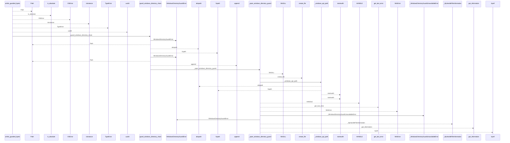
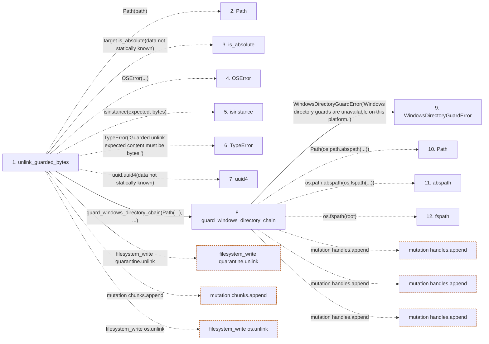

# unlink_guarded_bytes

**Entry point:** `unlink_guarded_bytes` (`api`)
**Source:** [filesystem_guard](../modules/filesystem_guard.md)
**Modules touched:** [filesystem_guard](../modules/filesystem_guard.md)

## Call sequence

<!-- Auto-generated from static call edges. Dashed arrows are external or unresolved calls. Reviewed runtime conditions and side effects belong in Behavior. -->

> Call sequence diagram shows 30 of 314 interactions; 284 omitted to keep the visualization within the 30-interaction and generated-diagram limits.

## Data flow

<!-- Auto-generated static analysis. Treat values and boundaries as best-effort hints, not runtime proof. -->

### Step data

| Step | Inputs | Reads | Writes | Returns |
|---|---|---|---|---|
| `unlink_guarded_bytes` | `path: Path`, `expected: bytes` | `os`, `os`, `os`, `os`, `os` | - | `none` |
| `Path` | - | - | - | - |
| `is_absolute` | - | - | - | - |
| `OSError` | - | - | - | - |
| `isinstance` | - | - | - | - |
| `TypeError` | - | - | - | - |
| `uuid4` | - | - | - | - |
| `guard_windows_directory_chain` | `root: Path`, `relative_components: Sequence[str]`, `create_missing: bool`, `require_restrictive_dacl: bool` | `os`, `WindowsDurabilityError` | - | - |
| `WindowsDirectoryGuardError` | - | - | - | - |
| `Path` | - | - | - | - |
| `abspath` | - | - | - | - |
| `fspath` | - | - | - | - |

### Call data

| From | To | Line | Call |
|---|---|---:|---|
| unlink_guarded_bytes | Path | 1669 | `Path(path)` |
| unlink_guarded_bytes | is_absolute | 1670 | `target.is_absolute(data not statically known)` |
| unlink_guarded_bytes | OSError | 1671 | `OSError(...)` |
| unlink_guarded_bytes | isinstance | 1672 | `isinstance(expected, bytes)` |
| unlink_guarded_bytes | TypeError | 1673 | `TypeError('Guarded unlink expected content must be bytes.')` |
| unlink_guarded_bytes | uuid4 | 1675 | `uuid.uuid4(data not statically known)` |
| unlink_guarded_bytes | guard_windows_directory_chain | 1677 | `guard_windows_directory_chain(Path(...), ...)` |
| guard_windows_directory_chain | WindowsDirectoryGuardError | 170 | `WindowsDirectoryGuardError('Windows directory guards are unavailable on this platform.')` |
| guard_windows_directory_chain | Path | 174 | `Path(os.path.abspath(...))` |
| guard_windows_directory_chain | abspath | 174 | `os.path.abspath(os.fspath(...))` |
| guard_windows_directory_chain | fspath | 174 | `os.fspath(root)` |

### Boundary effects

| Kind | Target | Step | Line |
|---|---|---|---:|
| filesystem_write | `quarantine.unlink` | `unlink_guarded_bytes` | 1701 |
| mutation | `chunks.append` | `unlink_guarded_bytes` | 1746 |
| filesystem_write | `os.unlink` | `unlink_guarded_bytes` | 1753 |
| mutation | `handles.append` | `guard_windows_directory_chain` | 182 |
| mutation | `handles.append` | `guard_windows_directory_chain` | 189 |
| mutation | `handles.append` | `guard_windows_directory_chain` | 216 |

### Static analysis gaps

| Kind | Step | Target | Line |
|---|---|---|---:|
| unresolved_call | `unlink_guarded_bytes` | `target.is_absolute` | 1670 |
| unresolved_call | `unlink_guarded_bytes` | `OSError` | 1671 |
| unresolved_call | `unlink_guarded_bytes` | `isinstance` | 1672 |
| unresolved_call | `unlink_guarded_bytes` | `TypeError` | 1673 |
| external_call | `unlink_guarded_bytes` | `uuid.uuid4` | 1675 |
| external_call | `guard_windows_directory_chain` | `os.path.abspath` | 174 |
| external_call | `guard_windows_directory_chain` | `os.fspath` | 174 |
| step_limit | `unlink_guarded_bytes` | `first 12 steps` | 0 |

## Behavior

This flow starts at `unlink_guarded_bytes` and is classified as `api`. The generated call and data-flow sections are bounded static projections; runtime conditions and side effects require source-level confirmation.
