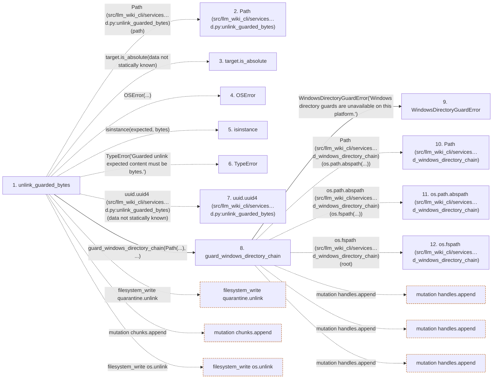

# unlink_guarded_bytes

**Entry point:** `unlink_guarded_bytes` (`api`)
**Source:** [filesystem_guard](../modules/filesystem_guard.md)
**Modules touched:** [filesystem_guard](../modules/filesystem_guard.md)

## Call sequence

```mermaid
sequenceDiagram
    participant p0 as unlink_guarded_bytes
    participant p1 as Path (src/llm_wiki_cli/services…d.py:unlink_guarded_bytes)
    participant p2 as target.is_absolute
    participant p3 as OSError
    participant p4 as isinstance
    participant p5 as TypeError
    participant p6 as uuid.uuid4 (src/llm_wiki_cli/services…d.py:unlink_guarded_bytes)
    participant p7 as guard_windows_directory_chain
    participant p8 as WindowsDirectoryGuardError
    participant p9 as Path (src/llm_wiki_cli/services…d_windows_directory_chain)
    participant p10 as os.path.abspath (src/llm_wiki_cli/services…d_windows_directory_chain)
    participant p11 as os.fspath (src/llm_wiki_cli/services…d_windows_directory_chain)
    participant p12 as handles.append
    participant p13 as _open_windows_directory_guard
    participant p14 as ctypes.WinDLL (src/llm_wiki_cli/services…n_windows_directory_guard)
    participant p15 as create_file (src/llm_wiki_cli/services…n_windows_directory_guard)
    participant p16 as _windows_api_path
    participant p17 as os.path.abspath (src/llm_wiki_cli/services…uard.py:_windows_api_path)
    participant p18 as os.fspath (src/llm_wiki_cli/services…uard.py:_windows_api_path)
    participant p19 as value.startswith
    participant p20 as wintypes.HANDLE (src/llm_wiki_cli/services…n_windows_directory_guard)
    participant p21 as ctypes.get_last_error (src/llm_wiki_cli/services…n_windows_directory_guard)
    participant p22 as ctypes.WinError (src/llm_wiki_cli/services…n_windows_directory_guard)
    participant p23 as _WindowsDirectoryGuardUnavailableError
    participant p24 as _ByHandleFileInformation (src/llm_wiki_cli/services…n_windows_directory_guard)
    participant p25 as get_information (src/llm_wiki_cli/services…n_windows_directory_guard)
    participant p26 as ctypes.byref (src/llm_wiki_cli/services…n_windows_directory_guard)
    p0-->>p1: Path (src/llm_wiki_cli/services…d.py:unlink_guarded_bytes)
    p0-->>p2: target.is_absolute
    p0-->>p3: OSError
    p0-->>p4: isinstance
    p0-->>p5: TypeError
    p0-->>p6: uuid.uuid4 (src/llm_wiki_cli/services…d.py:unlink_guarded_bytes)
    p0->>p7: guard_windows_directory_chain
    p7->>p8: WindowsDirectoryGuardError
    p7-->>p9: Path (src/llm_wiki_cli/services…d_windows_directory_chain)
    p7-->>p10: os.path.abspath (src/llm_wiki_cli/services…d_windows_directory_chain)
    p7-->>p11: os.fspath (src/llm_wiki_cli/services…d_windows_directory_chain)
    p7->>p8: WindowsDirectoryGuardError
    p7-->>p9: Path (src/llm_wiki_cli/services…d_windows_directory_chain)
    p7-->>p12: handles.append
    p7->>p13: _open_windows_directory_guard
    p13-->>p14: ctypes.WinDLL (src/llm_wiki_cli/services…n_windows_directory_guard)
    p13-->>p15: create_file (src/llm_wiki_cli/services…n_windows_directory_guard)
    p13->>p16: _windows_api_path
    p16-->>p17: os.path.abspath (src/llm_wiki_cli/services…uard.py:_windows_api_path)
    p16-->>p18: os.fspath (src/llm_wiki_cli/services…uard.py:_windows_api_path)
    p16-->>p19: value.startswith
    p16-->>p19: value.startswith
    p13-->>p20: wintypes.HANDLE (src/llm_wiki_cli/services…n_windows_directory_guard)
    p13-->>p21: ctypes.get_last_error (src/llm_wiki_cli/services…n_windows_directory_guard)
    p13-->>p22: ctypes.WinError (src/llm_wiki_cli/services…n_windows_directory_guard)
    p13->>p23: _WindowsDirectoryGuardUnavailableError
    p13->>p8: WindowsDirectoryGuardError
    p13-->>p24: _ByHandleFileInformation (src/llm_wiki_cli/services…n_windows_directory_guard)
    p13-->>p25: get_information (src/llm_wiki_cli/services…n_windows_directory_guard)
    p13-->>p26: ctypes.byref (src/llm_wiki_cli/services…n_windows_directory_guard)
```

<!-- Auto-generated from static call edges. Dashed arrows are external or unresolved calls. Reviewed runtime conditions and side effects belong in Behavior. -->

> Call sequence diagram shows 30 of 314 interactions; 284 omitted to keep the visualization within the 30-interaction and generated-diagram limits.

## Data flow

<!-- Auto-generated static analysis. Treat values and boundaries as best-effort hints, not runtime proof. -->

### Step data

| Step | Inputs | Reads | Writes | Returns |
|---|---|---|---|---|
| `unlink_guarded_bytes` | `path: Path`, `expected: bytes` | `os`, `os`, `os`, `os`, `os` | - | `none` |
| `Path (src/llm_wiki_cli/services…d.py:unlink_guarded_bytes)` | - | - | - | - |
| `target.is_absolute` | - | - | - | - |
| `OSError` | - | - | - | - |
| `isinstance` | - | - | - | - |
| `TypeError` | - | - | - | - |
| `uuid.uuid4 (src/llm_wiki_cli/services…d.py:unlink_guarded_bytes)` | - | - | - | - |
| `guard_windows_directory_chain` | `root: Path`, `relative_components: Sequence[str]`, `create_missing: bool`, `require_restrictive_dacl: bool` | `os`, `WindowsDurabilityError` | - | - |
| `WindowsDirectoryGuardError` | - | - | - | - |
| `Path (src/llm_wiki_cli/services…d_windows_directory_chain)` | - | - | - | - |
| `os.path.abspath (src/llm_wiki_cli/services…d_windows_directory_chain)` | - | - | - | - |
| `os.fspath (src/llm_wiki_cli/services…d_windows_directory_chain)` | - | - | - | - |

### Call data

| From | To | Line | Call |
|---|---|---:|---|
| unlink_guarded_bytes | Path (src/llm_wiki_cli/services…d.py:unlink_guarded_bytes) | 1669 | `Path(path)` |
| unlink_guarded_bytes | target.is_absolute | 1670 | `target.is_absolute(data not statically known)` |
| unlink_guarded_bytes | OSError | 1671 | `OSError(...)` |
| unlink_guarded_bytes | isinstance | 1672 | `isinstance(expected, bytes)` |
| unlink_guarded_bytes | TypeError | 1673 | `TypeError('Guarded unlink expected content must be bytes.')` |
| unlink_guarded_bytes | uuid.uuid4 (src/llm_wiki_cli/services…d.py:unlink_guarded_bytes) | 1675 | `uuid.uuid4(data not statically known)` |
| unlink_guarded_bytes | guard_windows_directory_chain | 1677 | `guard_windows_directory_chain(Path(...), ...)` |
| guard_windows_directory_chain | WindowsDirectoryGuardError | 170 | `WindowsDirectoryGuardError('Windows directory guards are unavailable on this platform.')` |
| guard_windows_directory_chain | Path (src/llm_wiki_cli/services…d_windows_directory_chain) | 174 | `Path(os.path.abspath(...))` |
| guard_windows_directory_chain | os.path.abspath (src/llm_wiki_cli/services…d_windows_directory_chain) | 174 | `os.path.abspath(os.fspath(...))` |
| guard_windows_directory_chain | os.fspath (src/llm_wiki_cli/services…d_windows_directory_chain) | 174 | `os.fspath(root)` |

### Boundary effects

| Kind | Target | Step | Line |
|---|---|---|---:|
| filesystem_write | `quarantine.unlink` | `unlink_guarded_bytes` | 1704 |
| mutation | `chunks.append` | `unlink_guarded_bytes` | 1749 |
| filesystem_write | `os.unlink` | `unlink_guarded_bytes` | 1756 |
| mutation | `handles.append` | `guard_windows_directory_chain` | 182 |
| mutation | `handles.append` | `guard_windows_directory_chain` | 189 |
| mutation | `handles.append` | `guard_windows_directory_chain` | 216 |

### Static analysis gaps

| Kind | Step | Target | Line |
|---|---|---|---:|
| unresolved_call | `unlink_guarded_bytes` | `target.is_absolute` | 1670 |
| external_call | `unlink_guarded_bytes` | `OSError` | 1671 |
| external_call | `unlink_guarded_bytes` | `isinstance` | 1672 |
| external_call | `unlink_guarded_bytes` | `TypeError` | 1673 |
| external_call | `unlink_guarded_bytes` | `uuid.uuid4` | 1675 |
| external_call | `guard_windows_directory_chain` | `os.path.abspath` | 174 |
| external_call | `guard_windows_directory_chain` | `os.fspath` | 174 |
| step_limit | `unlink_guarded_bytes` | `first 12 steps` | 0 |

## Behavior

This flow starts at `unlink_guarded_bytes` and is classified as `api`. The generated call and data-flow sections are bounded static projections; runtime conditions and side effects require source-level confirmation.
