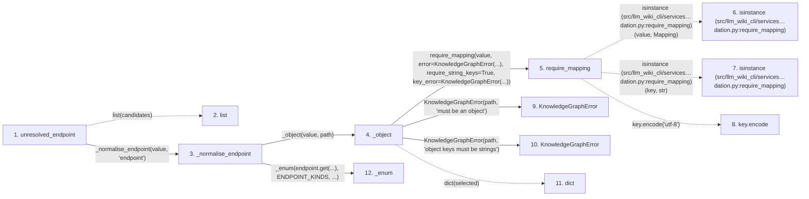

# unresolved_endpoint

**Entry point:** `unresolved_endpoint` (`api`)
**Source:** [knowledge_graph](../modules/knowledge_graph.md)
**Modules touched:** [knowledge_evidence](../modules/knowledge_evidence.md), [knowledge_graph](../modules/knowledge_graph.md), [validation](../modules/validation.md), [wiki_media](../modules/wiki_media.md), and 1 more

**Complete modules touched:**

- [knowledge_evidence](../modules/knowledge_evidence.md)
- [knowledge_graph](../modules/knowledge_graph.md)
- [validation](../modules/validation.md)
- [wiki_media](../modules/wiki_media.md)
- [wiki_surface](../modules/wiki_surface.md)

## Call sequence

```mermaid
sequenceDiagram
    participant p0 as unresolved_endpoint
    participant p1 as list
    participant p2 as _normalise_endpoint
    participant p3 as _object
    participant p4 as require_mapping
    participant p5 as isinstance (src/llm_wiki_cli/services…dation.py:require_mapping)
    participant p6 as key.encode
    participant p7 as KnowledgeGraphError
    participant p8 as dict
    participant p9 as _enum
    participant p10 as ', '.join
    participant p11 as repr
    participant p12 as require_choice
    participant p13 as require_trimmed_text
    participant p14 as require_nonempty_text
    participant p15 as isinstance (src/llm_wiki_cli/services….py:require_nonempty_text)
    participant p16 as value.strip (src/llm_wiki_cli/services….py:require_nonempty_text)
    participant p17 as any (src/llm_wiki_cli/services….py:require_nonempty_text)
    participant p18 as ord (src/llm_wiki_cli/services….py:require_nonempty_text)
    participant p19 as frozenset
    participant p20 as choice_error
    participant p21 as endpoint.get
    participant p22 as _only_fields
    participant p23 as require_exact_fields
    participant p24 as isinstance (src/llm_wiki_cli/services…n.py:require_exact_fields)
    participant p25 as str
    participant p26 as set
    p0-->>p1: list
    p0->>p2: _normalise_endpoint
    p2->>p3: _object
    p3->>p4: require_mapping
    p4-->>p5: isinstance (src/llm_wiki_cli/services…dation.py:require_mapping)
    p4-->>p5: isinstance (src/llm_wiki_cli/services…dation.py:require_mapping)
    p4-->>p6: key.encode
    p3->>p7: KnowledgeGraphError
    p3->>p7: KnowledgeGraphError
    p3-->>p8: dict
    p2->>p9: _enum
    p9->>p7: KnowledgeGraphError
    p9-->>p10: ', '.join
    p9-->>p11: repr
    p9->>p12: require_choice
    p12->>p13: require_trimmed_text
    p13->>p14: require_nonempty_text
    p14-->>p15: isinstance (src/llm_wiki_cli/services….py:require_nonempty_text)
    p14-->>p16: value.strip (src/llm_wiki_cli/services….py:require_nonempty_text)
    p14-->>p17: any (src/llm_wiki_cli/services….py:require_nonempty_text)
    p14-->>p18: ord (src/llm_wiki_cli/services….py:require_nonempty_text)
    p14-->>p18: ord (src/llm_wiki_cli/services….py:require_nonempty_text)
    p12-->>p19: frozenset
    p12-->>p20: choice_error
    p2-->>p21: endpoint.get
    p2->>p22: _only_fields
    p22->>p23: require_exact_fields
    p23-->>p24: isinstance (src/llm_wiki_cli/services…n.py:require_exact_fields)
    p23-->>p25: str
    p23-->>p26: set
```

<!-- Auto-generated from static call edges. Dashed arrows are external or unresolved calls. Reviewed runtime conditions and side effects belong in Behavior. -->

> Call sequence diagram shows 30 of 202 interactions; 172 omitted to keep the visualization within the 30-interaction and generated-diagram limits.

> Trace truncated at the depth limit; deeper calls are omitted.

## Data flow

<!-- Auto-generated static analysis. Treat values and boundaries as best-effort hints, not runtime proof. -->

### Step data

| Step | Inputs | Reads | Writes | Returns |
|---|---|---|---|---|
| `unresolved_endpoint` | `raw_target: str`, `candidates: Sequence[Mapping[str, Any]]` | - | `value[...]` | `_normalise_endpoint(...)` |
| `list` | - | - | - | - |
| `_normalise_endpoint` | `value: object`, `path: str` | `ENDPOINT_KINDS` | `result[...]`, `result[...]` | `{...}`, `{...}`, `{...}`, `result`, `result` |
| `_object` | `value: object`, `path: str` | - | - | `dict(...)` |
| `require_mapping` | `value: object`, `error: Exception`, `require_string_keys: bool`, `key_error: Exception \| None`, `require_utf8_keys: bool`, `utf8_key_error: Exception \| None` | `Mapping` | - | `value` |
| `isinstance (src/llm_wiki_cli/services…dation.py:require_mapping)` | - | - | - | - |
| `isinstance (src/llm_wiki_cli/services…dation.py:require_mapping)` | - | - | - | - |
| `key.encode` | - | - | - | - |
| `KnowledgeGraphError` | - | - | - | - |
| `KnowledgeGraphError` | - | - | - | - |
| `dict` | - | - | - | - |
| `_enum` | `value: object`, `values: Sequence[str]`, `path: str` | - | - | `require_choice(...)` |

### Call data

| From | To | Line | Call |
|---|---|---:|---|
| unresolved_endpoint | list | 296 | `list(candidates)` |
| unresolved_endpoint | _normalise_endpoint | 297 | `_normalise_endpoint(value, 'endpoint')` |
| _normalise_endpoint | _object | 1391 | `_object(value, path)` |
| _object | require_mapping | 2283 | `require_mapping(value, error=KnowledgeGraphError(...), require_string_keys=True, key_error=KnowledgeGraphError(...))` |
| require_mapping | isinstance (src/llm_wiki_cli/services…dation.py:require_mapping) | 727 | `isinstance(value, Mapping)` |
| require_mapping | isinstance (src/llm_wiki_cli/services…dation.py:require_mapping) | 731 | `isinstance(key, str)` |
| require_mapping | key.encode | 736 | `key.encode('utf-8')` |
| _object | KnowledgeGraphError | 2285 | `KnowledgeGraphError(path, 'must be an object')` |
| _object | KnowledgeGraphError | 2287 | `KnowledgeGraphError(path, 'object keys must be strings')` |
| _object | dict | 2289 | `dict(selected)` |
| _normalise_endpoint | _enum | 1392 | `_enum(endpoint.get(...), ENDPOINT_KINDS, ...)` |

### Boundary effects

*No boundary effects detected.*

### Static analysis gaps

| Kind | Step | Target | Line |
|---|---|---|---:|
| external_call | `require_mapping` | `isinstance` | 727 |
| external_call | `require_mapping` | `isinstance` | 731 |
| unresolved_call | `require_mapping` | `key.encode` | 736 |
| step_limit | `unresolved_endpoint` | `first 12 steps` | 0 |
| truncated_flow | `unresolved_endpoint` | `depth limit` | 0 |

## Behavior

This flow starts at `unresolved_endpoint` and is classified as `api`. The generated call and data-flow sections are bounded static projections; runtime conditions and side effects require source-level confirmation.
