# use_calibration_host_broker_authenticator

**Entry point:** `use_calibration_host_broker_authenticator` (`api`)
**Source:** [api](../modules/api.md)
**Modules touched:** [api](../modules/api.md), [context_packet](../modules/context_packet.md), [host_broker](../modules/host_broker.md), [validation](../modules/validation.md)

## Call sequence

```mermaid
sequenceDiagram
    participant p0 as use_calibration_host_broker_authenticator (src/llm_wiki_cli/api.py)
    participant p1 as use_calibration_host_broker_authenticator (src/llm_wiki_cli/services…alibration/host_broker.py)
    participant p2 as isinstance (src/llm_wiki_cli/services…host_broker_authenticator)
    participant p3 as HostBrokerAuthenticationUnavailable
    participant p4 as _require_bounded_text
    participant p5 as require_bounded_text
    participant p6 as isinstance (src/llm_wiki_cli/services…n.py:require_bounded_text)
    participant p7 as len
    participant p8 as value.strip
    participant p9 as contains_control_character
    participant p10 as pattern.search
    participant p11 as HostBrokerAuthenticationError
    participant p12 as _HOST_BROKER_AUTHENTICATOR.set
    participant p13 as _HOST_BROKER_AUTHENTICATOR.reset
    participant p14 as manager.__enter__
    participant p15 as _raise_api_error
    participant p16 as _raise_required_knowledge_api_error
    participant p17 as _required_knowledge_failure
    participant p18 as set (src/llm_wiki_cli/api.py:_required_knowledge_failure)
    participant p19 as id (src/llm_wiki_cli/api.py:_required_knowledge_failure)
    participant p20 as seen.add (src/llm_wiki_cli/api.py:_required_knowledge_failure)
    participant p21 as getattr (src/llm_wiki_cli/api.py:_required_knowledge_failure)
    participant p22 as type (src/llm_wiki_cli/api.py:_required_knowledge_failure)
    participant p23 as isinstance (src/llm_wiki_cli/api.py:_required_knowledge_failure)
    participant p24 as dict
    participant p25 as copied.get
    p0->>p1: use_calibration_host_broker_authenticator (src/llm_wiki_cli/services…alibration/host_broker.py)
    p1-->>p2: isinstance (src/llm_wiki_cli/services…host_broker_authenticator)
    p1->>p3: HostBrokerAuthenticationUnavailable
    p1->>p4: _require_bounded_text
    p4->>p5: require_bounded_text
    p5-->>p6: isinstance (src/llm_wiki_cli/services…n.py:require_bounded_text)
    p5-->>p7: len
    p5-->>p7: len
    p5-->>p8: value.strip
    p5->>p9: contains_control_character
    p9-->>p10: pattern.search
    p4->>p11: HostBrokerAuthenticationError
    p1-->>p12: _HOST_BROKER_AUTHENTICATOR.set
    p1-->>p13: _HOST_BROKER_AUTHENTICATOR.reset
    p0-->>p14: manager.__enter__
    p0->>p15: _raise_api_error
    p15->>p16: _raise_required_knowledge_api_error
    p16->>p17: _required_knowledge_failure
    p17-->>p18: set (src/llm_wiki_cli/api.py:_required_knowledge_failure)
    p17-->>p19: id (src/llm_wiki_cli/api.py:_required_knowledge_failure)
    p17-->>p20: seen.add (src/llm_wiki_cli/api.py:_required_knowledge_failure)
    p17-->>p19: id (src/llm_wiki_cli/api.py:_required_knowledge_failure)
    p17-->>p21: getattr (src/llm_wiki_cli/api.py:_required_knowledge_failure)
    p17-->>p22: type (src/llm_wiki_cli/api.py:_required_knowledge_failure)
    p17-->>p21: getattr (src/llm_wiki_cli/api.py:_required_knowledge_failure)
    p17-->>p23: isinstance (src/llm_wiki_cli/api.py:_required_knowledge_failure)
    p17-->>p24: dict
    p17-->>p25: copied.get
    p17-->>p23: isinstance (src/llm_wiki_cli/api.py:_required_knowledge_failure)
    p17-->>p24: dict
```

<!-- Auto-generated from static call edges. Dashed arrows are external or unresolved calls. Reviewed runtime conditions and side effects belong in Behavior. -->

> Call sequence diagram shows 30 of 126 interactions; 96 omitted to keep the visualization within the 30-interaction and generated-diagram limits.

## Data flow

```mermaid
flowchart LR
    s1["1. use_calibration_host_broker_authenticator (src/llm_wiki_cli/api.py)"]
    s2["2. use_calibration_host_broker_authenticator (src/llm_wiki_cli/services…alibration/host_broker.py)"]
    s3["3. isinstance (src/llm_wiki_cli/services…host_broker_authenticator)"]
    s4["4. HostBrokerAuthenticationUnavailable"]
    s5["5. _require_bounded_text"]
    s6["6. require_bounded_text"]
    s7["7. isinstance (src/llm_wiki_cli/services…n.py:require_bounded_text)"]
    s8["8. len"]
    s9["9. len"]
    s10["10. value.strip"]
    s11["11. contains_control_character"]
    s12["12. pattern.search"]
    s1 -->|"use_calibration_host_broker_authenticator (src/llm_wiki_cli/services…alibration/host_broker.py)(authenticator)"| s2
    s2 -. "isinstance (src/llm_wiki_cli/services…host_broker_authenticator)(authenticator, HostBrokerAuthenticator)" .-> s3
    s2 -->|"HostBrokerAuthenticationUnavailable('The host broker authenticator is malformed.')"| s4
    s2 -->|"_require_bounded_text(authenticator.authenticator_id, 'authenticator_id')"| s5
    s5 -->|"require_bounded_text(value, maximum=512, error=HostBrokerAuthenticationError(...))"| s6
    s6 -. "isinstance (src/llm_wiki_cli/services…n.py:require_bounded_text)(value, str)" .-> s7
    s6 -. "len(value)" .-> s8
    s6 -. "len(value)" .-> s9
    s6 -. "value.strip(data not statically known)" .-> s10
    s6 -->|"contains_control_character(value, reject_delete_character=reject_delete_character)"| s11
    s11 -. "pattern.search(value)" .-> s12
    click s1 "../modules/api.md"
    click s2 "../modules/host_broker.md"
    click s4 "../modules/host_broker.md"
    click s5 "../modules/host_broker.md"
    click s6 "../modules/validation.md"
    click s11 "../modules/validation.md"
```

<!-- Auto-generated static analysis. Treat values and boundaries as best-effort hints, not runtime proof. -->

### Step data

| Step | Inputs | Reads | Writes | Returns |
|---|---|---|---|---|
| `use_calibration_host_broker_authenticator (src/llm_wiki_cli/api.py)` | `authenticator: HostBrokerAuthenticator` | - | - | - |
| `use_calibration_host_broker_authenticator (src/llm_wiki_cli/services…alibration/host_broker.py)` | `authenticator: HostBrokerAuthenticator` | `HostBrokerAuthenticator` | - | - |
| `isinstance (src/llm_wiki_cli/services…host_broker_authenticator)` | - | - | - | - |
| `HostBrokerAuthenticationUnavailable` | - | - | - | - |
| `_require_bounded_text` | `value: Any`, `label: str` | - | - | `require_bounded_text(...)` |
| `require_bounded_text` | `value: object`, `maximum: int`, `error: Exception`, `minimum: int`, `control_error: Exception \| None`, `require_trimmed: bool`, `reject_control_characters: bool`, `reject_delete_character: bool` | - | - | `value` |
| `isinstance (src/llm_wiki_cli/services…n.py:require_bounded_text)` | - | - | - | - |
| `len` | - | - | - | - |
| `len` | - | - | - | - |
| `value.strip` | - | - | - | - |
| `contains_control_character` | `value: str`, `reject_delete_character: bool` | `_ASCII_CONTROL_DELETE`, `_ASCII_CONTROL` | - | `...` |
| `pattern.search` | - | - | - | - |

### Call data

| From | To | Line | Call |
|---|---|---:|---|
| use_calibration_host_broker_authenticator (src/llm_wiki_cli/api.py) | use_calibration_host_broker_authenticator (src/llm_wiki_cli/services…alibration/host_broker.py) | 3197 | `implementation(authenticator)` |
| use_calibration_host_broker_authenticator (src/llm_wiki_cli/services…alibration/host_broker.py) | isinstance (src/llm_wiki_cli/services…host_broker_authenticator) | 195 | `isinstance(authenticator, HostBrokerAuthenticator)` |
| use_calibration_host_broker_authenticator (src/llm_wiki_cli/services…alibration/host_broker.py) | HostBrokerAuthenticationUnavailable | 196 | `HostBrokerAuthenticationUnavailable('The host broker authenticator is malformed.')` |
| use_calibration_host_broker_authenticator (src/llm_wiki_cli/services…alibration/host_broker.py) | _require_bounded_text | 199 | `_require_bounded_text(authenticator.authenticator_id, 'authenticator_id')` |
| _require_bounded_text | require_bounded_text | 321 | `require_bounded_text(value, maximum=512, error=HostBrokerAuthenticationError(...))` |
| require_bounded_text | isinstance (src/llm_wiki_cli/services…n.py:require_bounded_text) | 650 | `isinstance(value, str)` |
| require_bounded_text | len | 651 | `len(value)` |
| require_bounded_text | len | 652 | `len(value)` |
| require_bounded_text | value.strip | 653 | `value.strip(data not statically known)` |
| require_bounded_text | contains_control_character | 656 | `contains_control_character(value, reject_delete_character=reject_delete_character)` |
| contains_control_character | pattern.search | 685 | `pattern.search(value)` |

### Boundary effects

*No boundary effects detected.*

### Static analysis gaps

| Kind | Step | Target | Line |
|---|---|---|---:|
| external_call | `use_calibration_host_broker_authenticator` | `isinstance` | 195 |
| external_call | `require_bounded_text` | `isinstance` | 650 |
| unresolved_call | `require_bounded_text` | `value.strip` | 653 |
| unresolved_call | `contains_control_character` | `pattern.search` | 685 |
| step_limit | `use_calibration_host_broker_authenticator` | `first 12 steps` | 0 |

## Behavior

This flow starts at `use_calibration_host_broker_authenticator` and is classified as `api`. The generated call and data-flow sections are bounded static projections; runtime conditions and side effects require source-level confirmation.
